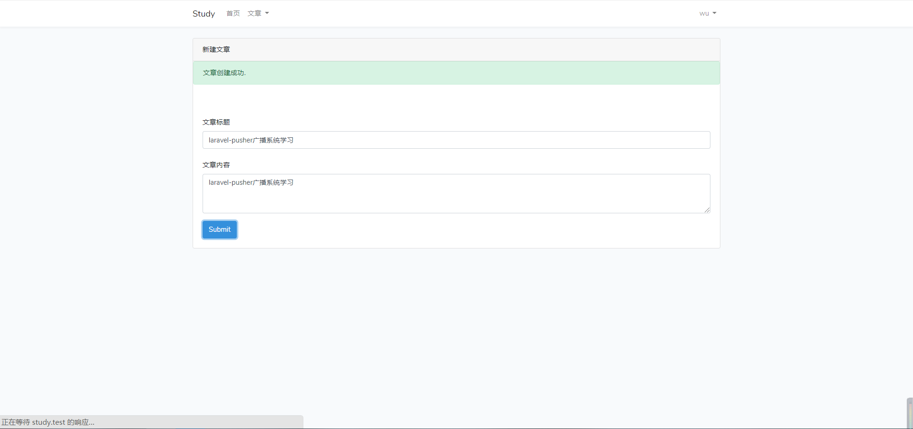
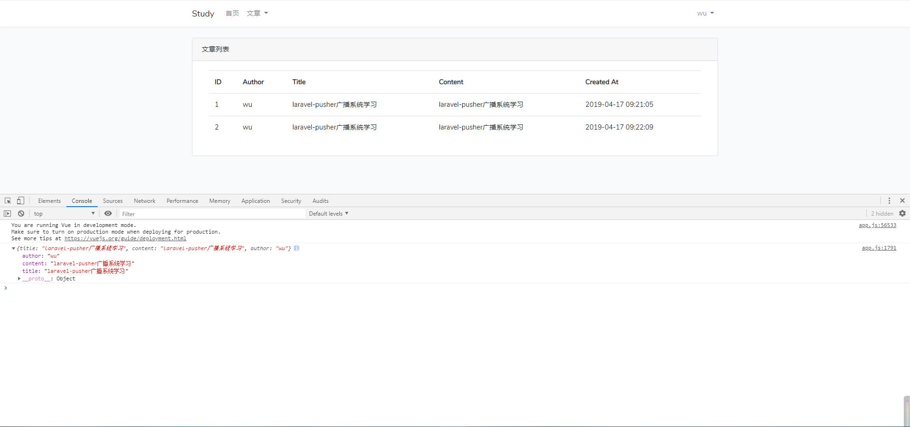

看到广播系统，先想起了曾经虐过我的即时通讯。

虽然都是对 websocket 的应用，但是好像又有点区别，这里好好学习一下。


<!-- more -->

laravel 的广播与事件紧密相关，广播即对事件进行广播，因此在学习广播之前，要先阅读事件和监听器的相关文档。


#### 配置
老规矩，先来看配置文件 `config/broadcasting.php` 里边的配置选项：

```php
<?php

return [

    /*
    |--------------------------------------------------------------------------
    | Default Broadcaster
    |--------------------------------------------------------------------------
    |
    | This option controls the default broadcaster that will be used by the
    | framework when an event needs to be broadcast. You may set this to
    | any of the connections defined in the "connections" array below.
    |
    | Supported: "pusher", "redis", "log", "null"
    |
    */

    'default' => env('BROADCAST_DRIVER', 'null'),

    /*
    |--------------------------------------------------------------------------
    | Broadcast Connections
    |--------------------------------------------------------------------------
    |
    | Here you may define all of the broadcast connections that will be used
    | to broadcast events to other systems or over websockets. Samples of
    | each available type of connection are provided inside this array.
    |
    */

    'connections' => [

        'pusher' => [
            'driver' => 'pusher',
            'key' => env('PUSHER_APP_KEY'),
            'secret' => env('PUSHER_APP_SECRET'),
            'app_id' => env('PUSHER_APP_ID'),
            'options' => [
                'cluster' => env('PUSHER_APP_CLUSTER'),
                'encrypted' => true,
            ],
        ],

        'redis' => [
            'driver' => 'redis',
            'connection' => 'default',
        ],

        'log' => [
            'driver' => 'log',
        ],

        'null' => [
            'driver' => 'null',
        ],

    ],

];

```

默认情况下，laravel 提供了以上几种开箱即用的广播驱动器程序。

`env` 配置文件中，默认的驱动为 `log`，意味着客户端不会受到任何信息，只是会把要广播的消息写入 log 文件中，跟学习目标不符，就先以 `pusher` 展开学习吧。

我们就以发布新文章后推送给所有用户为例。

#### 前期准备
开始之前，必须要先注册 `App\Providers\BroadcastServiceProvider`，在 `config/app.php` 配置文件中的 `providers` 数组中取消对提供者的注释。

注册:[ [ pusher ] ](https://dashboard.pusher.com)

然后把相关参数配置到 `.env` 文件。

#### 安装组件：
```php
composer require pusher/pusher-php-server
npm install --save laravel-echo pusher-js
```

添加文章模块，包含 migrate，controller，model，view 和 router 等内容。


#### 新建事件：
```php
php artisan make:event NewArticleNotificationEvent

// 事件内容：
<?php

namespace App\Events;

use Illuminate\Queue\SerializesModels;
use Illuminate\Broadcasting\Channel;
use Illuminate\Broadcasting\PrivateChannel;
use Illuminate\Foundation\Events\Dispatchable;
use Illuminate\Broadcasting\InteractsWithSockets;
use Illuminate\Contracts\Broadcasting\ShouldBroadcast;
use App\Article;

class NewArticleNotificationEvent implements ShouldBroadcast
{
    use Dispatchable, InteractsWithSockets, SerializesModels;

    private $article;
    /**
     * Create a new event instance.
     *
     * @return void
     */
    public function __construct(Article $article)
    {
        $this->article = $article;
    }

    public function broadcastWith()
    {
        return [
            'title' => $this->article->title,
            'content' => $this->article->content,
            'author' => $this->article->user->name
        ];
    }


    /**
     * Get the channels the event should broadcast on.
     *
     * @return \Illuminate\Broadcasting\Channel|array
     */
    public function broadcastOn()
    {
        return new Channel('articles');
    }
}

```

#### 触发事件
在保存文章的控制器中触发事件：
```php
$data = array_merge($request->only(['title', 'content']), ['uid' => Auth::id()]);
$article = Article::create($data);
broadcast(new NewArticleNotificationEvent($article));
```

#### 前端监听

文章列表用了vue组件，在这个组件中进行事件监听。
```vue
<template>
    <div class="container">
        <table class="table table-striped">
            <tr>
                <th>ID</th>
                <th>Author</th>
                <th>Title</th>
                <th>Content</th>
                <th>Created At</th>
            </tr>
            <tr v-for="article in articles">
                <td>{{article.id}}</td>
                <td>{{article.user.name}}</td>
                <td>{{article.title}}</td>
                <td>{{article.content}}</td>
                <td>{{article.created_at}}</td>
            </tr>
        </table>
    </div>
</template>

<script>
export default {
    props: ['articles'],
    created() {
        Echo.channel('articles').listen('NewArticleNotificationEvent', (article) => {
            console.log(article);
        })
    }
}
</script>

<style scoped>

</style>
```

写好后要在命令行执行 npm run watch-poll 实时编译文件。

#### 测试
写篇文章测试一下：




#### 注意事项
* 不需要创建 channel 路由
* 不需要开启队列监听
* 如果没反应请先强制刷新浏览器
