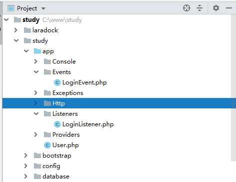
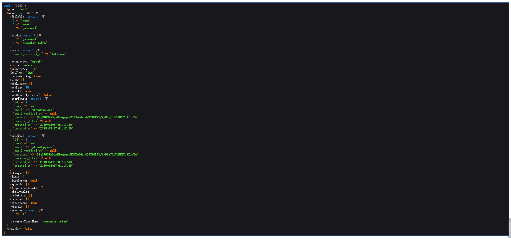

学习下 laravel 的事件系统。

<!-- more -->

Laravel 的事件提供了一个简单的观察者实现，能够订阅和监听应用中发生的各种事件。

先以一个登陆日志来作为例子开始事件的学习吧。

#### 注册事件 && 监听器

在 app\Providers\EventServiceProvider.php 中，添加以下内容：
```php
protected $listen = [
    Registered::class => [
        SendEmailVerificationNotification::class,
    ],
    'App\Events\LoginEvent' => [
        'App\Listeners\LoginListener'
    ]
];
```

然后运行命令，生成事件和监听器：

```php
php artisan event:generate
```

运行结束后，事件和监听器都会被自动创建好。


在监听中打个 log： info('user login event')

然后找个控制器触发事件。

`event(new LoginEvent());`

可以看到 log 文件中有一条新纪录：

>[2019-03-27 08:16:21] local.INFO: user login event

走到这里，理论上已经可以做很多事情了，但是对于登录日志来说，这样处理并不完美，因为 larave 内置已经写好了登录事件，只需要去调用就可以了。

#### 改造事件
在身份验证处理过程中 Laravel 引发了多种事件 。 
可以在 EventServiceProvider 中附着这些事件的监听器。
[文档](https://laravel.com/docs/5.8/authentication#events)

```php
/**
 * 应用的事件监听器映射。
 *
 * @var array
 */
protected $listen = [
    'Illuminate\Auth\Events\Registered' => [
        'App\Listeners\LogRegisteredUser',
    ],

    'Illuminate\Auth\Events\Attempting' => [
        'App\Listeners\LogAuthenticationAttempt',
    ],

    'Illuminate\Auth\Events\Authenticated' => [
        'App\Listeners\LogAuthenticated',
    ],

    'Illuminate\Auth\Events\Login' => [
        'App\Listeners\LogSuccessfulLogin',
    ],

    'Illuminate\Auth\Events\Failed' => [
        'App\Listeners\LogFailedLogin',
    ],

    'Illuminate\Auth\Events\Logout' => [
        'App\Listeners\LogSuccessfulLogout',
    ],

    'Illuminate\Auth\Events\Lockout' => [
        'App\Listeners\LogLockout',
    ],

    'Illuminate\Auth\Events\PasswordReset' => [
        'App\Listeners\LogPasswordReset',
    ],
];
```

这里就只使用登录事件。
修改 EventServiceProvider：

```php
'Illuminate\Auth\Events\Login' => [
    'App\Listeners\LoginListener'
]
```

再改改 listener：
```php
public function handle($guard) {
    info('user login event', ['username'=>$guard->user->name]);
    dd($guard);
}
```

#### 触发事件
退出帐号重新登录，可以看到以下内容：


可以再优化一下：
```php
public function handle($guard) {
    $log = [
        'name' => $guard->user->name,
        'email'=> $guard->user->email,
        'ip'=> \Request::getClientIp(true),
        'datetime' => Carbon::now()
    ];
    info('user login event', $log);
}
```

这里可以选中用 log 存储还是用 mysql 存储。

事件的学习就是这些了，平时开发要经常使用避免遗忘。