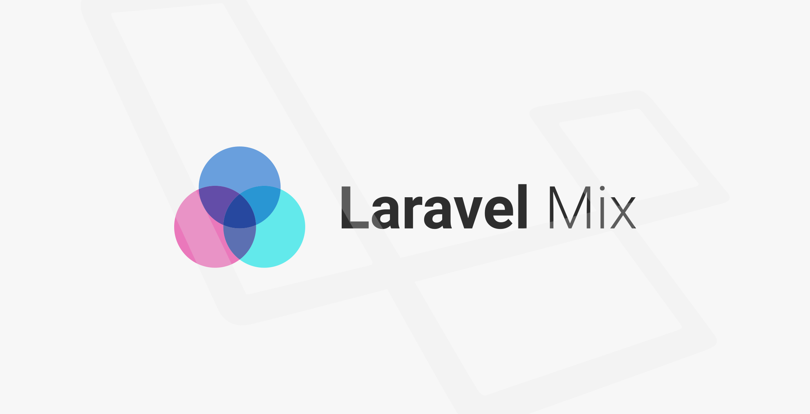

学习下如何在 laravel 框架中，用 laravel mix 编译前端资源。


<!-- more -->

#### 使用
本次操作的环境依然是 laradock，如果没用特殊说明，以后应该默认 laradock。

workspace 容器中，已经提前装好了 node 环境，而在项目根目录中，package.json 和 webpack.mix.js 也已经为我们预设好了，所以laravel 项目建好后，直接在根目录安装即可：
```bash
npm install
```

在 webpack.mix.js 中，已经加载了两个默认的文件：
```javascript
mix.js('resources/js/app.js', 'public/js')
   .sass('resources/sass/app.scss', 'public/css');
```

我们只需要把自己的资源文件，按照同样的格式写入进去，然后开始运行，就可以生成编译后的资源了。

虽然示例中只写了 sass 一种样式文件，但是其实可以支持常见的以及不常见的很多中格式，只需要调用对应的接口即可。而且还可以把多个资源文件合并成一个。

举个🌰：
```javascript
mix.less('resources/assets/less/app.less', 'public/stylesheets/styles.css');

mix.styles([
    'public/css/vendor/normalize.css',
    'public/css/vendor/videojs.css'
], 'public/css/all.css');
```

#### 运行
```bash
npm run dev
npm run watch
```
在上一篇中，我们修改视图后使之生效的命令，其实就是通知 mix 开始工作的。

#### 单独使用
在 laravel 框架之外也是可以使用 mix 的，具体教程请参考 [[ learnku ]](https://learnku.com/docs/laravel-mix/4.0)

其实不难，挺简单的。😎