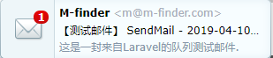

学习下 laravel 的队列系统。


队列的目的是将耗时的任务延时处理，比如发送邮件，从而大幅度缩短 Web 请求和相应的时间。

常用的队列后台有： Beanstalk，Amazon SQS，Redis 等。
<!-- more -->

#### 配置
laravel 为多种队列服务做了统一的API，在配置文件 `config/queue.php` 中可以找到每种队列驱动的配置。

其中每种驱动都有一个默认的 queue 属性，用来存放使用时没有显示定义队列的任务。

```php
// 分发到默认队列
Job::dispatch();

// 分发到 emails 队列
Job::dispatch()->onQueue('emails');
```

在项目的配置文件中，可以指定驱动，老版本中为 `QUEUE_DRIVER`，新版本中为`QUEUE_CONNECTION` , 驱动默认为 `sync`，这是一个本地的同步驱动，方便调试队列里的任务。

先以 redis 为例做一个邮件发送队列。

因为 laravel 的 redis 默认使用了 predis，所以先装下扩展：

```composer
composer require 'predis/predis'
```

邮件配置，最后两项是手动添加的，否则会报错：
```env
MAIL_DRIVER=smtp
MAIL_HOST=smtp.mxhichina.com
MAIL_PORT=25
MAIL_USERNAME=m@m-finder.com
MAIL_PASSWORD=xxxxxx
MAIL_ENCRYPTION=null
MAIL_FROM_NAME=M-finder
MAIL_FROM_ADDRESS=m@m-finder.com
```

#### 生成任务类
命令行执行：`php artisan make:job EmailJob`，该命令会在 `app/jobs` 下自动创建文件。

在任务类中发送邮件：
```php
public function handle() {
    $email = $this->email;
    $content = '这是一封来自Laravel的队列测试邮件.';
    Mail::raw($content, function ($message) use ($email) {
        $message->subject('[ 测试 ] 测试邮件SendMail - ' . date('Y-m-d H:i:s'));
        $message->to($email);
    });
}
```

#### 任务调度

之前弄了登录事件和监听，就在监听里去触发吧。

```php
EmailJob::dispatch($guard->user)->onQueue('emails');
```

#### 开启队列
```php
php artisan queue:work --tries=3 --timeout=30 --queue=emails 
```

然后重新登录触发任务。
可以看到邮箱已经有了提示：



邮件已经成功发出，接下来就可以在实际的需求中使用了。
