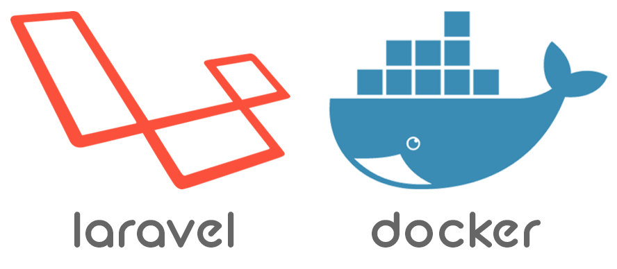

在 laradock 环境中使用 laravel-swoole 加速你的 laravel 应用。

<!-- more -->

#### 安装laravel-swoole
```
composer require swooletw/laravel-swoole
php artisan vendor:publish --tag=laravel-swoole
```

#### 开放 workspace 端口
在 `laradock/workspace/Dockerfile` 最后添加一行：
```
EXPOSE 1215
```

然后重新 build workspace 容器。


#### 修改 nginx 配置
```
upstream swoole-http {
    server workspace:1215;
}

map $http_upgrade $connection_upgrade {
    default upgrade;
    ''      close;
}

server {

    listen 80;
    listen [::]:80;

    # For https
    # listen 443 ssl;
    # listen [::]:443 ssl ipv6only=on;
    # ssl_certificate /etc/nginx/ssl/default.crt;
    # ssl_certificate_key /etc/nginx/ssl/default.key;


    server_name study.test;
    root /var/www/laravel-learn/public;
    index index.php index.html index.htm;

    location = /index.php {
            # Ensure that there is no such file named "not_exists"
            # in your "public" directory.
            try_files /not_exists @swoole;
    }

    location / {
        try_files $uri $uri/ @swoole;
    }

    location @swoole {
        set $suffix "";

        if ($uri = /index.php) {
            set $suffix "/";
        }
        proxy_set_header Host $http_host;
        proxy_set_header Scheme $scheme;
        proxy_set_header SERVER_PORT $server_port;
        proxy_set_header REMOTE_ADDR $remote_addr;
        proxy_set_header X-Forwarded-For $proxy_add_x_forwarded_for;
        proxy_set_header Upgrade $http_upgrade;
        proxy_set_header Connection $connection_upgrade;

        # IF https
        # proxy_set_header HTTPS "on";

        charset utf-8;

        proxy_pass http://swoole-http$suffix;
    }
}
```

然后重启 nginx

#### 修改 laravel env
```
SWOOLE_HTTP_HOST=workspace
SWOOLE_HTTP_DAEMONIZE=true
SWOOLE_HOT_RELOAD_ENABLE=true
```

#### 启动 swoole
```
php artisan swoole:http start | stop | restart | resload
```

# 开发环境热更新
调整 swoole_http 中 `max_request = 1`
