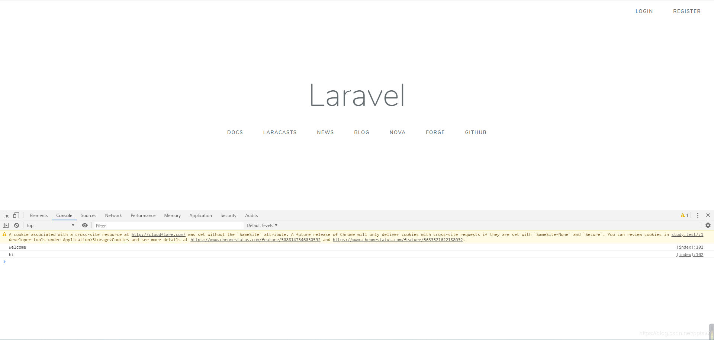

之前写了一篇 [在 laradock 环境中使用 laravel-swoole 加速你的 laravel 应用](https://www.m-finder.com/2019/08/23/laravel-swoole-in-laradock/) 的博客，算是敲开了 laravel-swoole 的大门，今天就继续研究下期中的 websocket 功能。


<!-- more -->

#### 安装 laravel-swoole
这里就不写了，参考上篇。

#### 配置 socket
编辑 laravel  env 文件，写入如下一行：
```env
SWOOLE_HTTP_WEBSOCKET=true
```

然后执行 `php artisan swoole:http infos` 查看状态
```shell
+-----------------+-----------------------------------------------------+
| Name            | Value                                               |
+-----------------+-----------------------------------------------------+
| PHP Version     | 7.2.21-1+ubuntu16.04.1+deb.sury.org+1               |
| Swoole Version  | 4.4.4                                               |
| Laravel Version | 5.8.33                                              |
| Listen IP       | workspace                                           |
| Listen Port     | 1215                                                |
| Server Status   | Online                                              |
| Reactor Num     | 2                                                   |
| Worker Num      | 2                                                   |
| Task Worker Num | 2                                                   |
| Websocket Mode  | On                                                  |
| Master PID      | 326                                                 |
| Manager PID     | 327                                                 |
| Log Path        | /var/www/laravel-learn/storage/logs/swoole_http.log |
+-----------------+-----------------------------------------------------+
```

可以看到 `Websocket Mode` 一项已经打开了。
#### 编辑 socket 路由
在 `routes/websocket.php` 中:
```php
Websocket::on('connect', function ($websocket, Request $request) {
    // called while socket on connect
    $websocket->emit('message', 'welcome');
});

Websocket::on('disconnect', function ($websocket) {
    // called while socket on disconnect
    $websocket->emit('message', 'server is gone, bye~');
});

Websocket::on('example', function ($websocket, $data) {
    $websocket->emit('message', $data);
});

```
此文件修改后需要重启 `swoole:http`。

#### 前端连接 socket
因为 laravel-swoole 使用的是 `Socket.io`，所以这里也采用这个。
```html
<script src="https://cdnjs.cloudflare.com/ajax/libs/socket.io/2.1.1/socket.io.js"></script>
<script type="text/javascript">
    var socket = io('http://study.test:8080/', {transports: ['websocket'], reconnection: true});

    socket.on('connect', function () {
        socket.emit('example', 'hi');

        socket.on('disconnect', function () {
            console.log('disconnect');
        });

        socket.on('message', function (msg) {
            console.log(msg)
        });
    });
</script>
```

#### 配置 nginx
如果你用的 swoole 版本为 ` 4.4.4`，那么还需要对上篇文章中的 nginx 配置做个小修改，即添加一行：
```
 proxy_http_version 1.1;
```

完整配置就不贴了，把这一行加在 `proxy_pass http://swoole-http$suffix;` 这一行前后都行。

如果没有这一行的话，而且怎么也没反应的话，记得去 log 中找具体报错。

emmm，文档没写，在 issue 里扒出来的……


