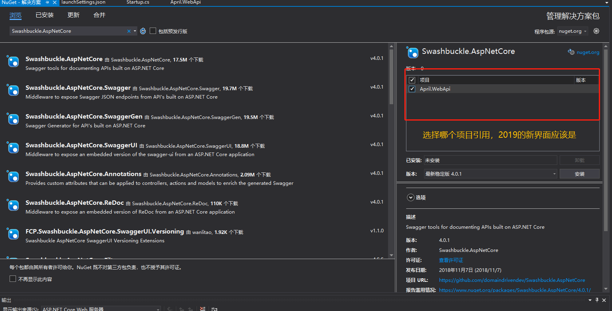
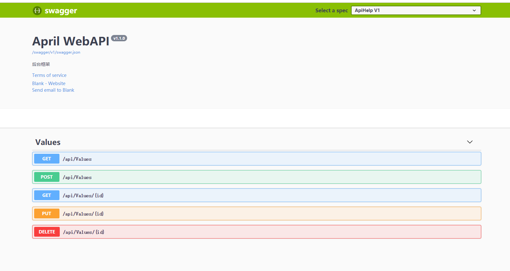
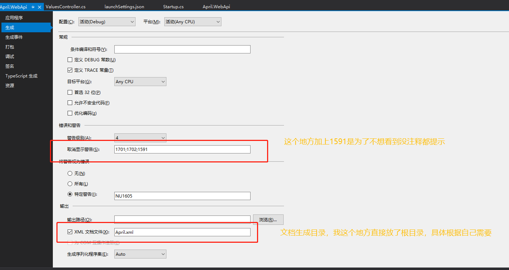
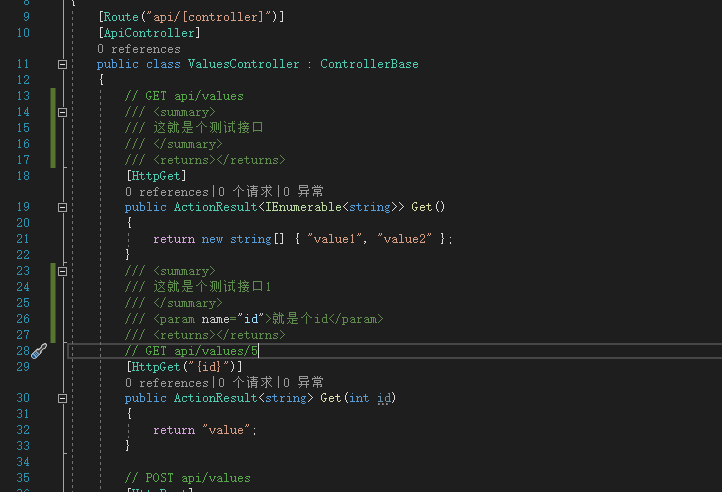
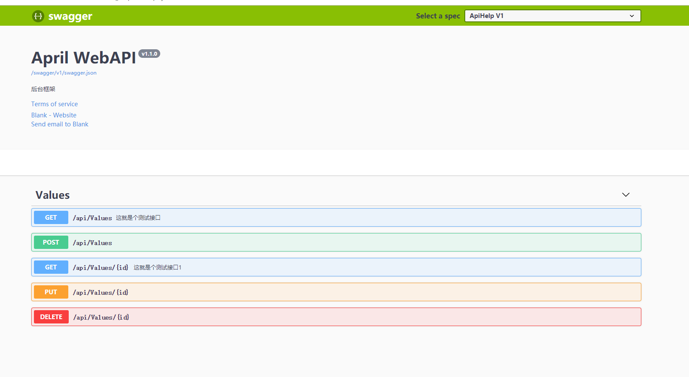
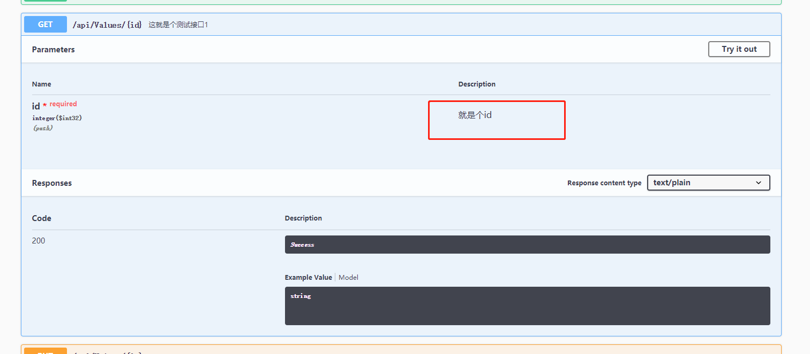

### 前言
前后分离的好处，就是后端埋头做业务逻辑功能，不需要过多考虑用户体验，只专注于数据、性能开发，对于前端需要的数据可以通过组Json或者其他方式回调，但是前后两端需要确定好接口Api的规范，并且前端如果需要查看接口的相关信息，就需要文档的支撑了。那么问题来了，后端在开发过程中每次改动接口，都需要改动文档，累不累。
### Swagger
Swagger作为一个在线文档，通过后端的接口控制器生成一套Json串数据，实时展示后端的接口请求地址，参数，类型以及回调，很好的解决这个问题（后端可以给前端一个Swagger的地址，然后来句你自己看吧，当然还是需要多沟通的），这个在Java里用过之后，就马上看看有没有.net的版本，果然，语言都是相通的，废话不多说，开始**第三方类库的引用**。
### NuGet引用第三方类库
工具->NuGet包管理器->管理解决方案的NuGet程序包...
在**浏览**中查找"Swashbuckle.AspNetCore"，选择项目工程，点击安装。

引入完成后，在Startup.cs文件ConfigureServices中，加入以下代码：
```csharp
        public void ConfigureServices(IServiceCollection services)
        {
            services.AddMvc().SetCompatibilityVersion(CompatibilityVersion.Version_2_2);
            
           #region Swagger
            services.AddSwaggerGen(options =>
            {
                options.SwaggerDoc("v1", new Info
                {
                    Version = "v1.1.0",
                    Title = "April WebAPI",
                    Description = "后台框架",
                    TermsOfService = "None",
                    Contact = new Contact { Name = "Blank", Email = "1829027193@qq.com", Url = "http://www.aprilblank.com" }
                });
            });
            #endregion 
        }
```
在Startup.cs类里编辑Configure方法，加入以下代码：
```csharp
        public void Configure(IApplicationBuilder app, IHostingEnvironment env)
        {
           …
           
            #region Swagger
            app.UseSwagger();
            app.UseSwaggerUI(options =>
            {
                options.SwaggerEndpoint("/swagger/v1/swagger.json", "ApiHelp V1");
            });
            #endregion

            app.UseHttpsRedirection();
            app.UseMvc();
        }
```

重新生成工程后，访问你的端口/swagger就可以看到接口文档帮助界面了。

### 别急，还有
在线的接口文档是有了，可一个接口啥意思都不知道，前端还是得一脸懵逼问你，这个接口啥意思啊，这个参数啥意思啊什么的。

### 没错，注释
还是在Startup.cs文件ConfigureServices中，加入以下代码：
```csharp
        public void ConfigureServices(IServiceCollection services)
        {
            services.AddMvc().SetCompatibilityVersion(CompatibilityVersion.Version_2_2);
            #region Swagger
            services.AddSwaggerGen(options =>
            {
                options.SwaggerDoc("v1", new Info
                {
                    Version = "v1.1.0",
                    Title = "April WebAPI",
                    Description = "后台框架",
                    TermsOfService = "None",
                    Contact = new Contact { Name = "Blank", Email = "790048789@qq.com", Url = "http://www.aprilblank.com" }
                });
                
                // 为 Swagger JSON and UI设置xml文档注释路径
                var basePath = Path.GetDirectoryName(AppContext.BaseDirectory);//获取应用程序所在目录（绝对，不受工作目录影响，建议采用此方法获取路径）
                var xmlPath = Path.Combine(basePath, "April.xml");
                options.IncludeXmlComments(xmlPath);
                
            });
            #endregion
        }
```

右键WebApi这个项目工程，点击属性，在生成这一栏



先拿Values这个控制器做实验

重新生成后会在对应目录看到有Apirl.xml文档文件，运行之后查看/Swagger

点开刚才单独注释参数的/api/Values/{id}

#### 小结
一个WebApi工程离不开文档，而一个在线文档可以省掉自己很多事，并且Swagger也支持在线调试，虽说我自己还是倾向于Postman（后续会介绍相关工具），这个在线文档不仅是方便了前端查看，总之在开发上确实是一个利器。

下一篇，介绍后台核心之一，**Log日志**。