### 前言
作为WebApi接口工程，性能效率是必不可少的，每次的访问请求，数据库读取，业务逻辑处理都或多或少耗费时间，偶尔再来个各种花式for循环，那就嗨翻天了，一些公有的数据，访问频繁且大致重复的数据，我们可以考虑通过缓存来放置内存存储，以内存空间换取时间上的提升，至于缓存的方法，**Cache,Session,Cookie等**，为什么用等呢，因为还有很多缓存的方法，如Redis，具体后面用到了会专门介绍。

### Cache
net core中没有Cache，但是它有MemoryCache，其实，大差不差，毕竟都是Cache。

Cache在项目工程中使用的范围还是挺广泛的：
- 在个人开发的时候，我一般会把系统字典做缓存，方便调用提高响应速度
- 消息推送后，会把消息实体缓存
- 其他，自己看着办吧

首先，引入**Microsoft.Extensions.Caching.Memory**
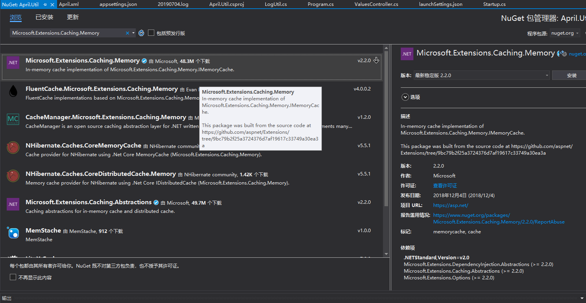
这里我直接在Util引入，前面已经讲了，一个工程引入第三方，其他工程引入项目工程即可使用对应第三方类库。
引入完成后，我们就开始来使用这个MemoryCache吧。
```csharp
	//实例化
	private static readonly MemoryCache Cache = new MemoryCache(new MemoryCacheOptions());
	/// <summary>
    /// 添加缓存
    /// </summary>
    /// <param name="key">缓存Key</param>
    /// <param name="value">缓存Value</param>
    /// <param name="expiresSliding">滑动过期时长（如果在过期时间内有操作，则以当前时间点延长过期时间）</param>
    /// <param name="expiressAbsoulte">绝对过期时长</param>
    /// <returns></returns>
    public static bool Set(string key, object value, TimeSpan expiresSliding, TimeSpan expiressAbsoulte)
    {
        if (key == null)
            throw new ArgumentNullException(nameof(key));
        if (value == null)
            throw new ArgumentNullException(nameof(value));

        Cache.Set(key, value,
            new MemoryCacheEntryOptions().SetSlidingExpiration(expiresSliding)
                .SetAbsoluteExpiration(expiressAbsoulte));
        return Exists(key);
    }

    /// <summary>
    /// 添加缓存
    /// </summary>
    /// <param name="key">缓存Key</param>
    /// <param name="value">缓存Value</param>
    /// <param name="expiresIn">缓存时长</param>
    /// <param name="isSliding">是否滑动过期（如果在过期时间内有操作，则以当前时间点延长过期时间）</param>
    /// <returns></returns>
    public static bool Set(string key, object value, TimeSpan expiresIn, bool isSliding = false)
    {
        if (key == null)
            throw new ArgumentNullException(nameof(key));
        if (value == null)
            throw new ArgumentNullException(nameof(value));

        Cache.Set(key, value,
            isSliding
                ? new MemoryCacheEntryOptions().SetSlidingExpiration(expiresIn)
                : new MemoryCacheEntryOptions().SetAbsoluteExpiration(expiresIn));

        return Exists(key);
    }
```

这个地方大致列下如何使用，其实对于第三方的包，我们封装是为了减少其他开发人员的学习成本，后面的SqlSugar等类库一样，其实本身第三方已经做了一次封装整合，而我们是因为实际开发需要来针对不同的业务功能做不同的封装整合，接口开放等。

补个测试效果，写到Session才想起来，唉，果然写东西不能让打断，-,-||。

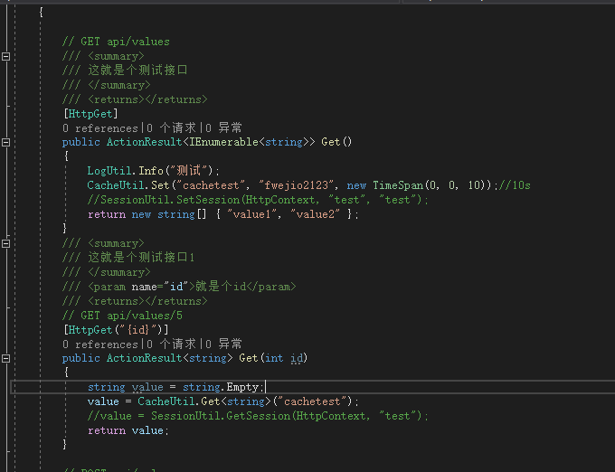

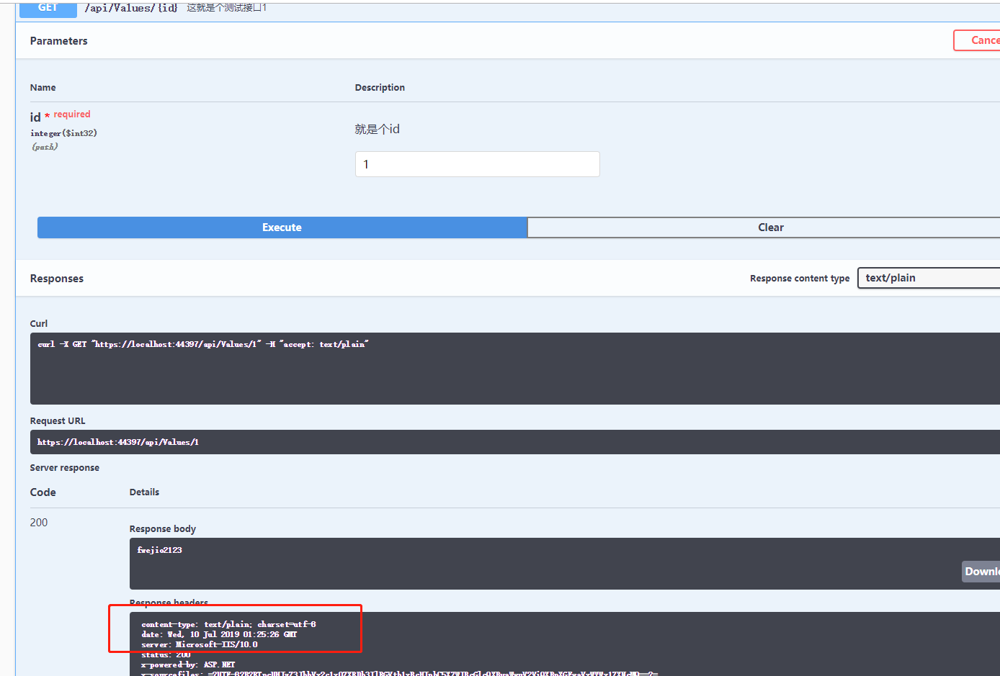
注意观察时间，一段时间后Cache过期销毁。
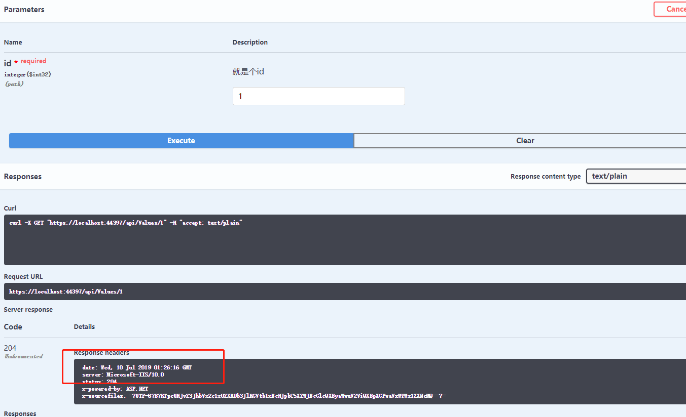

### Session
最初鼓捣net core的时候，我确实没有过多关注Session这个会话模式，毕竟只有浏览器才能使用，之前跟别人谈到Session多爽的时候，说道Session其实本质上类似Cookie（当然我也不清楚），因为用户访问后会有个SessionID，有状态的访问会留下Cookie也是情有可原的，如果用户自己整个隐私模式访问，那，再见（你就在登录界面循环往复吧）。

在用户登录后，Session存储用户基本登录信息这个是web端常用的手段，毕竟跟浏览器打交道Cookie少不了，对于无状态访问授权的[JWT](https://jwt.io/)也是折腾过，不过还是理解不透彻，统一的授发token的方式还是挺可取的，如果是多服务，多应用，负载均衡的场景，单点登录确实方便，但是我常规会自己生成token来通过Session或者Redis存储，实际效果应该是差不多吧。
好了，废话不多说，一样是引入**Microsoft.AspNetCore.Session**
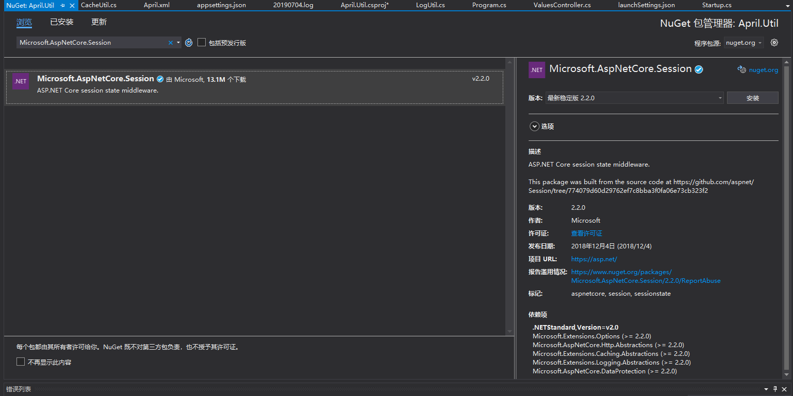
引入完成后，在Startup.cs注册Session服务。
```csharp
        public void ConfigureServices(IServiceCollection services)
        {
            //…之前的代码
            
            #region Session
            services.AddSession(options =>
            {
                options.Cookie.Name = "April.Session";
                options.IdleTimeout = TimeSpan.FromSeconds(2000);//设置session的过期时间
                options.Cookie.HttpOnly = true;//设置在浏览器不能通过js获得该cookie的值,实际场景根据自身需要
            });
            #endregion
        }
```
注册服务后，需要在ConfigConfigure使用，注意所有的Use要在UserMvc之前才能生效。
```csharp
        public void Configure(IApplicationBuilder app, IHostingEnvironment env)
        {
            //…之前的代码

            app.UseSession();//这里使用

            app.UseHttpsRedirection();
            app.UseMvc();
        }
```

在Util创建一个SessionUtil，来封装Session方法，这里只简单描述下如何使用，后续代码开源后可查看源码使用。
```csharp
    public class SessionUtil
    {
        /// <summary>
        /// 设置Session
        /// </summary>
        /// <param name="key">键</param>
        /// <param name="value">值</param>
        public void SetSession(HttpContext content,string key, string value)
        {
            content.Session.SetString(key, value);
        }
        /// <summary>
        /// 获取Session
        /// </summary>
        /// <param name="key">键</param>
        /// <returns>返回对应的值</returns>
        public string GetSession(HttpContext context, string key, string defaultValue = "")
        {
            string value = context.Session.GetString(key);
            if (string.IsNullOrEmpty(value))
            {
                value = defaultValue;
            }
            return value;
        }
    }
```
我们依然拿这个万恶的ValuesController开刀。

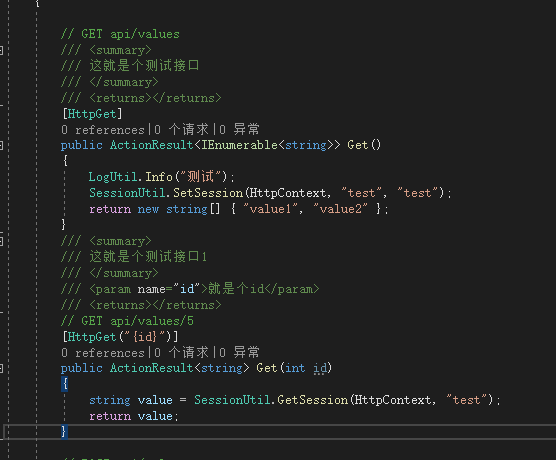
运行后，访问这个Values/{id}接口，发现我们的Session值已经获取到了。
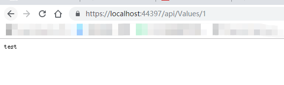

HttpContext这个对象，可以通过IServiceProvider来获取，这样方便调用统一维护。
新建AprilConfig类文件，代码如下：
```csharp
    public class AprilConfig
    {
        public static IServiceProvider _provider;

        public static HttpContext HttpCurrent
        {
            get
            {
                object factory = _provider.GetService(typeof(IHttpContextAccessor));
                HttpContext context = ((IHttpContextAccessor)factory).HttpContext;
                return context;
            }
        }
    }
```

写好后我们需要回到Startup.cs，给IserviceProvider赋值。
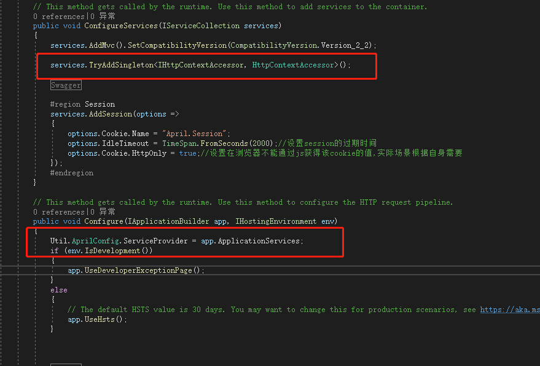
SessionUtil代码修改调整，不需要再传HttpContext这个参数。
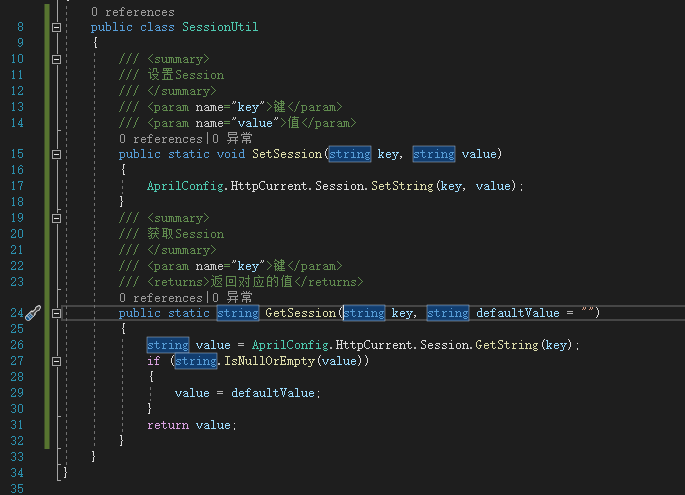
这样少传一个是一个，后续用到HttpContext这个上下文的时候，也不用考虑啥了，直接**AprilConfig.HttpCurrent**走起。

### Cookie
Cookie在web开发使用的还是相当频繁的，毕竟不占用服务器内存，跟服务器基本上没半毛钱关系，客户端的内存想咋折腾咋折腾，客户端的资源想咋使用咋使用（ps：这就是为啥你的电脑越来越卡，软件开发不考虑性能优化的种种结果）。

Cookie本身在net core中已经支持，所以不需要引入啥NuGet包。

新建CookieUtil（不要吐槽我的命名方法，习惯了）。
```csharp
public class CookieUtil
    {
        /// <summary>
        /// 设置本地cookie
        /// </summary>
        /// <param name="key">键</param>
        /// <param name="value">值</param>  
        /// <param name="minutes">过期时长，单位：分钟</param>      
        public static void SetCookies(string key, string value, int minutes = 10)
        {
            AprilConfig.HttpCurrent.Response.Cookies.Append(key, value, new CookieOptions
            {
                Expires = DateTime.Now.AddMinutes(minutes)
            });
        }
        /// <summary>
        /// 删除指定的cookie
        /// </summary>
        /// <param name="key">键</param>
        public static void DeleteCookies(string key)
        {
            //这个地方想判断就判断下，不过内部封装的方法应该是已经做过处理
            AprilConfig.HttpCurrent.Response.Cookies.Delete(key);
        }

        /// <summary>
        /// 获取cookies
        /// </summary>
        /// <param name="key">键</param>
        /// <returns>返回对应的值</returns>
        public static string GetCookies(string key,string defaultValue="")
        {
            string value = string.Empty;
            AprilConfig.HttpCurrent.Request.Cookies.TryGetValue(key, out value);
            if (string.IsNullOrEmpty(value))
            {
                value = defaultValue;
            }
            return value;
        }
    }
```

写好之后，老规矩ValuesController走一波。
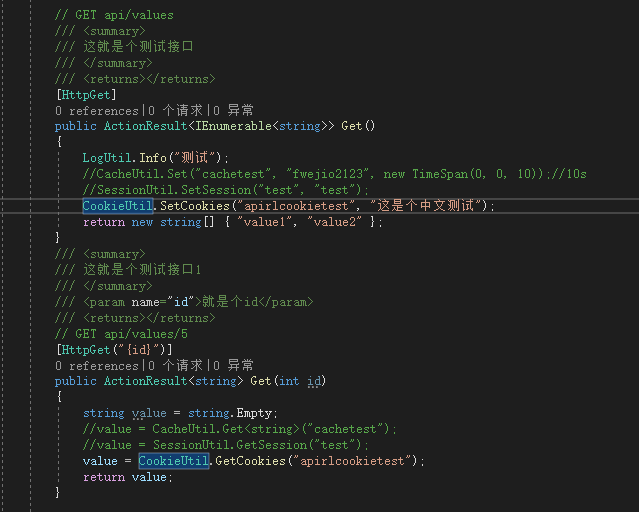
测试结果：
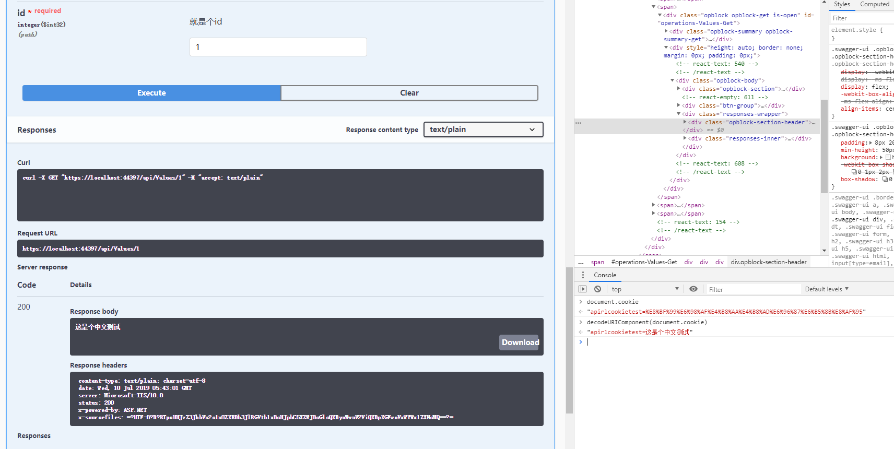

### 小结
从创建工程到在线文档，日志管理，缓存机制基本上走了一遍了，下一步，就是数据层的操作，一个工程管理肯定少不了数据的支撑，总不能每次都自己YY数据吧，下一节，**数据库操作**。

### 补充
针对Session.SetString的方法没有问题，需要引入一个NuGet包，这个里面包含官方的扩展方法，**Microsoft.AspNetCore.Http.Abstractions**。