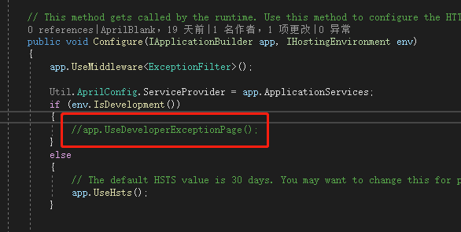
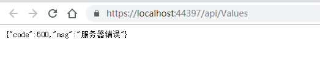
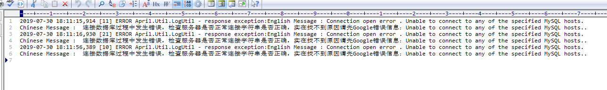
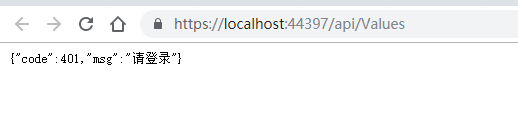
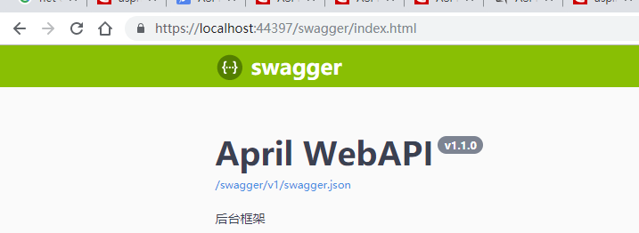
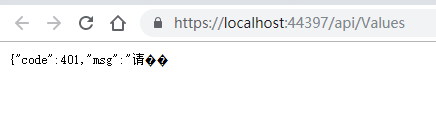
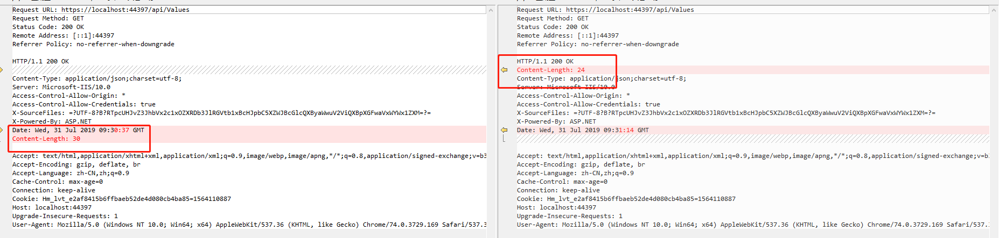
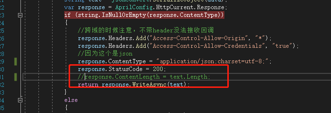

### 前言
一天天不知道怎么过的，但确实挺忙，事赶事不带停那种，让我感觉跟在流水线干活一样，忙活的事差不多了就喘口气继续补充这一系列的内容，前面几篇基本上把一个常规的后端服务搭建差不多了，后面的会时不时根据自己需要或者常规的测试内容来一点点完善更新。

### 拦截器
这里先不提AOP的内容，其实在我个人之前的理解，AOP开发的思想就是，我们做的某些操作例如身份验证，日志记录，异常抓捕等等这些操作，可以单独拎出来放那，谁用了加个头部标识就可以了，剩余的交给代码来处理，这样我们开发就只需要关心业务功能，而其他的全都可以不用考虑，这就是框架的好处，别人封装集成好，就可以省去很大的开发工作量。

好，开始说拦截器，其实也是中间层，个人感觉跟AOP的概念类似，就放到这里写上了。

### 异常拦截器
在我们**Api**的工程目录下新建文件夹Filters用于存放拦截器，之后我们新建**ExceptionFilter**这个异常的拦截器，用于记录工程抛异常并做对应回调处理。

代码如下，具体不过多解释，因为实在觉得这个没啥说的，只是注意异步调用的问题即可。
```csharp
    public class ExceptionFilter
    {
        private readonly RequestDelegate _next;

        /// <summary>
        /// 
        /// </summary>
        /// <param name="next"></param>
        public ExceptionFilter(RequestDelegate next)
        {
            _next = next;
        }

        /// <summary>
        /// 
        /// </summary>
        /// <param name="context"></param>
        /// <returns></returns>
        public async Task Invoke(HttpContext context)
        {
            try
            {
                await _next(context);
            }
            catch (Exception ex) //发生异常
            {
                context.Response.StatusCode = 500;
                LogUtil.Error($"response exception:{ex.Message}");// {ex.StackTrace}
                await ResponseUtil.HandleExceptionAsync(500, "服务器错误");
            }
        }
    }
```

这个地方的**ResponseUtil**是单独在Util层创建的（公共类尽量扔到同一个工程类库下，以后一键打包，各种复用）。

```csharp
    public class ResponseUtil
    {
        /// <summary>
        /// 回调
        /// </summary>
        /// <param name="statusCode">html状态码</param>
        /// <param name="msg">消息</param>
        /// <returns></returns>
        public static Task HandleExceptionAsync(int statusCode, string msg)
        {
            var data = new { code = statusCode, msg = msg };
            string text = JsonConvert.SerializeObject(data);
            var response = AprilConfig.HttpCurrent.Response;
            if (string.IsNullOrEmpty(response.ContentType))
            {
                //跨域的时候注意，不带header没法接收回调
                response.Headers.Add("Access-Control-Allow-Origin", "*");
                response.Headers.Add("Access-Control-Allow-Credentials", "true");
                //因为这个是json
                response.ContentType = "application/json;charset=utf-8";
                response.StatusCode = 200;
                response.ContentLength = text.Length;
                return response.WriteAsync(text);
            }
            else
            {
                return response.WriteAsync(text);
            }
        }
    }
```

之后我们依然要在Startup中注册我们这个中间层。

```csharp
        public void Configure(IApplicationBuilder app, IHostingEnvironment env)
        {
            app.UseMiddleware<ExceptionFilter>();
			…
        }
```

这样我们在全局如果出现异常的时候，可以统一捕获到问题，然后做记录，当然在测试环境下注意，如果这个错误帮助页打开的时候，那上面的拦截器将毫无乱用。

### 测试结果


这样如果真是哪个地方没有做异常捕获，全局最终都会一个不漏的抓住然后告诉你，好处是如果懒那就所有地方都不写了，问题是有些异常即使捕获但是不需要告知用户也不需要做记录（比如文件上传下载的线程中断异常之类的），所以这个只是为了保险起见而不是为了省事。

### 身份验证拦截器
接下来我们继续创建一个**AuthFilter**，目的是做身份验证的判断，如果没通过就没必要再进入具体的控制器了。
```csharp
    public class AuthFilter
    {
        private readonly RequestDelegate _next;

        public AuthFilter(RequestDelegate next)
        {
            _next = next;
        }

        public Task Invoke(HttpContext context)
        {
            if (context.Request.Method == "OPTIONS")
            {
                return _next(context);
            }
            var headers = context.Request.Headers;
            //检查头文件是否有jwt token
            if (!headers.ContainsKey("Authorization"))
            {
                string path = context.Request.Path.Value;
                if (!AprilConfig.AllowUrl.Contains(path) && path.IndexOf("swagger") < 0)
                {
                    //这里做下相关的身份校验
                    return ResponseUtil.HandleExceptionAsync(401, "请登录");
                    
                    //判断是否有权限查看(在身份验证后判断对应的权限，这个方法后续再写)
                    return ResponseUtil.HandleExceptionAsync(-2, "无权访问");

                }
            }
            return _next(context);
        }
    }
```

同样我们需要在Startup注册使用中间层。
```csharp
        public void Configure(IApplicationBuilder app, IHostingEnvironment env)
        {
            app.UseMiddleware<ExceptionFilter>();
            app.UseMiddleware<AuthFilter>();
			…
        }
```

### 测试

然后访问我们的Swagger，效果就很明显了。


### 小结
这一篇主要就是引入中间层的使用，个人认为什么AOP开发OOP开发完全因人而异，没必要为了追求新技术而去整体大功能改造，新技术确实使用起来方便，也有很好的前景，但是对于企业来讲，稳定是最重要的，不会为了1%的性能速度而去冒30%甚至更高的风险，但是我还是要说一句，**net core到目前为止已经历过一个大版本的更新，虽然3.0没有正式发布，但是一个个版本的更新之后，稳定性已经很ok了，所以该吃螃蟹都可以动手了**。
下一篇，继续引入AOP的开发，主要用的第三方的组件**AspectCore**，将针对接口调用的时候做一些常规操作。

***

### 补充 2019-07-31
今天在做调试的时候发现一个问题，现状如下

发现这个问题我的第一反应是，**字符编码**，但是看到我回调的时候明显已经设置了ContentType，所以这个应该不是错误的原因，但是多次刷新的测试结果是偶尔正常，怪异的情况总是伴随着bug，于是比对了正确的回调信息和错误的回调信息（这里是通过chrome浏览器调试然后获取的回调信息，具体调试方法后续前端介绍，当然基本上都知道）。


这样一看发现了问题所在，所以这个地方决定不再自主去设置Length了。

