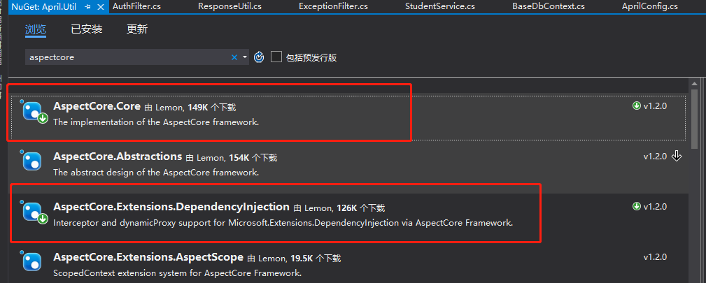
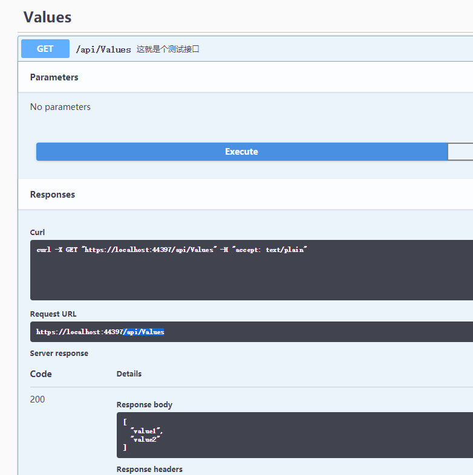
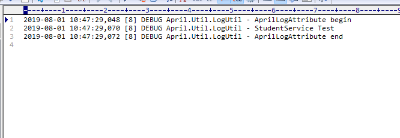
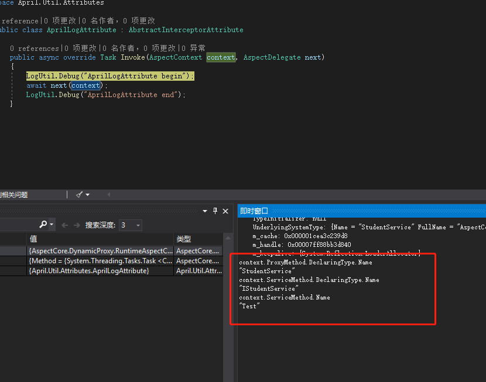

### 前言
前一篇讲到了中间层的使用，可能不是那么AOP，今天主要来说下一个轻量级的AOP第三方类库**AspectoCore**。

简单介绍下这个类库，AspectCore Project 是适用于 net core 平台的轻量级 Aop(Aspect-oriented programming) 解决方案，它更好的遵循 net core 的模块化开发理念，使用AspectCore可以更容易构建低耦合、易扩展的Web应用程序。

### 引入
首先，我们在Util层直接引入相关的类库。

然后我们还是先在Startup注册下，将ConfigureServices方法从void更改为IServiceProvider，目的就是，这个管道给别人了，不再由默认的来了。
```csharp
	public IServiceProvider ConfigureServices(IServiceCollection services)
	{
		//...之前的
		services.AddAspectCoreContainer();
        return services.BuildAspectInjectorProvider();
	}
```

### 自定义属性
写完之后，我们就可以来试试这个玩意儿怎么玩了，不多说，Util来个文件夹**Attributes**，然后新建一个类**AprilLogAttribute**，继承**AbstractInterceptorAttribute**。
```csharp
    public class AprilLogAttribute : AbstractInterceptorAttribute
    {
        public async override Task Invoke(AspectContext context, AspectDelegate next)
        {
            LogUtil.Debug("AprilLogAttribute begin");
            await next(context);
            LogUtil.Debug("AprilLogAttribute end");
        }
    }
```
没啥具体的使用注解，就是加个前后注释的作用。然后我们在之前的Student这个接口中加上一个测试方法。
```csharp
    public interface IStudentService : IBaseService<StudentEntity>
    {
        [AprilLog]
        void Test();
    }
```
StudentService我们来实现这个方法。
```csharp
    public class StudentService : BaseService<StudentEntity>, IStudentService
    {
        public void Test()
        {
            LogUtil.Debug("StudentService Test");
        }
    }
```

### 测试
全部搞定之后，我们继续Values开刀，注释掉之前的代码之后，只留一个Test方法。
```csharp
        [HttpGet]
        public ActionResult<IEnumerable<string>> Get()
        {
            _service.Test();
            return new string[] { "value1", "value2" };
        }
```

别忘了运行前在application.json里面加上接口白名单。
```json
{
  "Logging": {
    "LogLevel": {
      "Default": "Warning"
    }
  },
  "AllowedHosts": "*",
  "CommonSettings": {
    "FilePath": "/uploads/files/"
  },
  "DefaultSqlConnectionString": {
    "MySql": "server=127.0.0.1;userid=root;password=root;database=test;"
  },
  "AllowUrl": "/api/Values" //这个如果没有那一直是返回未登录
}
```


运行没问题，我们来看下日志记录。

另外也补充下这个记录的问题，如果需要监视接口调用的情况，我们可以加上断点看下这个context，这个对象里面本身已经包含了我们调用了哪个接口的哪个方法等等信息，这里只举个简单的例子，我们可以知道我们调用的接口及方法，包括实现及方法，然后可以记录下是谁访问，哪个接口，执行时间等等。


### 小结
写到这里，net core webapi的基础工程基本上已经完工了，通过这些记录我本身又对之前的工程进行了小量的改动，每次的一版写完都有一个新的感受，可能当时写一版的时候没有想太多，一遍一遍的过完之后发现有些地方可以优化，并且优化的效果也是挺明显，后续如果有新的功能实现或者业务需要的时候，也会同步更新的这个示例工程。
