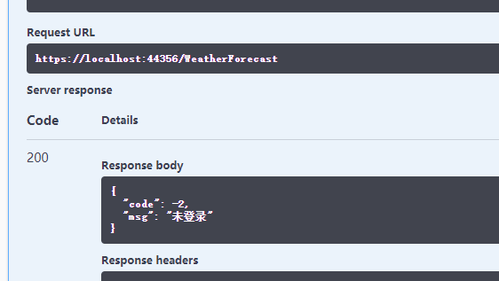
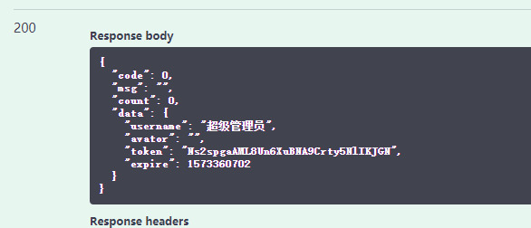
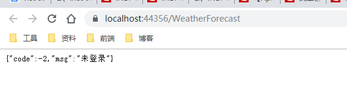
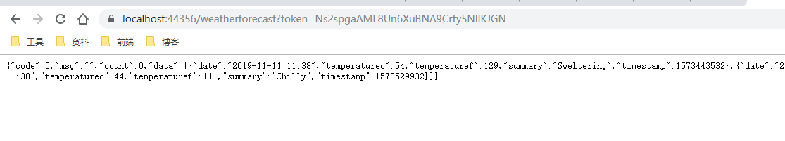
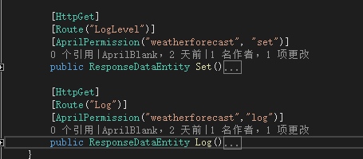
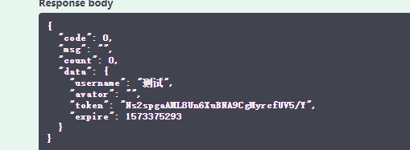
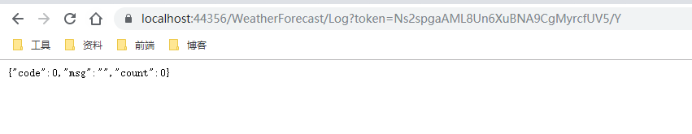
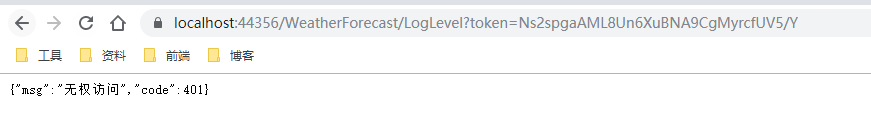

### 前言
在之前已经提到过，公用类库Util已经开源，目的一是为了简化开发的工作量，毕竟有些常规的功能类库重复率还是挺高的，二是为了一起探讨学习软件开发，用的人越多问题也就会越多，解决的问题越多功能也就越完善，**仓库地址：** [April.Util_github](https://github.com/AprilBlank/April.Util.Public)，[April.Util_gitee](https://gitee.com/AprilBlank/April.Util.Public)，还没关注的朋友希望可以先mark，后续会持续维护。

### 权限
在之前的[net core WebApi——公用库April.Util公开及发布](/2019/11/07/net-core-april-util/)中已经介绍了初次发布的一些功能，其中包括缓存，日志，加密，统一的配置等等，具体可以再回头看下这篇介绍，而在其中有个**TokenUtil**，因为当时发布的时候这块儿还没有更新上，趁着周末来整理下吧。

关于webapi的权限，可以借助Identity，Jwt，但是我这里没有借助这些，只是自己做了个token的生成已经存储用户主要信息，对于权限我想大多数人已经有了一套自己的权限体系，所以这里我简单介绍下我的思路。

1. 首先对于菜单做权限标示，请求的控制器，请求的事件
2. 菜单信息维护后，设置角色对应多个菜单
3. 管理员对应多个角色
4. 在登录的时候根据账号信息获取对应管理员的角色及最终菜单，控制器，事件
5. 处理管理员信息后自定义token，可设置token过期时间，token可以反解析（如果到期自动重新授权，我这里没有处理）
6. 每次访问接口的时候（除公开不需校验的接口），根据请求的路径判断是否有当前控制器权限（通过中间层），进入接口后判断是否有对应权限（通过标签）

> 通过上述流程来做权限的校验，当然这里只是针对单应用，如果是多应用的话，这里还要考虑应用问题（如，一个授权认证工程主做身份校验，多个应用工程通用一个管理）。

首先，我们需要一个可以存储管理员的对应属性集合**AdminEntity**，主要存储基本信息，控制器集合，权限集合，数据集合（也就是企业部门等）。

```csharp
    /// <summary>
    /// 管理员实体
    /// </summary>
    public class AdminEntity
    {
        private int _ID = -1;
        private string _UserName = string.Empty;
        private string _Avator = string.Empty;
        private List<string> _Controllers = new List<string>();
        private List<string> _Permissions = new List<string>();
        private int _TokenType = 0;
        private bool _IsSuperManager = false;
        private List<int> _Depts = new List<int>();
        private int _CurrentDept = -1;
        private DateTime _ExpireTime = DateTime.Now;

        /// <summary>
        /// 主键
        /// </summary>
        public int ID { get => _ID; set => _ID = value; }
        /// <summary>
        /// 用户名
        /// </summary>
        public string UserName { get => _UserName; set => _UserName = value; }
        /// <summary>
        /// 头像
        /// </summary>
        public string Avator { get => _Avator; set => _Avator = value; }
        /// <summary>
        /// 控制器集合
        /// </summary>
        public List<string> Controllers { get => _Controllers; set => _Controllers = value; }
        /// <summary>
        /// 权限集合
        /// </summary>
        public List<string> Permissions { get => _Permissions; set => _Permissions = value; }
        /// <summary>
        /// 访问方式
        /// </summary>
        public int TokenType { get => _TokenType; set => _TokenType = value; }
        /// <summary>
        /// 是否为超管
        /// </summary>
        public bool IsSuperManager { get => _IsSuperManager; set => _IsSuperManager = value; }
        /// <summary>
        /// 企业集合
        /// </summary>
        public List<int> Depts { get => _Depts; set => _Depts = value; }
        /// <summary>
        /// 当前企业
        /// </summary>
        public int CurrentDept { get => _CurrentDept; set => _CurrentDept = value; }
        /// <summary>
        /// 过期时间
        /// </summary>
        public DateTime ExpireTime { get => _ExpireTime; set => _ExpireTime = value; }
    }
```

之后我们来完成TokenUtil这块儿，首先是生成我们的token串，因为考虑到需要反解析，所以这里采用的是字符串加解密，当然这个加密串具体是什么可以自定义，目前我这里设置的是固定需要两个参数{id}，{ts}，目的是为了保证加密串的唯一，当然也是为了过期无感知重新授权准备的。

```csharp
    public class TokenUtil
    {
        /// <summary>
        /// 设置token
        /// </summary>
        /// <returns></returns>
        public static string GetToken(AdminEntity user, out string expiretimstamp)
        {
            string id = user.ID.ToString();
            double exp = 0;
            switch ((AprilEnums.TokenType)user.TokenType)
            {
                case AprilEnums.TokenType.Web:
                    exp = AprilConfig.WebExpire;
                    break;
                case AprilEnums.TokenType.App:
                    exp = AprilConfig.AppExpire;
                    break;
                case AprilEnums.TokenType.MiniProgram:
                    exp = AprilConfig.MiniProgramExpire;
                    break;
                case AprilEnums.TokenType.Other:
                    exp = AprilConfig.OtherExpire;
                    break;
            }
            DateTime date = DateTime.Now.AddHours(exp);
            user.ExpireTime = date;
            double timestamp = DateUtil.ConvertToUnixTimestamp(date);
            expiretimstamp = timestamp.ToString();
            string token = AprilConfig.TokenSecretFormat.Replace("{id}", id).Replace("{ts}", expiretimstamp);
            token = EncryptUtil.EncryptDES(token, EncryptUtil.SecurityKey);
            //LogUtil.Debug($"用户{id}获取token：{token}");
            Add(token, user);
            //处理多点登录
            SetUserToken(token, user.ID);
            return token;
        }

        /// <summary>
        /// 通过token获取当前人员信息
        /// </summary>
        /// <param name="token"></param>
        /// <returns></returns>
        public static AdminEntity GetUserByToken(string token = "")
        {
            if (string.IsNullOrEmpty(token))
            {
                token = GetTokenByContent();
            }
            if (!string.IsNullOrEmpty(token))
            {
                
                AdminEntity admin = Get(token);
                if (admin != null)
                {
                    //校验时间
                    if (admin.ExpireTime > DateTime.Now)
                    {
                        if (AprilConfig.AllowSliding)
                        {
                            //延长时间
                            admin.ExpireTime = DateTime.Now.AddMinutes(30);
                            //更新
                            Add(token, admin);
                        }
                        return admin;
                    }
                    else
                    {
                        //已经过期的就不再延长了，当然后续根据情况改进吧
                        return null;
                    }
                }
            }
            return null;
        }
        /// <summary>
        /// 通过用户请求信息获取Token信息
        /// </summary>
        /// <returns></returns>
        public static string GetTokenByContent()
        {
            string token = "";
            //判断header
            var headers = AprilConfig.HttpCurrent.Request.Headers;
            if (headers.ContainsKey("token"))
            {
                token = headers["token"].ToString();
            }
            if (string.IsNullOrEmpty(token))
            {
                token = CookieUtil.GetString("token");
            }
            if (string.IsNullOrEmpty(token))
            {
                AprilConfig.HttpCurrent.Request.Query.TryGetValue("token", out StringValues temptoken);
                if (temptoken != StringValues.Empty)
                {
                    token = temptoken.ToString();
                }
            }
            return token;
        }
        /// <summary>
        /// 移除Token
        /// </summary>
        /// <param name="token"></param>
        public static void RemoveToken(string token = "")
        {
            if (string.IsNullOrEmpty(token))
            {
                token = GetTokenByContent();
            }
            if (!string.IsNullOrEmpty(token))
            {
                Remove(token);
            }
        }

        #region 多个登录
        /// <summary>
        /// 多个登录设置缓存
        /// </summary>
        /// <param name="token"></param>
        /// <param name="userid"></param>
        public static void SetUserToken(string token, int userid)
        {
            Dictionary<int, List<string>> dicusers = CacheUtil.Get<Dictionary<int, List<string>>>("UserToken");
            if (dicusers == null)
            {
                dicusers = new Dictionary<int, List<string>>();
            }
            List<string> listtokens = new List<string>();
            if (dicusers.ContainsKey(userid))
            {
                listtokens = dicusers[userid];
                if (listtokens.Count <= 0)
                {
                    listtokens.Add(token);
                }
                else
                {
                    if (!AprilConfig.AllowMuiltiLogin)
                    {
                        foreach (var item in listtokens)
                        {
                            RemoveToken(item);
                        }
                        listtokens.Add(token);
                    }
                    else
                    {
                        bool isAdd = true;
                        foreach (var item in listtokens)
                        {
                            if (item == token)
                            {
                                isAdd = false;
                            }
                        }
                        if (isAdd)
                        {
                            listtokens.Add(token);
                        }
                    }
                }
            }
            else
            {

                listtokens.Add(token);
                dicusers.Add(userid, listtokens);
            }
            CacheUtil.Add("UserToken", dicusers, new TimeSpan(6, 0, 0), true);
        }
        /// <summary>
        /// 多个登录删除缓存
        /// </summary>
        /// <param name="userid"></param>
        public static void RemoveUserToken(int userid)
        {
            Dictionary<int, List<string>> dicusers = CacheUtil.Get<Dictionary<int, List<string>>>("UserToken");
            if (dicusers != null && dicusers.Count > 0)
            {
                if (dicusers.ContainsKey(userid))
                {
                    //删除所有token
                    var listtokens = dicusers[userid];
                    foreach (var token in listtokens)
                    {
                        RemoveToken(token);
                    }
                    dicusers.Remove(userid);
                }
            }
        }
        /// <summary>
        /// 多个登录获取
        /// </summary>
        /// <param name="userid"></param>
        /// <returns></returns>
        public static List<string> GetUserToken(int userid)
        {
            Dictionary<int, List<string>> dicusers = CacheUtil.Get<Dictionary<int, List<string>>>("UserToken");
            List<string> lists = new List<string>();
            if (dicusers != null && dicusers.Count > 0)
            {
                foreach (var item in dicusers)
                {
                    if (item.Key == userid)
                    {
                        lists = dicusers[userid];
                        break;
                    }
                }
            }
            return lists;
        }
        #endregion

        #region 私有方法(这块儿还需要改进)

        private static void Add(string token,AdminEntity admin)
        {
            switch (AprilConfig.TokenCacheType)
            {
                //不推荐Cookie
                case AprilEnums.TokenCacheType.Cookie:
                    CookieUtil.Add(token, admin);
                    break;
                case AprilEnums.TokenCacheType.Cache:
                    CacheUtil.Add(token, admin, new TimeSpan(0, 30, 0));
                    break;
                case AprilEnums.TokenCacheType.Session:
                    SessionUtil.Add(token, admin);
                    break;
                case AprilEnums.TokenCacheType.Redis:
                    RedisUtil.Add(token, admin);
                    break;
            }
        }

        private static AdminEntity Get(string token)
        {
            AdminEntity admin = null;
            switch (AprilConfig.TokenCacheType)
            {
                case AprilEnums.TokenCacheType.Cookie:
                    admin = CookieUtil.Get<AdminEntity>(token);
                    break;
                case AprilEnums.TokenCacheType.Cache:
                    admin = CacheUtil.Get<AdminEntity>(token);
                    break;
                case AprilEnums.TokenCacheType.Session:
                    admin = SessionUtil.Get<AdminEntity>(token);
                    break;
                case AprilEnums.TokenCacheType.Redis:
                    admin = RedisUtil.Get<AdminEntity>(token);
                    break;
            }
            return admin;
        }

        private static void Remove(string token)
        {
            switch (AprilConfig.TokenCacheType)
            {
                case AprilEnums.TokenCacheType.Cookie:
                    CookieUtil.Remove(token);
                    break;
                case AprilEnums.TokenCacheType.Cache:
                    CacheUtil.Remove(token);
                    break;
                case AprilEnums.TokenCacheType.Session:
                    SessionUtil.Remove(token);
                    break;
                case AprilEnums.TokenCacheType.Redis:
                    RedisUtil.Remove(token);
                    break;
            }
        }
        #endregion
    }
```

### 中间层
当然这也在之前已经提到过[net core Webapi基础工程搭建（七）——小试AOP及常规测试_Part 1](/2019/07/30/net-core-aop-1/)，当时还觉得这个叫做拦截器，too young too simple，至于使用方法这里就不多说了，可以参考之前2.2版本的东西，也可以看代码仓库中的示例工程。

```csharp
    public class AprilAuthorizationMiddleware
    {
        private readonly RequestDelegate next;

        public AprilAuthorizationMiddleware(RequestDelegate next)
        {
            this.next = next;
        }

        public Task Invoke(HttpContext context)
        {
            if (context.Request.Method != "OPTIONS")
            {
                string path = context.Request.Path.Value;
                if (!AprilConfig.AllowUrl.Contains(path))
                {
                    //获取管理员信息
                    AdminEntity admin = TokenUtil.GetUserByToken();
                    if (admin == null)
                    {
                        //重新登录
                        return ResponseUtil.HandleResponse(-2, "未登录");
                    }
                    if (!admin.IsSuperManager)
                    {
                        //格式统一为/api/Controller/Action，兼容多级如/api/Controller1/ConrolerInnerName/xxx/Action
                        string[] strValues = System.Text.RegularExpressions.Regex.Split(path, "/");

                        string controller = "";
                        bool isStartApi = false;
                        if (path.StartsWith("/api"))
                        {
                            isStartApi = true;
                        }
                        for (int i = 0; i < strValues.Length; i++)
                        {
                            //为空，为api，或者最后一个
                            if (string.IsNullOrEmpty(strValues[i]) || i == strValues.Length - 1)
                            {
                                continue;
                            }
                            if (isStartApi && strValues[i] == "api")
                            {
                                continue;
                            }
                            if (!string.IsNullOrEmpty(controller))
                            {
                                controller += "/";
                            }
                            controller += strValues[i];
                        }
                        if (string.IsNullOrEmpty(controller))
                        {
                            controller = strValues[strValues.Length - 1];
                        }
                        if (!admin.Controllers.Contains(controller.ToLower()))
                        {
                            //无权访问
                            return ResponseUtil.HandleResponse(401, "无权访问");
                        }

                    }
                }
            }
            return next.Invoke(context);
        }
    }
```

Ok，我们先来看下Login中的操作以及实现效果吧。

```csharp
		[HttpPost]
        public async Task<ResponseDataEntity> Login(LoginFormEntity formEntity)
        {
            if (string.IsNullOrEmpty(formEntity.LoginName) || string.IsNullOrEmpty(formEntity.Password))
            {
                return ResponseUtil.Fail("请输入账号密码");
            }
            if (formEntity.LoginName == "admin")
            {
                //这里实际应该通过db获取管理员
                string password = EncryptUtil.MD5Encrypt(formEntity.Password, AprilConfig.SecurityKey);
                if (password == "B092956160CB0018")
                {
                    //获取管理员相关权限，同样是db获取，这里只做展示
                    AdminEntity admin = new AdminEntity
                    {
                        UserName = "超级管理员",
                        Avator = "",
                        IsSuperManager = true,
                        TokenType = (int)AprilEnums.TokenType.Web
                    };
                    string token = TokenUtil.GetToken(admin, out string expiretimestamp);
                    int expiretime = 0;
                    int.TryParse(expiretimestamp, out expiretime);
                    //可以考虑记录登录日志等其他信息
                    return ResponseUtil.Success("", new { username = admin.UserName, avator = admin.Avator, token = token, expire = expiretime });
                }
            }
            else if (formEntity.LoginName == "test")
            {
                //这里做权限演示
				AdminEntity admin = new AdminEntity
                {
                    UserName = "测试",
                    Avator = "",
                    TokenType = (int)AprilEnums.TokenType.Web
                };
                admin.Controllers.Add("weatherforecast");
                admin.Permissions.Add("weatherforecast_log");//控制器_事件(Add,Update...)
                string token = TokenUtil.GetToken(admin, out string expiretimestamp);
                int expiretime = 0;
                int.TryParse(expiretimestamp, out expiretime);
                //可以考虑记录登录日志等其他信息
                return ResponseUtil.Success("", new { username = admin.UserName, avator = admin.Avator, token = token, expire = expiretime });
            }
            //这里其实已经可以考虑验证码相关了，但是这是示例工程，后续可持续关注我，会有基础工程（带权限）的实例公开
            return ResponseUtil.Fail("账号密码错误");
        }
```
> 可能乍一看会先吐槽下，明明是异步接口还用同步的方法，没有异步的实现空浪费内存xxx，因为db考虑是要搞异步，所以这里示例就这样先写了，主要是领会精神，咳咳。

来试下效果吧，首先我们随便访问个白名单外的接口。


然后我们通过账号登陆Login接口（直接写死了，admin，123456），获取到token。

然后我们来访问接口。

是不是还是未登录，没错，因为没有token的传值，当然我这里是通过query传值，支持header，token，query。


这里因为是超管，所以权限随意搞，无所谓，接下来展示下普通用户的权限标示。

目前可以通过标签**AprilPermission**，把当前的控制器与对应事件的权限作为参数传递，之后根据当前管理员信息做校验。

```csharp
    public class AprilPermissionAttribute : Attribute, IActionFilter
    {

        public string Permission;
        public string Controller;
        /// <summary>
        /// 构造函数
        /// </summary>
        /// <param name="_controller">控制器</param>
        /// <param name="_permission">接口事件</param>
        public AprilPermissionAttribute(string _controller, string _permission)
        {
            Permission = _permission;
            Controller = _controller;
        }

        public void OnActionExecuted(ActionExecutedContext context)
        {
            LogUtil.Debug("AprilPermission OnActionExecuted");
        }
        public void OnActionExecuting(ActionExecutingContext context)
        {
            AdminEntity admin = TokenUtil.GetUserByToken();
            if (admin == null || admin.ExpireTime <= DateTime.Now)
            {
                context.Result = new ObjectResult(new { msg = "未登录", code = -2 });
            }
            if (!admin.IsSuperManager)
            {
                string controller_permission = $"{Controller}_{Permission}";
                if (!admin.Controllers.Contains(Controller) || !admin.Permissions.Contains(controller_permission))
                {
                    context.Result = new ObjectResult(new { msg = "无权访问", code = 401 });
                }
            }
        }
    }
```

针对几个接口做了调整，附上标签后判断权限，我们来测试下登录test，密码随意。






至此权限相关的功能也统一起来，当然如果有个性化的还是需要调整的，后续也是会不断的更新改动。

### 小结
权限还是稍微麻烦点儿啊，通过中间层，标签以及**TokenUtil**来完成登录授权这块儿，至于数据的划分，毕竟这个东西不是通用的，所以只是点出来而没有去整合，如果有好的建议或者自己整合的通用类库也可以跟我交流。

