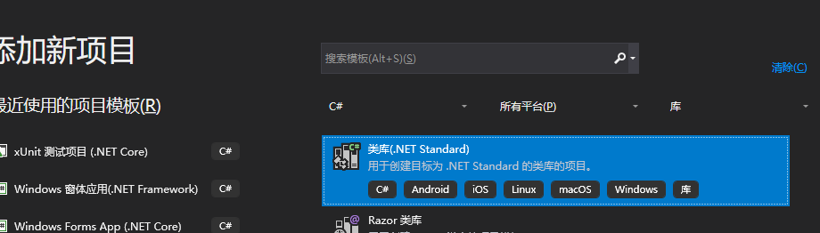
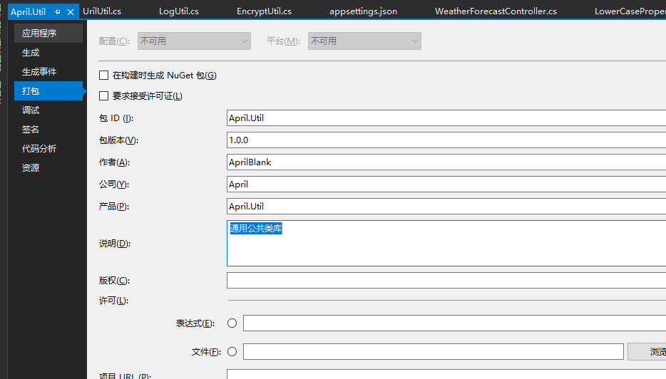
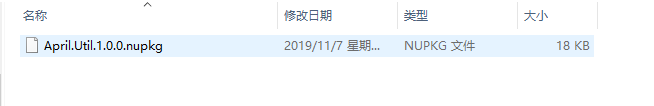
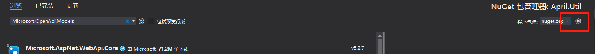
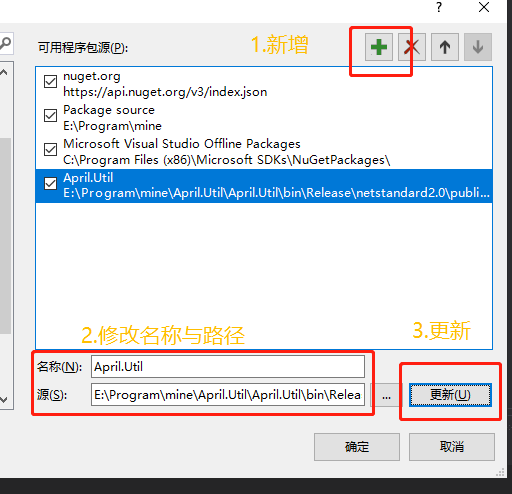
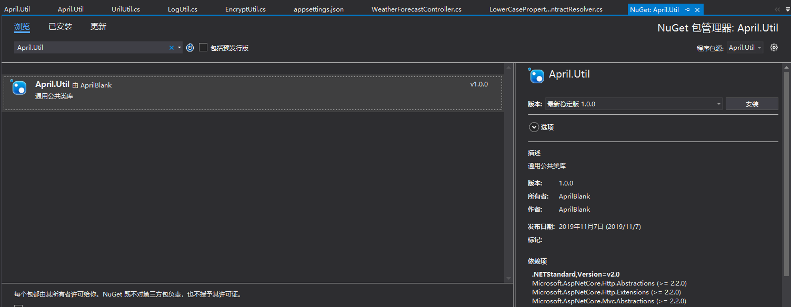
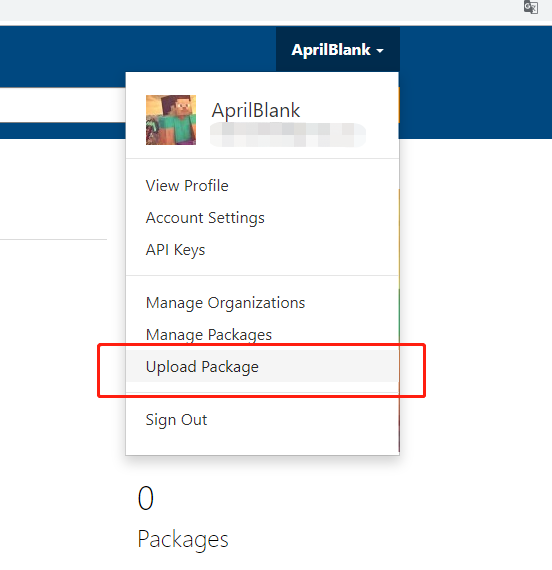
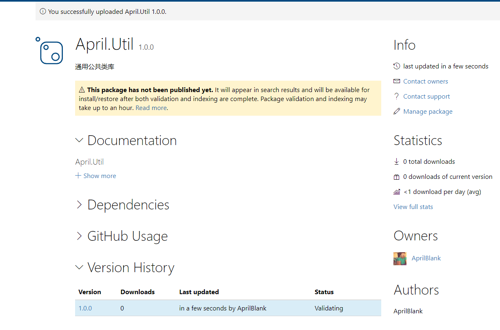
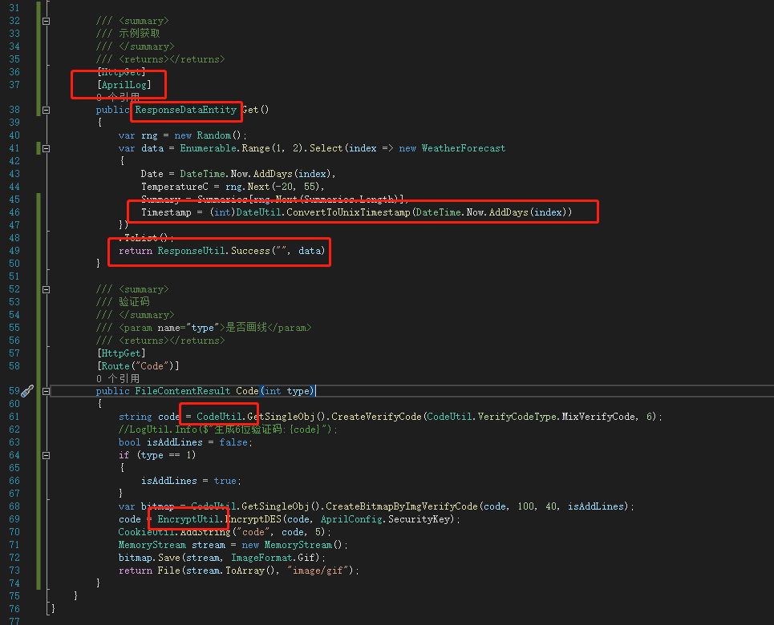

### 前言
在之前鼓捣过一次基础工程**April.WebApi**后，就考虑把常用的类库打包做成一个公共类库，这样既方便维护也方便后续做快速开发使用，仓库地址：[April.Util_github](https://github.com/AprilBlank/April.Util.Public)，[April.Util_gitee](https://gitee.com/AprilBlank/April.Util.Public)，后续会继续推出基于Util的基础工程（包含权限相关）以及如果代码生成器觉得可以了也会推出，先mark不错过。

### April.Util
首先，我们创建一个类库工程，当然新建之后就是删掉默认的类，我这里的版本是netstandard 2.0。

然后我们先缕下之前我做基础工程时候需要用到的通用型类库（当然后续会一直跟进补充）。

- 通用配置 **AprilConfig，AprilEnums**
- 缓存相关 **CacheUtil，CookieUtil，SessionUtil，RedisUtil**
- 日志相关 **LogUtil**
- 路径请求相关 **UriUtil**
- 回调相关 **ResponseUtil**
- 时间处理相关 **DateUtil**
- 验证码相关 **CodeUtil**
- 管理员相关 **TokenUtil**
- 加密相关 **EncrypUtil**
- Aop相关 **AprilLogAttribute**
- 其他扩展类
- *未完待续*

我们所需要引入的NuGet包，尽可能的节省新工程需要引入的类库，这样统一类库环境，方便多工程简单部署问题，当然也可以只引入dll文件，自己在工程中引入需要的环境类库，引入类库列表。

- log4net
- Microsoft.AspNetCore.Http.Abstractions
- Microsoft.AspNetCore.Http.Extensions
- Microsoft.AspNetCore.Mvc.Abstractions
- Microsoft.AspNetCore.Mvc.Core
- Microsoft.AspNetCore.Session
- Microsoft.Extensions.Caching.Memory
- Microsoft.Extensions.Configuration
- Newtonsoft.Json
- QRCoder
- StackExchange.Redis
- System.Drawing.Common
- *未完待续*

当然其中可能大多在WebApi工程中已经存在或是需要引用，这里存在重复引入的可能，所以需要关注版本问题，但是目前是会根据新版本的稳定版来统一版本问题。

代码可直接从仓库拉取，地址也在开头给出，生成工程之后我们可以得到一个dll文件，就如我前面所说，你可以引入dll文件然后在自己工程打入需要的环境包，也可以发布一个NuGet包，直接引入**April.Util**。

### 打包带走
首先，右键Util选择属性，切换到打包界面。

之后我们来发布当前类库工程，发布的过程这里就不再多说了，之后我们根据路径来找到我们发布的类库。

#### 本地使用
如果只是本地自己用的话，也不想发布为公开，可以通过配置NuGet包的地址来获取我们自己的NuGet包。


之后，我们就可以获取我们自己的NuGet了。


#### 发布NuGet
当然你可以选择发布到NuGet仓库，登录[NuGet官网](https://www.nuget.org/users/account/LogOn?returnUrl=%2F)，如果没有账号需要注册个google账号。

登录之后，在我们头像下选择上传包。

选择文件，拉到最下面（当然你可以一路看看相关的参数），然后最终的Submit，之后我们就可以看到已经上传成功，但是检索需要等待个把小时，**上传的包应该是没法删除，所以这点儿需要注意**。


### 示例
在代码仓库中我连带有个Simple的WebApi，里面引入了Util，包括一些其他的常规使用方法，特别注意下入口文件**Startup**，当然这个工程后续也是会不断的完善的，至于更新的力度以及代码规范度，emm，个人的力量还是有限，希望也能有更多的人可以一起探讨。

**Startup**

```csharp
        public Startup(IConfiguration configuration)
        {
            Configuration = configuration;

            AprilConfig.Configuration = configuration;
            LogUtil.InitLog();

            RedisUtil.InitRedis();
        }
		
		public void Configure(IApplicationBuilder app, IWebHostEnvironment env)
        {
            AprilConfig.ServiceProvider = app.ApplicationServices;
            
        }
```


```csharp
/// <summary>
        /// 示例获取
        /// </summary>
        /// <returns></returns>
        [HttpGet]
        [AprilLog]
        public ResponseDataEntity Get()
        {
            var rng = new Random();
            var data = Enumerable.Range(1, 2).Select(index => new WeatherForecast
            {
                Date = DateTime.Now.AddDays(index),
                TemperatureC = rng.Next(-20, 55),
                Summary = Summaries[rng.Next(Summaries.Length)],
                Timestamp = (int)DateUtil.ConvertToUnixTimestamp(DateTime.Now.AddDays(index))
            })
            .ToList();
            return ResponseUtil.Success("", data);
        }

        /// <summary>
        /// 验证码
        /// </summary>
        /// <param name="type">是否画线</param>
        /// <returns></returns>
        [HttpGet]
        [Route("Code")]
        public FileContentResult Code(int type)
        {
            string code = CodeUtil.GetSingleObj().CreateVerifyCode(CodeUtil.VerifyCodeType.MixVerifyCode, 6);
            //LogUtil.Info($"生成6位验证码:{code}");
            bool isAddLines = false;
            if (type == 1)
            {
                isAddLines = true;
            }
            var bitmap = CodeUtil.GetSingleObj().CreateBitmapByImgVerifyCode(code, 100, 40, isAddLines);
            code = EncryptUtil.EncryptDES(code, AprilConfig.SecurityKey);
            CookieUtil.AddString("code", code, 5);
            MemoryStream stream = new MemoryStream();
            bitmap.Save(stream, ImageFormat.Gif);
            return File(stream.ToArray(), "image/gif");
        }
```

### 小结
路漫漫，小半天的整理，但是前前后后的基础工程的路淌了好几版，从netframework到net core，想做一套通用的基础工程以减少开发工作量，但是这种确实没有十全十美的，根据业务来设计才是最合适的，但是规范化这点儿不可缺失，就先从Util开始，一点点的领出来，组件化的来开发，相信往后会越来越好，**如果有哪些地方不合适，也希望能有大佬给出指点，一人摸索过河，也请见谅**。
