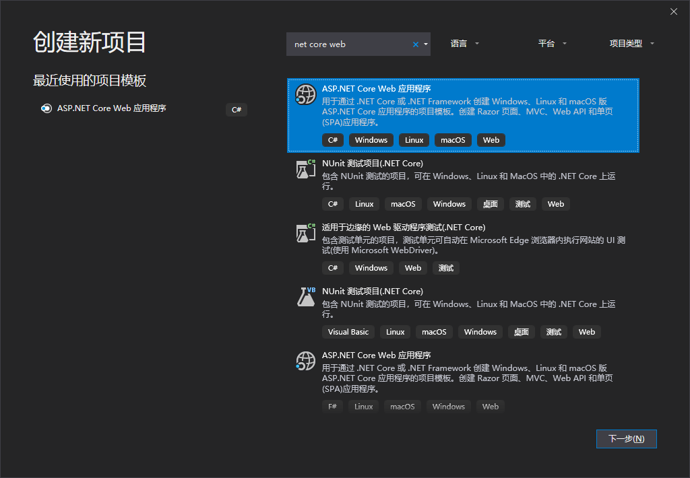
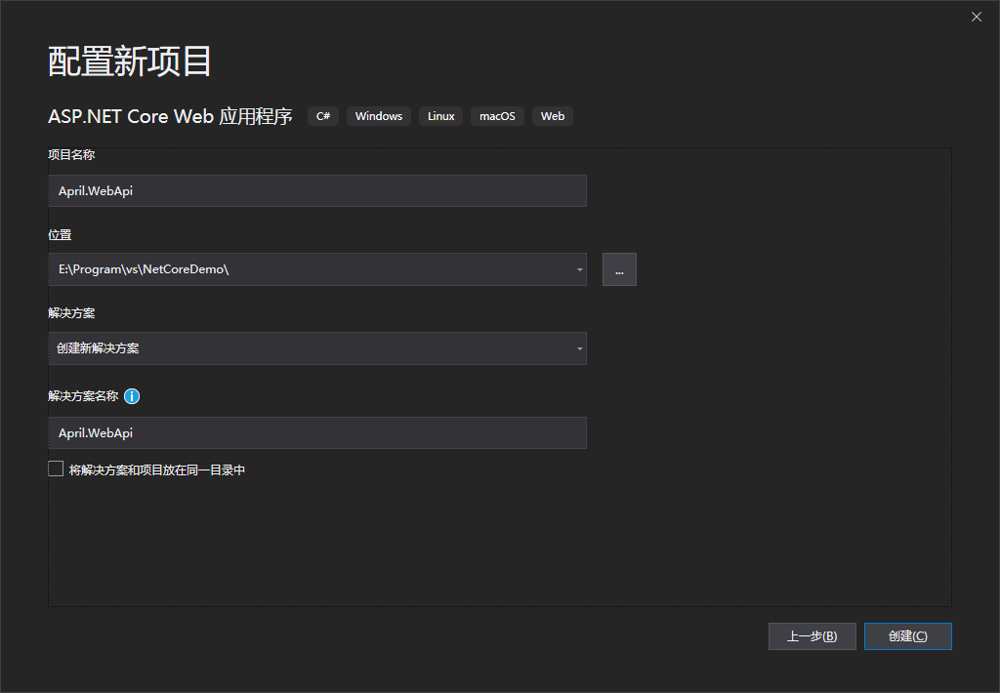
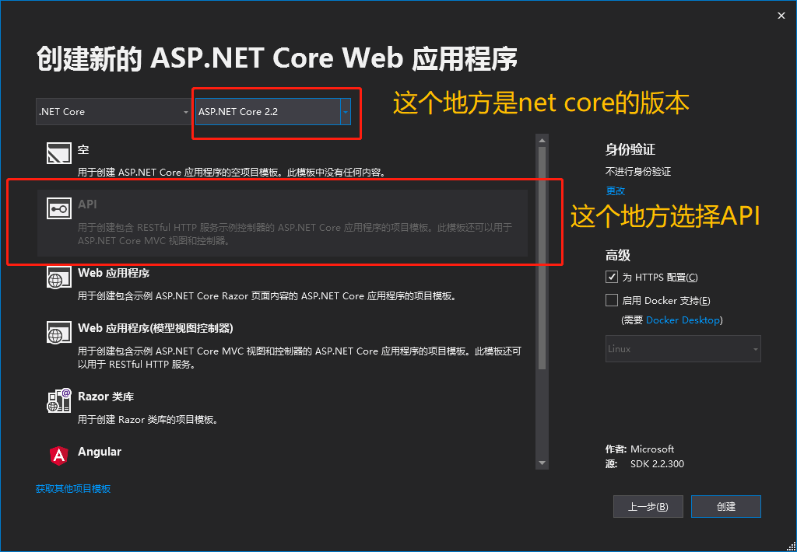
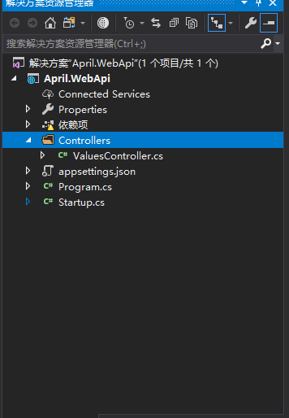
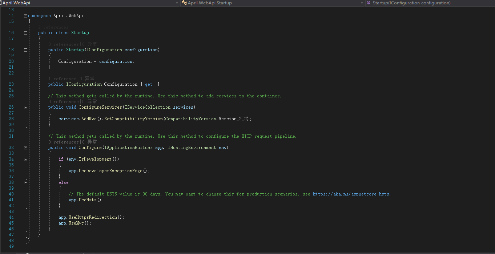

### 前言
前面介绍了开发工具及net core版本，后端工程的框架结构[开发工具及环境](/2019/07/02/net-core-tools-and-environment/)，因为是基础工程，所以没考虑太复杂的框架，如果有架构师请勿喷。

### 创建工程
废话不多说，撸起袖子干。
打开vs2019，左上角->文件->新建->项目

一般不需要检索，毕竟就几个，找到这个Web 应用程序，点击下一步。

自己起个名字，选个路径，点击创建。

基本上该标注的都标注了，启用HTTPS这个看自己需要，勾选了之后就可以通过https://访问，至于Docker支持这个，先挖个坑，后面鼓捣Docker的时候专门介绍，其实个人感觉跨平台主要得力于Docker这个说是虚拟机也不算，说是服务器也不算的工具。
创建完成后基本上都可以看到这个工程的大概东西了。

### 工程文件概述（个人理解）
- **Properties**
这下面有个launchSettings.json，这是个系统配置文件，iis的端口，请求地址，默认地址等等的配置。
- **Controllers**
你的所有控制器（搞过mvc的不用多说）都在这里，其实说白了就是你的接口API，至于Method，Router都是你自己在每个Api控制器里编辑，具体业务逻辑也是在对应接口实现。
- **appsettings.json**
这个是配置项文件，net core的web.config，用json来配置个人感觉还是比较舒服的，最起码看着方便，参数什么的也都清楚。
-  **Program.cs**
入口文件，没啥说的，我鼓捣的也不多，说实话做了一个工程这个地方貌似没改动，这个地方可以选择使用哪个Startup（如果你有多个的话）。
- **Startup.cs**
这个文件就比较厉害了，后续做的Log，Swagger等等第三方类库或者其他有些配置还有你的Service，都需要（有些是最好）在这个文件下注册，先切出代码看下。

- Startup
```csharp
		public Startup(IConfiguration configuration)
        {
            Configuration = configuration;
        }
```
- ConfigureServices

构造函数这块儿就不多说了，实例化Configuration，这个就是系统整体的Config，AppKey的具体参数是在appsettings.json里配置的（.netframework的AppSettings -,-||）

```csharp
        public void ConfigureServices(IServiceCollection services)
        {
            services.AddMvc().SetCompatibilityVersion(CompatibilityVersion.Version_2_2);
        }
```

在Configure前由主机调用执行，services主要用来注册服务以及定义一些系统的配置信息，后续使用Swagger，Quartz等服务都是需要在这个地方注册下。

- Configure
```csharp
        public void Configure(IApplicationBuilder app, IHostingEnvironment env)
        {
            if (env.IsDevelopment())
            {
                app.UseDeveloperExceptionPage();
            }
            else
            {
                // The default HSTS value is 30 days. You may want to change this for production scenarios, see https://aka.ms/aspnetcore-hsts.
                app.UseHsts();
            }

            app.UseHttpsRedirection();
            app.UseMvc();
        }
```
这个Configure个人感觉是在services注册过后，这个地方要告诉管道我要用，所以基本上都是Use，并且在这里可以添加中间层。

### 运行
简单介绍了下创建的工程内容后，一通Ctrl+F5，不出意外的话你看不到欢迎界面，就只要一个字符串数组，这就是你的ValuesController的GET请求返回的结果，如果需要更改默认启动页面，可以在Properties下面的json文件修改launchUrl。

### 小结
工程创建完成，下一步就要引入一些第三方的类库来完成一个基础工程常规的使用了。

