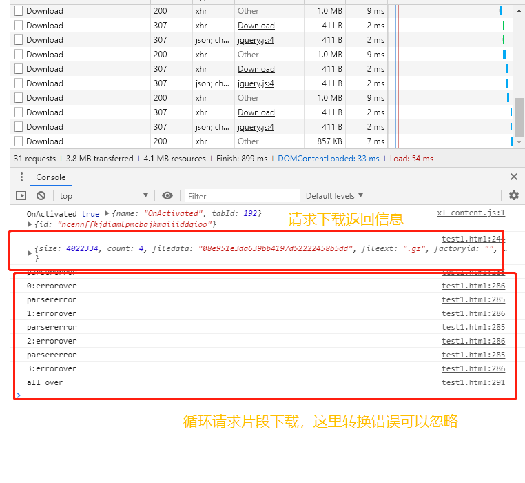

### 前言
上一篇[net core WebApi——文件分片上传与跨域请求处理](/2019/08/23/net-core-fileuploader-and-cors/)介绍完文件的上传操作，本来是打算紧接着写文件下载，中间让形形色色的事给耽误的，今天还是抽个空整理完文件这块儿，然后就可以鼓捣别的东西了。
### 开始
这里我们仍然使用基础工程，需要下载的朋友请移步[net core Webapi 总目录](/2019/07/19/net-core-webapi-main/)，代码都是与博客的进度基本同步的。
上传的时候我们介绍过分片的思路，而下载也一样，只是客户端与服务端角色转换下就好了。
**后端**
1. 接收前端下载请求，校验请求信息，返回文件基本信息
2. 根据前端请求文件片段进行下载流处理。

**前端**

1. 向后端发起下载请求，获取文件总片段数
2. 根据片段数循环请求文件片段流进行下载（可单独请求某一片段文件数据）

文件下载相对于上传来说稍微简洁点儿，如果不考虑服务器压力也可以一个**a**标签解决下载问题，分片的意义就在于每次与服务端的交互减少流量，有些时候我们推荐拿空间换时间，但对于大流量来说还是慢慢来比较好，单次访问量如果大再加上多并发怕是服务器会受不了，所以有了一片片分步来循环访问这个方法。

也是直接来看代码吧，我们在**FileController**创建几个接口方法**RequestDownloadFile**，**FileDownload**。

```csharp
        /// <summary>
        /// 请求下载文件
        /// </summary>
        /// <param name="fileInfo">文件参数信息[name]</param>
        /// <returns></returns>
        [HttpPost, Route("RequestDownload")]
        public MessageEntity RequestDownloadFile([FromBody]Dictionary<string, object> fileInfo)
        {

        }

        /// <summary>
        /// 分段下载文件
        /// </summary>
        /// <param name="fileInfo">请求参数信息[index,name]</param>
        /// <returns></returns>
        [HttpPost, Route("Download")]
        public async Task<IActionResult> FileDownload([FromBody]Dictionary<string, object> fileInfo)
        {

        }
```

**RequestDownloadFile**
>这里说明下，与服务端的操作都要尽可能多的确认身份信息（当然后续会有说这块儿），文件的相关操作也一样需要并且还要严格点儿，我这里就是为了做示例演示所以只传文件信息即可。

```csharp
        public MessageEntity RequestDownloadFile([FromBody]Dictionary<string, object> fileInfo)
        {
            MessageEntity message = new MessageEntity();
            string fileName = string.Empty;
            string fileExt = string.Empty;
            if (fileInfo.ContainsKey("name"))
            {
                fileName = fileInfo["name"].ToString();
            }
            if (fileInfo.ContainsKey("ext"))
            {
                fileExt = fileInfo["ext"].ToString();
            }
            if (string.IsNullOrEmpty(fileName))
            {
                message.Code = -1;
                message.Msg = "文件名不能为空";
                return message;
            }
            //获取对应目录下文件，如果有，获取文件开始准备分段下载
            string filePath = $".{AprilConfig.FilePath}{DateTime.Now.ToString("yyyy-MM-dd")}/{fileName}";
            filePath = $"{filePath}{fileExt}";
            FileStream fs = null;
            try
            {
                if (!System.IO.File.Exists(filePath))
                {
                    //文件为空
                    message.Code = -1;
                    message.Msg = "文件尚未处理完";
                    return message;
                }
                fs = new FileStream(filePath, FileMode.Open);
                if (fs.Length <= 0)
                {
                    //文件为空
                    message.Code = -1;
                    message.Msg = "文件尚未处理完";
                    return message;
                }
                int shardSize = 1 * 1024 * 1024;//一次1M
                RequestFileUploadEntity request = new RequestFileUploadEntity();
                request.fileext = fileExt;
                request.size = fs.Length;
                request.count = (int)(fs.Length / shardSize);
                if ((fs.Length % shardSize) > 0)
                {
                    request.count += 1;
                }
                request.filedata = GetCryptoString(fs);

                message.Data = request;
            }
            catch (Exception ex)
            {
                LogUtil.Debug($"读取文件信息失败：{filePath}，错误信息：{ex.Message}");
            }
            finally
            {
                if (fs != null)
                {
                    fs.Close();
                }
            }

            return message;
        }
```

**FileDownload**
```csharp
        public async Task<IActionResult> FileDownload([FromBody]Dictionary<string, object> fileInfo)
        {
            //开始根据片段来下载
            int index = 0;
            if (fileInfo.ContainsKey("index"))
            {
                int.TryParse(fileInfo["index"].ToString(), out index);
            }
            else
            {
                return Ok(new { code = -1, msg = "缺少参数" });
            }
            string fileName = string.Empty;
            string fileExt = string.Empty;
            if (fileInfo.ContainsKey("name"))
            {
                fileName = fileInfo["name"].ToString();
            }
            if (fileInfo.ContainsKey("ext"))
            {
                fileExt = fileInfo["ext"].ToString();
            }
            if (string.IsNullOrEmpty(fileName))
            {
                return Ok(new { code = -1, msg = "文件名不能为空" });
            }
            //获取对应目录下文件，如果有，获取文件开始准备分段下载
            string filePath = $".{AprilConfig.FilePath}{DateTime.Now.ToString("yyyy-MM-dd")}/{fileName}";
            filePath = $"{filePath}{fileExt}";
            if (!System.IO.File.Exists(filePath))
            {
                return Ok(new { code = -1, msg = "文件尚未处理" });
            }
            using (var fs = new FileStream(filePath, FileMode.Open))
            {
                if (fs.Length <= 0)
                {
                    return Ok(new { code = -1, msg = "文件尚未处理" });
                }
                int shardSize = 1 * 1024 * 1024;//一次1M
                int count = (int)(fs.Length / shardSize);
                if ((fs.Length % shardSize) > 0)
                {
                    count += 1;
                }
                if (index > count - 1)
                {
                    return Ok(new { code = -1, msg = "无效的下标" });
                }
                fs.Seek(index * shardSize, SeekOrigin.Begin);
                if (index == count - 1)
                {
                    //最后一片 = 总长 - (每次片段大小 * 已下载片段个数)
                    shardSize = (int)(fs.Length - (shardSize * index));
                }
                byte[] datas = new byte[shardSize];
                await fs.ReadAsync(datas, 0, datas.Length);
                //fs.Close();
                return File(datas, "application/x-gzip");
            }
        }
```

看过上传的朋友都清楚上传是三步，**请求上传**=>**开始上传**=>**合并**，而下载只需要两步，因为合并与否其实不那么重要了，反正文件流都给客户端了，那边自己判断需要重新下载还是下载部分片段都是他们自己的事了（服务端只管卖，东西有问题自己解决，多理想的状态）。

### 测试
搞完之后重新生成，运行之后我们来测试下效果，测试之前不要忘了接口白名单（做过登录相关的验证操作的忽略这点）。

这里提示error是因为解析错误，实际请求下载测试是正常的，如果有异常问题可以与我联系。

### 小结
文件相关的上传下载以及常规信息的操作可以告一段落，至于下一步鼓捣点儿啥也还没想好，本来还在看着linux相关的操作做发布部署的铺垫，看最近总体的进度吧，总之，**学如逆水行舟，如果不想溺水，就握好你的浆**（当然有些人不用浆那就算了，告辞）。