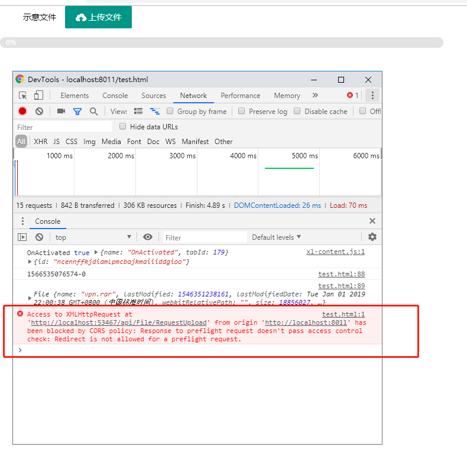
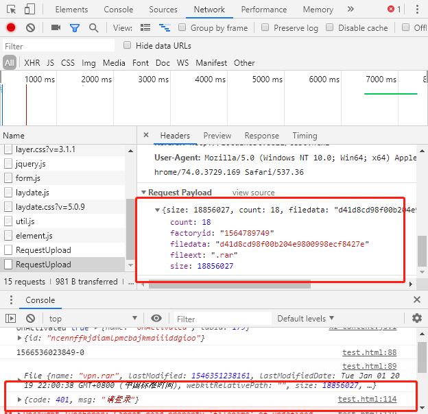
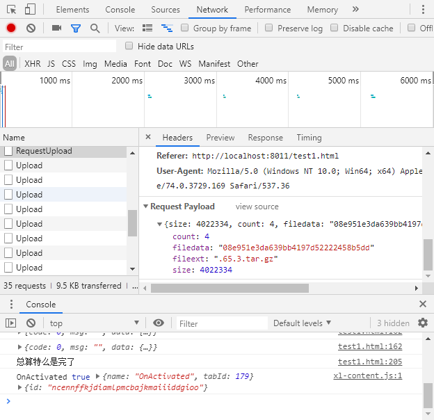
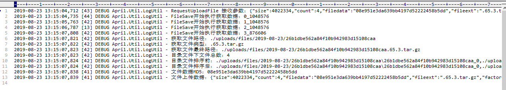
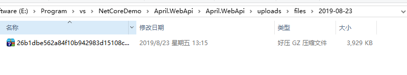
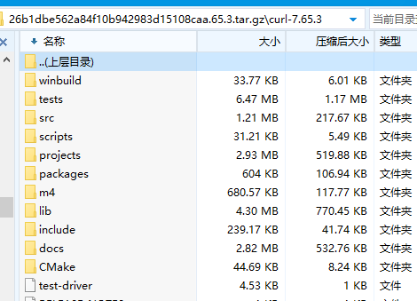
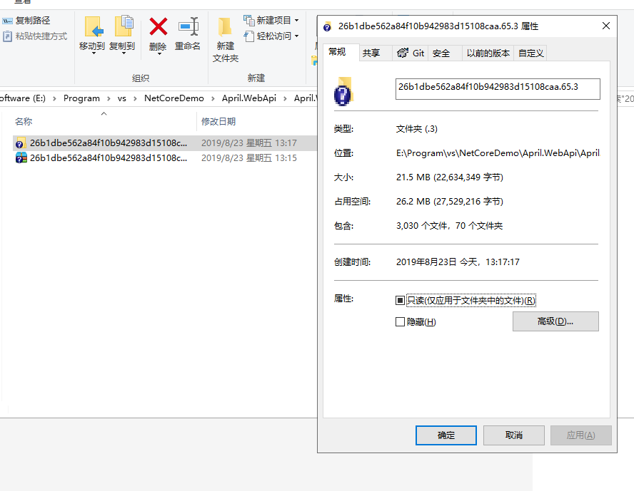

### 前言
在之前整理完一套简单的后台基础工程后，因为业务需要鼓捣了文件上传跟下载，整理完后就迫不及待的想分享出来，希望有用到文件相关操作的朋友可以得到些帮助。

### 开始
我们依然用我们的基础工程，之前也提到过后续如果有测试功能之类的东西，会一直不断的更新这套代码（如果搞炸了之后那就…），首先我们需要理一下文件分片上传的思路：
- **后端**
1. 接收前端文件上传请求并处理回调
2. 根据前端传递的钥匙判断，允许后开始接收文件流并保存到临时文件夹
3. 前端最终上传完成后给予后端合并请求（也称作上传完成确认），后端合并文件后判断最终文件是否正确给予回调。
- **前端**
1. 读取文件相关信息（名称，扩展类型，大小等基本信息）
2. 根据需要做片段划分以及文件的md5值（md5主要用于最终确认文件是否缺损）
3. 请求后端获取钥匙
4. 拿到钥匙后，我们根据划分的片段去循环上传文件，并根据每次回调判断是否上传成功，如失败则重新上传
5. 最终循环完成后，给予后端合并请求（上传完成确认）

ps：这里的钥匙就是个文件名，当然你可以来个token啊什么的根据自己业务需要。

> 这里还是想分享下敲代码的经验，在我们动手之前，最好把能考虑到的东西全都想好，思路理清也就是打好提纲后，敲代码的效率会高并且错误率也会低，行云流水不是天马行空，而是你的大脑中已经有了山水鸟兽。

OK，流程清楚之后，我们开始动手敲代码吧。

首先，我们新建一个控制器**FileController**，当然名字可以随意取，根据我们上述后端的思路，新建三个接口**RequestUploadFile**，**FileSave**，**FileMerge**。

```csharp
    [Route("api/[controller]")]
    [ApiController]
    public class FileController : ControllerBase
    {
        /// <summary>
        /// 请求上传文件
        /// </summary>
        /// <param name="requestFile">请求上传参数实体</param>
        /// <returns></returns>
        [HttpPost, Route("RequestUpload")]
        public MessageEntity RequestUploadFile([FromBody]RequestFileUploadEntity requestFile)
        {

        }

        /// <summary>
        /// 文件上传
        /// </summary>
        /// <returns></returns>
        [HttpPost, Route("Upload")]
        public async Task<MessageEntity> FileSave()
        {
        }

        /// <summary>
        /// 文件合并
        /// </summary>
        /// <param name="fileInfo">文件参数信息[name]</param>
        /// <returns></returns>
        [HttpPost, Route("Merge")]
        public async Task<MessageEntity> FileMerge([FromBody]Dictionary<string, object> fileInfo)
        {

        }
    }
```
如果直接复制的朋友，这里肯定是满眼红彤彤，这里主要用了两个类，一个请求实体**RequestFileUploadEntity**，一个回调实体**MessageEntity**，这两个我们到Util工程创建（当然也可以放到Entity工程，这里为什么放到Util呢，因为我觉得放到这里公用比较好，毕竟还是有复用的价值的）。
```csharp
    /// <summary>
    /// 文件请求上传实体
    /// </summary>
    public class RequestFileUploadEntity
    {
        private long _size = 0;
        private int _count = 0;
        private string _filedata = string.Empty;
        private string _fileext = string.Empty;
        private string _filename = string.Empty;

        /// <summary>
        /// 文件大小
        /// </summary>
        public long size { get => _size; set => _size = value; }
        /// <summary>
        /// 片段数量
        /// </summary>
        public int count { get => _count; set => _count = value; }
        /// <summary>
        /// 文件md5
        /// </summary>
        public string filedata { get => _filedata; set => _filedata = value; }
        /// <summary>
        /// 文件类型
        /// </summary>
        public string fileext { get => _fileext; set => _fileext = value; }
        /// <summary>
        /// 文件名
        /// </summary>
        public string filename { get => _filename; set => _filename = value; }
    }
```

```csharp
    /// <summary>
    /// 返回实体
    /// </summary>
    public class MessageEntity
    {
        private int _Code = 0;
        private string _Msg = string.Empty;
        private object _Data = new object();

        /// <summary>
        /// 状态标识
        /// </summary>
        public int Code { get => _Code; set => _Code = value; }
        /// <summary>
        /// 返回消息
        /// </summary>
        public string Msg { get => _Msg; set => _Msg = value; }
        /// <summary>
        /// 返回数据
        /// </summary>
        public object Data { get => _Data; set => _Data = value; }
    }
```

创建完成写好之后我们在红的地方Alt+Enter，哪里爆红点哪里（so easy），好了，不扯犊子了，每个接口的方法如下。

**RequestUploadFile**
```csharp
        public MessageEntity RequestUploadFile([FromBody]RequestFileUploadEntity requestFile)
        {
            LogUtil.Debug($"RequestUploadFile 接收参数：{JsonConvert.SerializeObject(requestFile)}");
            MessageEntity message = new MessageEntity();
            if (requestFile.size <= 0 || requestFile.count <= 0 || string.IsNullOrEmpty(requestFile.filedata))
            {
                message.Code = -1;
                message.Msg = "参数有误";
            }
            else
            {
                //这里需要记录文件相关信息，并返回文件guid名，后续请求带上此参数
                string guidName = Guid.NewGuid().ToString("N");

                //前期单台服务器可以记录Cache，多台后需考虑redis或数据库
                CacheUtil.Set(guidName, requestFile, new TimeSpan(0, 10, 0), true);

                message.Code = 0;
                message.Msg = "";
                message.Data = new { filename = guidName };
            }
            return message;
        }
```

**FileSave**
```csharp
        public async Task<MessageEntity> FileSave()
        {
            var files = Request.Form.Files;
            long size = files.Sum(f => f.Length);
            string fileName = Request.Form["filename"];

            int fileIndex = 0;
            int.TryParse(Request.Form["fileindex"], out fileIndex);
            LogUtil.Debug($"FileSave开始执行获取数据：{fileIndex}_{size}");
            MessageEntity message = new MessageEntity();
            if (size <= 0 || string.IsNullOrEmpty(fileName))
            {
                message.Code = -1;
                message.Msg = "文件上传失败";
                return message;
            }

            if (!CacheUtil.Exists(fileName))
            {
                message.Code = -1;
                message.Msg = "请重新请求上传文件";
                return message;
            }

            long fileSize = 0;
            string filePath = $".{AprilConfig.FilePath}{DateTime.Now.ToString("yyyy-MM-dd")}/{fileName}";
            string saveFileName = $"{fileName}_{fileIndex}";
            string dirPath = Path.Combine(filePath, saveFileName);
            if (!Directory.Exists(filePath))
            {
                Directory.CreateDirectory(filePath);
            }

            foreach (var file in files)
            {
                //如果有文件
                if (file.Length > 0)
                {
                    fileSize = 0;
                    fileSize = file.Length;

                    using (var stream = new FileStream(dirPath, FileMode.OpenOrCreate))
                    {
                        await file.CopyToAsync(stream);
                    }
                }
            }

            message.Code = 0;
            message.Msg = "";
            return message;
        }
```

**FileMerge**
```csharp
		public async Task<MessageEntity> FileMerge([FromBody]Dictionary<string, object> fileInfo)
        {
            MessageEntity message = new MessageEntity();
            string fileName = string.Empty;
            if (fileInfo.ContainsKey("name"))
            {
                fileName = fileInfo["name"].ToString();
            }
            if (string.IsNullOrEmpty(fileName))
            {
                message.Code = -1;
                message.Msg = "文件名不能为空";
                return message;
            }

            //最终上传完成后，请求合并返回合并消息
            try
            {
                RequestFileUploadEntity requestFile = CacheUtil.Get<RequestFileUploadEntity>(fileName);
                if (requestFile == null)
                {
                    message.Code = -1;
                    message.Msg = "合并失败";
                    return message;
                }
                string filePath = $".{AprilConfig.FilePath}{DateTime.Now.ToString("yyyy-MM-dd")}/{fileName}";
                string fileExt = requestFile.fileext;
                string fileMd5 = requestFile.filedata;
                int fileCount = requestFile.count;
                long fileSize = requestFile.size;

                LogUtil.Debug($"获取文件路径：{filePath}");
                LogUtil.Debug($"获取文件类型：{fileExt}");

                string savePath = filePath.Replace(fileName, "");
                string saveFileName = $"{fileName}{fileExt}";
                var files = Directory.GetFiles(filePath);
                string fileFinalName = Path.Combine(savePath, saveFileName);
                LogUtil.Debug($"获取文件最终路径：{fileFinalName}");
                FileStream fs = new FileStream(fileFinalName, FileMode.Create);
                LogUtil.Debug($"目录文件下文件总数：{files.Length}");

                LogUtil.Debug($"目录文件排序前：{string.Join(",", files.ToArray())}");
                LogUtil.Debug($"目录文件排序后：{string.Join(",", files.OrderBy(x => x.Length).ThenBy(x => x))}");
                byte[] finalBytes = new byte[fileSize];
                foreach (var part in files.OrderBy(x => x.Length).ThenBy(x => x))
                {
                    var bytes = System.IO.File.ReadAllBytes(part);

                    await fs.WriteAsync(bytes, 0, bytes.Length);
                    bytes = null;
                    System.IO.File.Delete(part);//删除分块
                }
                fs.Close();
                //这个地方会引发文件被占用异常
                fs = new FileStream(fileFinalName, FileMode.Open);
                string strMd5 = GetCryptoString(fs);
                LogUtil.Debug($"文件数据MD5：{strMd5}");
                LogUtil.Debug($"文件上传数据：{JsonConvert.SerializeObject(requestFile)}");
                fs.Close();
                Directory.Delete(filePath);
                //如果MD5与原MD5不匹配，提示重新上传
                if (strMd5 != requestFile.filedata)
                {
                    LogUtil.Debug($"上传文件md5：{requestFile.filedata},服务器保存文件md5：{strMd5}");
                    message.Code = -1;
                    message.Msg = "MD5值不匹配";
                    return message;
                }

                CacheUtil.Remove(fileInfo["name"].ToString());
                message.Code = 0;
                message.Msg = "";
            }
            catch (Exception ex)
            {
                LogUtil.Error($"合并文件失败，文件名称：{fileName}，错误信息：{ex.Message}");
                message.Code = -1;
                message.Msg = "合并文件失败,请重新上传";
            }
            return message;
        }
```

这里说明下，在Merge的时候，主要校验md5值，用到了一个方法，我这里没有放到Util（其实是因为懒），代码如下：
```csharp
		/// <summary>
        /// 文件流加密
        /// </summary>
        /// <param name="fileStream"></param>
        /// <returns></returns>
        private string GetCryptoString(Stream fileStream)
        {
            MD5 md5 = new MD5CryptoServiceProvider();
            byte[] cryptBytes = md5.ComputeHash(fileStream);
            return GetCryptoString(cryptBytes);
        }

        private string GetCryptoString(byte[] cryptBytes)
        {
            //加密的二进制转为string类型返回
            StringBuilder sb = new StringBuilder();
            for (int i = 0; i < cryptBytes.Length; i++)
            {
                sb.Append(cryptBytes[i].ToString("x2"));
            }
            return sb.ToString();
        }
```

### 测试
方法写好了之后，我们需不需要测试呢，那不是废话么，自己的代码不过一遍等着让测试人员搞你呢。

> 再说个编码习惯，就是自己的代码自己最起码常规的过一遍，也不说跟大厂一样什么KPI啊啥的影响，自己的东西最起码拿出手让人一看知道用心了就行，不说什么测试全覆盖，就是1+1=2这种基本的正常就OK。

程序运行之后，我这里写了个简单的测试界面，运行之后发现提示OPTIONS，果断跨域错误，还记得我们之前提到的跨域问题，这里给出解决方法。

### 跨域
跨域，就是我在这个区域，想跟另一个区域联系的时候，我们会碰到墙，这堵墙的目的就是，禁止不同区域的人私下交流沟通，但是现在我们就是不要这堵墙或者说要开几个门的话怎么做呢，net core有专门设置的地方，我们回到Startup这里。

我们来看新增的代码：
```csharp
        public IServiceProvider ConfigureServices(IServiceCollection services)
        {
        	//…之前的代码忽略
        	
            services.AddCors(options =>
            {
                options.AddPolicy("AllowAll", p =>
                {
                    p.AllowAnyOrigin()
                    .AllowAnyMethod()
                    .AllowAnyHeader()
                    .AllowCredentials();
                });
            });
            
            services.AddAspectCoreContainer();
            return services.BuildAspectInjectorProvider();

        }
```

**AddCors**来添加一个跨域处理方式，**AddPolicy**就是加个巡逻官，看看符合规则的放进来，不符合的直接赶出去。

|方法| 介绍 |
|--|--|
| AllowAnyOrigin | 允许所有的域名请求 |
| AllowAnyMethod | 允许所有的请求方式GET/POST/PUT/DELETE |
| AllowAnyHeader | 允许所有的头部参数 |
| AllowCredentials | 允许携带Cookie |

这里我使用的是允许所有，可以根据自身业务需要来调整，比如只允许部分域名访问，部分请求方式，部分Header：
```csharp
			//只是示例，具体根据自身需要
            services.AddCors(options =>
            {
                options.AddPolicy("AllowSome", p =>
                 {
                     p.WithOrigins("https://www.baidu.com")
                     .WithMethods("GET", "POST")
                     .WithHeaders(HeaderNames.ContentType, "x-custom-header");
                 });
            });
```

写好之后我们在**Configure**中声明注册使用哪个巡逻官。
```csharp
        public void Configure(IApplicationBuilder app, IHostingEnvironment env)
        {
        	//…之前的
            app.UseCors("AllowAll");  
            
            app.UseHttpsRedirection();
            app.UseMvc();      
        }
```

好了，设置好跨域之后我们再来执行下上传操作。

我们看到这个提示之后，是不是能想起来什么，我们之前做过中间层不知道还记得不，忘了的朋友可以再看下[net core Webapi基础工程搭建（七）——小试AOP及常规测试_Part 1](/2019/07/30/aop-and-test-part-1/)。
在appsettings.json添加上接口白名单。
```json
  "AllowUrl": "/api/Values,/api/File/RequestUpload,/api/File/Upload,/api/File/Merge"
```
设置好之后，我们继续上传，这次总算是可以了（文件后缀这个忽略，测试使用，js就是做了个简单的substring）。

我们来查看上传文件记录的日志信息。

再来我们看下文件存储的位置，这个位置我们在appsettings里面已经设置过，可以根据自己业务需要调整。

打开文件看下是否有损坏，压缩包很容易看出来是否正常，只要能打开基本上（当然可能会有问题）没问题。

解压出来如果正常那肯定就是没问题了吧（压缩这个玩意儿真是牛逼，节省了多少的存储空间，虽说硬盘白菜价）。

### 小结
在整理文件上传这篇刚好捎带着把跨域也简单了过了一遍，下来需要再折腾的东西就是**大文件的分片下载**，大致的思路与文件上传一致，毕竟都是一个大蛋糕，切成好几块，你一块，剩下的都是我的。


