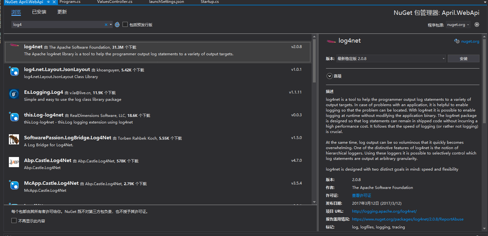
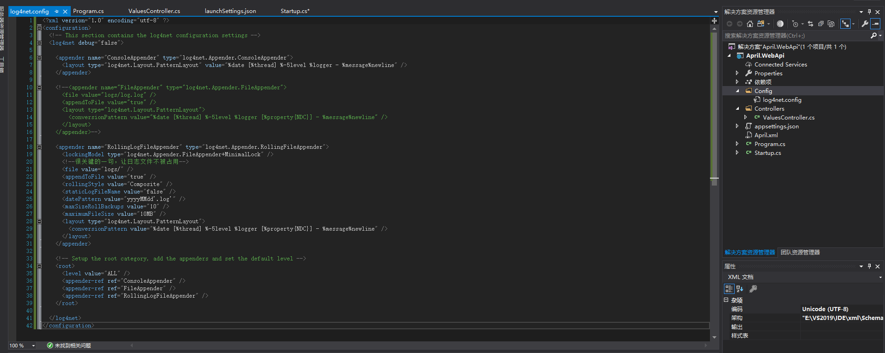
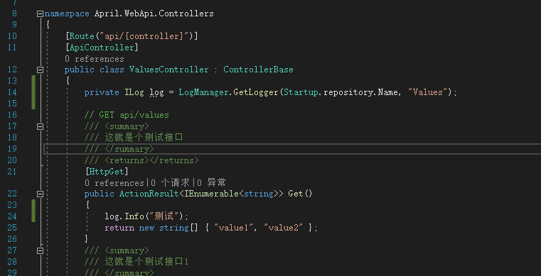
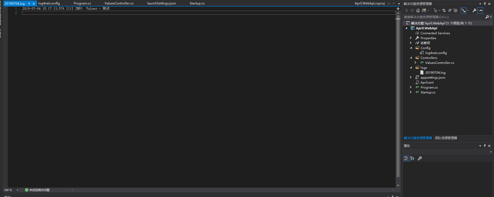
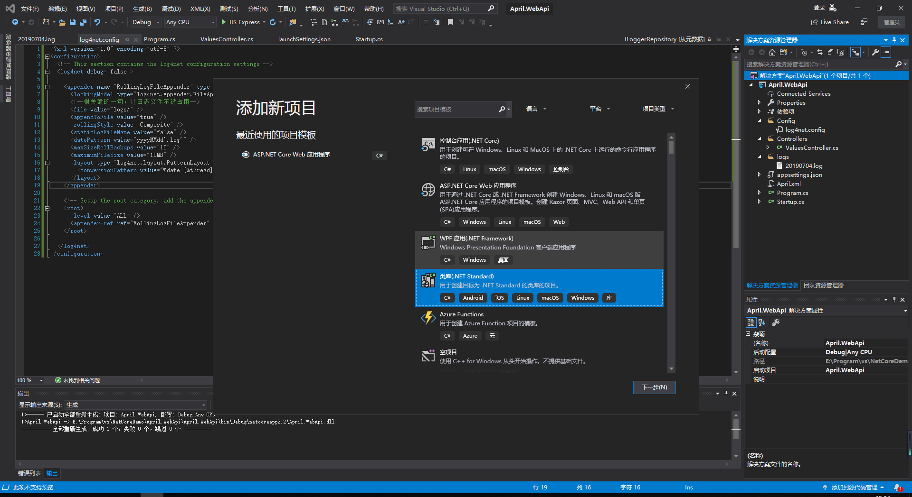
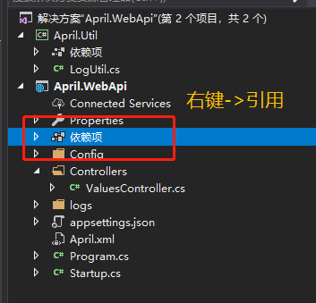
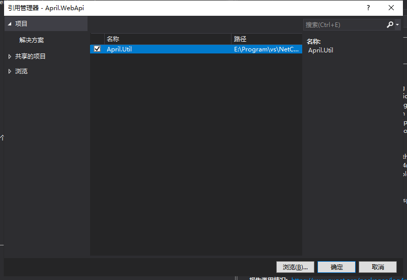
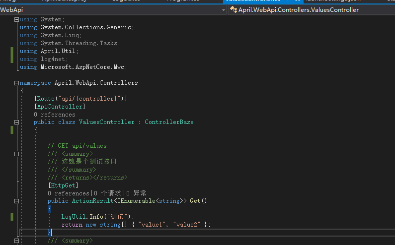
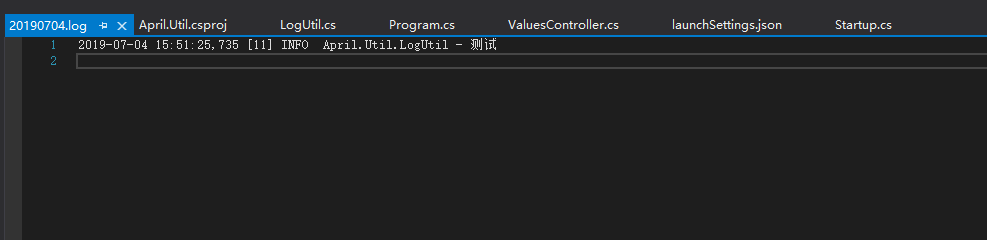

### 前言
一个完整的项目工程离不开日志文件的记录，而记录文件的方法也有很多，可以自己通过Stream去实现文件的读写来完成日志记录，但是如果有个好的封装类库，那为什么不去用呢？

.net日志记录，NLog，log4都可以，用什么都可以，根据自己喜好，我常用log4，所以这里还是介绍Log4的引用及用法。

### log4net
这个log4从开发到现在，从netframework开始用，一个config文件就够了，NLog没用过，但是应该都是大差不差，毕竟名字都这么相似嘛（手动滑稽）

### 依然是，NuGet引用第三方类库
工具->NuGet包管理器->管理解决方案的NuGet程序包…
在浏览中查找"log4"，选择项目工程，点击安装。

安装完成后，依然是来Startup.cs，这次在构造函数直接声明实例化。
```csharp
        public Startup(IConfiguration configuration)
        {
            Configuration = configuration;

            repository = LogManager.CreateRepository("AprilLog");

            XmlConfigurator.Configure(repository, new FileInfo("Config/log4net.config"));//配置文件路径可以自定义
            BasicConfigurator.Configure(repository);
        }

        //log4net日志
        public static ILoggerRepository repository { get; set; }
```

配置文件的创建可以在工程目录下新建一个config文件，配置信息如下，需要标注的信息基本上都在文件注释中，不过多阐述：
```xml
<?xml version="1.0" encoding="utf-8" ?>
<configuration>
  <!-- This section contains the log4net configuration settings -->
  <log4net debug="false">
    <appender name="RollingLogFileAppender" type="log4net.Appender.RollingFileAppender">
      <lockingModel type="log4net.Appender.FileAppender+MinimalLock" /><!--很关键的一句，让日志文件不被占用-->
      <file value="logs/" /> <!-- 日志生成文件路径 -->
      <appendToFile value="true" /> 
      <rollingStyle value="Composite" />
      <staticLogFileName value="false" />
      <datePattern value="yyyyMMdd'.log'" /> <!-- 日志文件名称格式 -->
      <maxSizeRollBackups value="10" />
      <maximumFileSize value="10MB" /> <!-- 最大文件大小，达到后生成新文件 -->
      <layout type="log4net.Layout.PatternLayout">
        <conversionPattern value="%date [%thread] %-5level %logger - %message%newline" /> <!-- 生成日志格式 -->
      </layout>
    </appender>

    <!-- Setup the root category, add the appenders and set the default level -->
    <root>
      <level value="ALL" />  <!-- 日志等级 -->
      <appender-ref ref="RollingLogFileAppender" /> 
    </root>

  </log4net>
</configuration>
```
创建完成后，还是要对比下你的配置文件目录与实际目录是否一致。

OK，全部确认完成后，可以在需要用到Log的地方，添加以下代码：
```csharp
	private ILog log = LogManager.GetLogger(Startup.repository.Name, "Name");
	…
	log.Info("测试");
```

例如我们继续拿Values这个控制器开刀。


写好之后我们运行代码，运行后我们可以看到工程目录已经有了logs这个文件夹，打开日志文件。

这样我们就可以在日常使用中记录日志，方便调试记录，追踪问题所在。

### 整合LogUtil
我这个人比较懒，并且我也不需要关心它是在哪运行，我只想要记录的时候调用下方法，所以对日志记录做了封装调整。

首先，新建类库工程，Apirl.Util（这个工程应该刚开始都创建的-,-||）。

类库工程新建完成的第一件事，干掉Class.cs（我要这示例有何用）

将log4net通过NuGet引入Util工程，过程不过多说了，引用的介绍已经可以了。

引用完成后，在WebApi工程引入Util。

选中Util这个类库工程。


> 题外话，其实NuGet引入第三方类库在一个项目工程即可，其他工程只要引用对应的项目工程，也可以使用对应的第三方类库，即我在Util引入log4，我就没必要在WebApi工程再引入，这里只是为了讲解说明。

新建LogUtil这个类，代码如下。
```csharp
	public class LogUtil
    {
        private static readonly ILog log = LogManager.GetLogger("AprilLog", typeof(LogUtil));

        /// <summary>
        /// 调试日志
        /// </summary>
        /// <param name="msg"></param>
        /// <param name="obj"></param>
        public static void Debug(string msg, object obj = null)
        {
            if (log.IsDebugEnabled && !string.IsNullOrEmpty(msg))
            {
                if (obj == null)
                {
                    log.Debug(msg);
                }
                else
                {
                    log.DebugFormat(msg, obj);
                }
            }
        }
        /// <summary>
        /// 日常日志
        /// </summary>
        /// <param name="msg"></param>
        /// <param name="obj"></param>
        public static void Info(string msg, object obj = null)
        {
            if (log.IsInfoEnabled && !string.IsNullOrEmpty(msg))
            {
                if (obj == null)
                {
                    log.Info(msg);
                }
                else
                {
                    log.InfoFormat(msg, obj);
                }
            }
        }
        /// <summary>
        /// 错误日志
        /// </summary>
        /// <param name="msg"></param>
        /// <param name="obj"></param>
        public static void Error(string msg, object obj = null)
        {
            if (log.IsErrorEnabled && !string.IsNullOrEmpty(msg))
            {
                if (obj == null)
                {
                    log.Error(msg);
                }
                else
                {
                    log.ErrorFormat(msg, obj);
                }
            }
        }
        /// <summary>
        /// 重要日志
        /// </summary>
        /// <param name="msg"></param>
        /// <param name="obj"></param>
        public static void Fatal(string msg, object obj = null)
        {
            if (log.IsFatalEnabled && !string.IsNullOrEmpty(msg))
            {
                if (obj == null)
                {
                    log.Fatal(msg);
                }
                else
                {
                    log.FatalFormat(msg, obj);
                }
            }
        }

    }
```

下完之后，继续ValuesController（Why一直是这），更改代码如下：

运行看下效果。

### 小结
封装的好处是为了省事，哪里需要写（点）哪里，咳咳，日志的重要性在代码里面不言而喻，没有日志的工程是不健全的，程序猿可以不会写逻辑，不去考虑架构，不去优化性能，但是日志的记录，代码的注释是不可或缺的，毕竟如果想活着，这两个地方还是多注意吧。

下一节，开始**缓存机制**。