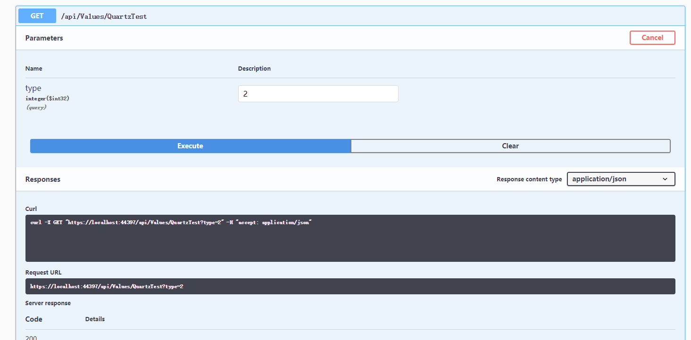
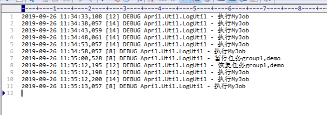
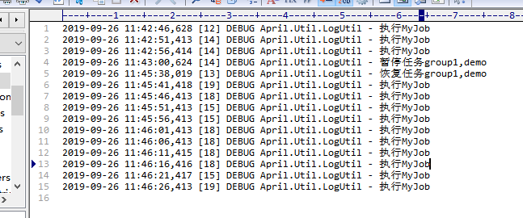

### 前言
本来打算昨天都开始写这篇，就因为要把小团队的博客整理汇总，一看二哈的博客那么多，一个个复制粘贴肯定麻烦（其实是我自己觉得复制麻烦），所以穿插着写了个小爬虫，后续写差不多了就拿出来晾晾吧（py菜鸡水平）。

之前开发的时候，忽略了记录，等到想写点儿啥跟后台有关的东西的时候，还得一点点回忆，最近是因为同事给我说，"哎，每个月把数据给我统计下做个界面展示啊"。一想到每个月我要做次操作就头疼，咦，不对，这不就是写个**定时任务**就搞定了嘛。

### Quartz
其实在选这个定时器的类库的时候，我在**Hangfire**两者间徘徊，后来是想到不管用什么方法什么工具都是次要的，主要看你怎么用，用到哪，图形界面是需要但不是必要，分秒级别的控制也都是看你自己业务需要，定时器就后台挂起运行就行了没必要让我看见，想操作了再说吧，就这样愉快的决定使用**Quartz**。

首先，依然是在我们Util的工程引入包。

引入完成后，在我们的入口Startup中添加实例的注册声明。
```csharp
        public IServiceProvider ConfigureServices(IServiceCollection services)
        {
            ServiceInjection.ConfigureRepository(services);

            services.AddMvc().SetCompatibilityVersion(CompatibilityVersion.Version_2_2);
			//任务调度
            services.TryAddSingleton<ISchedulerFactory, StdSchedulerFactory>();
		}
```

**SchedulerFactory**任务调度就好比一个公司的老大，**Trigger**就是一个项管，**Job**就是苦逼的码农，老大想要一天搞个app，就跟项管说一句，我要一天后要东西，这时候项管心里就有数了，一天后的那个时间，找到码农，直接剥夺他的代码执行，好了app出来了，苦逼的结束并不意味着真的结束，这老大一看可以啊，好了，以后每天我要一个成品app，如此循环往复，项管不厌其烦，码农换了又换（当然job不会）。

项管还会有多个，每个项管下面可不止一个码农。

> 像这样的情况可能有些夸张，但是类似的情况却真实存在。

ok，完了之后，我们来创建一个**MyJob**。

```csharp
    public class MyJob : IJob
    {
        public Task Execute(IJobExecutionContext context)
        {
            return Task.Run(() =>
            {
                LogUtil.Debug("执行MyJob");
            });
        }
    }
```

之后我们来写个简单的**QuartzUtil**。

```csharp
    public class QuartzUtil
    {
        private static ISchedulerFactory _schedulerFactory;
        private static IScheduler _scheduler;

        /// <summary>
        /// 添加任务
        /// </summary>
        /// <param name="type">类</param>
        /// <param name="jobKey">键</param>
        /// <param name="trigger">触发器</param>
        public static async Task Add(Type type, JobKey jobKey, ITrigger trigger = null)
        {
            Init();
            _scheduler = await _schedulerFactory.GetScheduler();

            await _scheduler.Start();

            if (trigger == null)
            {
                trigger = TriggerBuilder.Create()
                    .WithIdentity("april.trigger")
                    .WithDescription("default")
                    .WithSimpleSchedule(x=>x.WithMisfireHandlingInstructionFireNow().WithRepeatCount(-1))
                    .Build();
            }
            var job = JobBuilder.Create(type)
                .WithIdentity(jobKey)
                .Build();

            await _scheduler.ScheduleJob(job, trigger);          
        }
        /// <summary>
        /// 恢复任务
        /// </summary>
        /// <param name="jobKey">键</param>
        public static async Task Resume(JobKey jobKey)
        {
            Init();
            _scheduler = await _schedulerFactory.GetScheduler();
            LogUtil.Debug($"恢复任务{jobKey.Group},{jobKey.Name}");
            await _scheduler.ResumeJob(jobKey);
        }
        /// <summary>
        /// 停止任务
        /// </summary>
        /// <param name="jobKey">键</param>
        public static async Task Stop(JobKey jobKey)
        {
            Init();
            _scheduler = await _schedulerFactory.GetScheduler();
            LogUtil.Debug($"暂停任务{jobKey.Group},{jobKey.Name}");
            await _scheduler.PauseJob(jobKey);
        }
        /// <summary>
        /// 初始化
        /// </summary>
        private static void Init()
        {
            if (_schedulerFactory == null)
            {
                _schedulerFactory = AprilConfig.ServiceProvider.GetService<ISchedulerFactory>();
            }
        }
    }
```
触发器的使用，有很多种方式，可以使用简单的执行一次/多久执行一次/循环执行几次等等。

还有可以使用**Cron**表达式：

简单来说，**corn从左到右（用空格隔开）：秒 分 小时 月份中的日期 月份 星期中的日期 年份**，举个例子，就像开头说的，让我每隔一个月执行一次统计，写法就是 0 0 0 1 * ?，当然这就有涉及到什么符号的问题了，这种不需要强记，需要的时候查下就行，推荐一个工具站吧，[Cron校验工具](http://www.bejson.com/othertools/cronvalidate/)。

### 测试
>感觉我的博客内容好单调，内容框架就是开头，代码，测试，结尾，唉

不过做啥东西，测试少不了，最起码你的东西能用，才说明可行。

我们在**Values**添加一个方法，这里我们5s一执行（懒得等）。

```csharp
        [HttpGet]
        [Route("QuartzTest")]
        public void QuartzTest(int type)
        {
            JobKey jobKey = new JobKey("demo","group1");
            switch (type)
            {
                //添加任务
                case 1:
                    var trigger = TriggerBuilder.Create()
                            .WithDescription("触发器描述")
                            .WithIdentity("test")
                            //.WithSchedule(CronScheduleBuilder.CronSchedule("0 0/30 * * * ? *").WithMisfireHandlingInstructionDoNothing())
                            .WithSimpleSchedule(x=>x.WithIntervalInSeconds(5).RepeatForever().WithMisfireHandlingInstructionIgnoreMisfires())
                            .Build();
                    QuartzUtil.Add(typeof(MyJob), jobKey, trigger);
                    break;
                //暂停任务
                case 2:
                    QuartzUtil.Stop(jobKey);
                    break;
                //恢复任务
                case 3:
                    QuartzUtil.Resume(jobKey);
                    break;
            }
        }
```

让我们来愉快的运行吧，记得appsettings配置个路径访问白名单。


一番1，2，3输入完之后，我们来看下日志。


- 执行任务--- ok
- 暂停任务--- ok
- 恢复任务--- ok

### 问题及解决方法

但是问题出现了，暂停恢复后，连执行了多次（具体看你间隔时间以及你的频率），这个是有点儿怪异，当时我记得这个问题让我鼓捣了好半天，也是各种查资料查方法，但实际呢这个是Quartz的保护机制，为了防止你的操作是因为不可预知的问题导致的，所以有个重做错过的任务，另外我们的代码中触发器也有这个配置**WithMisfireHandlingInstructionIgnoreMisfires**。

我们来去掉这个重做机制并测试。


**CronTrigger**

|规则| 介绍 |
|--|--|
| withMisfireHandlingInstructionDoNothing | 不触发立即执行; 等待下次Cron触发频率到达时刻开始按照Cron频率依次执行 |
| withMisfireHandlingInstructionIgnoreMisfires| 以错过的第一 个频率时间立刻开始执行; 重做错过的所有频率周期后; 当下一次触发频率发生时间大于当前时间后，再按照正常的Cron频率依次执行  |
| withMisfireHandlingInstructionFireAndProceed| 以当前时间为触发频率立刻触发一次执行; 然后按照Cron频率依次执行 |

**SimpleTrigger**

|规则| 介绍 |
|--|--|
| withMisfireHandlingInstructionFireNow| 以当前时间为触发频率立即触发执行; 执行至FinalTIme的剩余周期次数;以调度或恢复调度的时刻为基准的周期频率，FinalTime根据剩余次数和当前时间计算得到; 调整后的FinalTime会略大于根据starttime计算的到的FinalTime值 |
| withMisfireHandlingInstructionIgnoreMisfires| 以错过的第一个频率时间立刻开始执行; 重做错过的所有频率周期;当下一次触发频率发生时间大于当前时间以后，按照Interval的依次执行剩下的频率; 共执行RepeatCount+1次  |
| withMisfireHandlingInstructionNextWithExistingCount| 不触发立即执行; 等待下次触发频率周期时刻，执行至FinalTime的剩余周期次数; 以startTime为基准计算周期频率，并得到FinalTime; 即使中间出现pause，resume以后保持FinalTime时间不变 |
| withMisfireHandlingInstructionNowWithExistingCount| 以当前时间为触发频率立即触发执行; 执行至FinalTIme的剩余周期次数; 以调度或恢复调度的时刻为基准的周期频率，FinalTime根据剩余次数和当前时间计算得到; 调整后的FinalTime会略大于根据starttime计算的到的FinalTime值 |
| withMisfireHandlingInstructionNextWithRemainingCount| 不触发立即执行; 等待下次触发频率周期时刻，执行至FinalTime的剩余周期次数; 以startTime为基准计算周期频率，并得到FinalTime; 即使中间出现pause，resume以后保持FinalTime时间不变 |
| withMisfireHandlingInstructionNowWithRemainingCount| 以当前时间为触发频率立即触发执行; 执行至FinalTIme的剩余周期次数; 以调度或恢复调度的时刻为基准的周期频率，FinalTime根据剩余次数和当前时间计算得到; 调整后的FinalTime会略大于根据starttime计算的到的FinalTime值 |


配置规则介绍参考：[https://blog.csdn.net/yangshangwei/article/details/78539433](https://blog.csdn.net/yangshangwei/article/details/78539433)

之前在net framework遇到过一个问题，IIS回收问题，网站在20分钟无请求后就停了，任务也紧跟着停了，当时的解决方法是做个windows服务来定时请求网站保持活跃，当然也可以通过禁止回收来保持网站一直运行。

net core中还没部署运行，如果有相关问题，后续也会补充上来一起交流解决。

### 小结
定时任务在一个后台系统中一般使用场景还算广泛，主要是sql数据统计，sql/文件备份，定时推送等，具体问题具体分析，**net core 3.0**都已经问世了，学无止境啊。

