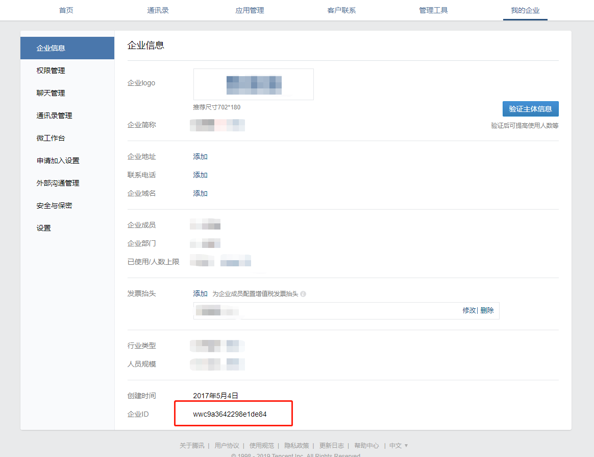
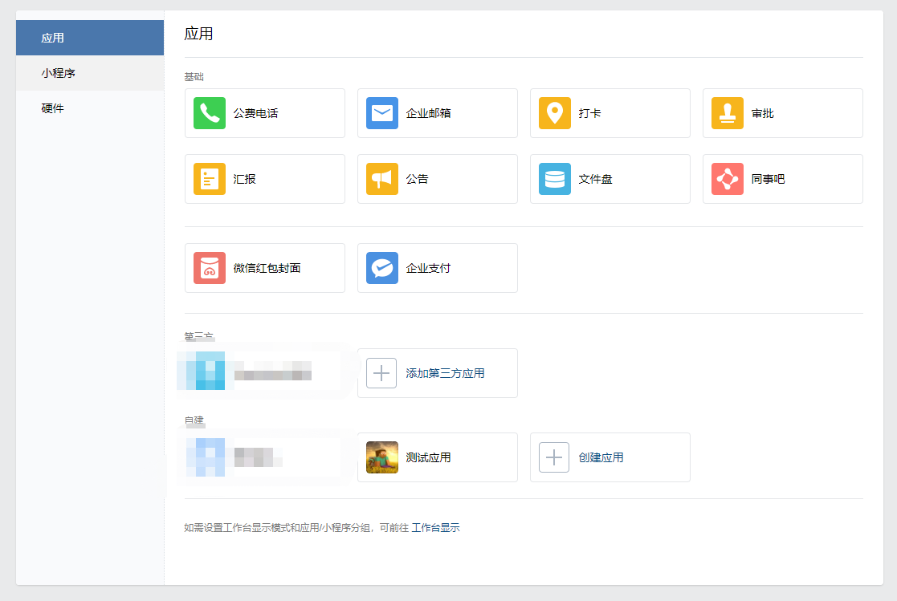
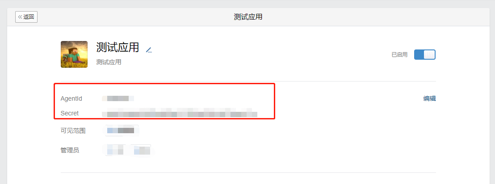
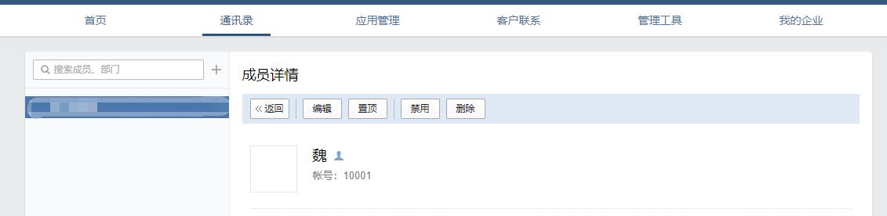
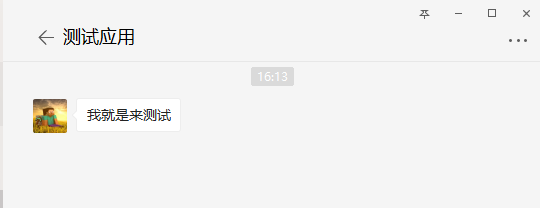

### 前言
这几天忙活着别的东西，耽误了很长时间，从文件操作完了之后就在考虑着下一步鼓捣点儿啥，因为最开始的业务开发就是企业微信相关的，这刚好来做个内部应用的小例子玩玩。

### 企业微信
前身是企业号，当时微信主推的还是公众号与服务号，后续战略考虑到企业的OA了（当然还是跟某个抢市场），企业号应该是在16年还是具体啥时候出的，刚出的时候也是问题不断一直在修复更新，最近这两年基本上没咋关注企业微信了，也都是偶尔上去看看有没有新东西啊什么的，不过不得不说，在这几年的成长中已经修复逐渐成为一个不错的产品了（大厂的效率还是有的），相对于公众号的开发，为什么我选这个作为例子呢，因为企业微信我可以通过个人来使用（注册的早，现在不清楚注册流程，主要看是否需要企业认证），个人开发者在不论啥时候啥平台都或多或少有些不友好（当然，认证了说明你是个好人，为了信息安全，都懂）。
### 开始
注册企业微信的流程我就不多说了，直接说注册完成之后，我们来看下这个界面，标注的就是我们需要的关键参数。

记好这个东西之后，我们转到**应用管理**。

这个创建就是你添张图片打个名字而已，不多说，创建完成之后我们来看下图的标记。

记好这两个参数，OK，下来我们就来看[API](https://work.weixin.qq.com/api/doc#90000/90003/90487)吧，这里我只是介绍下消息推送。
微信等相关的第三方开发大致流程都类似，如下：
1. 注册账号（这不废话么）
2. 账号认证（为了权限，当然企业微信内部应用不需要）
3. 服务域名确定好
4. AppID、Secret等等的配置（为了accesstoken）
5. 几乎所有的接口都是先获取accesstoken，相当于你在微信的登录
6. 根据接口文档来传参啊获取回调啊获取事件等等
7. 根据返回值来看看错误信息

> 我这里不做服务端，只是写个示例，需要服务端什么的开发之类的可以给我联系，互相学习。

首先，在我们的**Util**新建一个类**QyThirdUtil**（名字感觉起的好没水平，玩游戏止于起名字，别人都10级了，我还在想名字），先把我们需要的配置信息搞了。
```csharp
		private static string _CorpID = string.Empty;
        private static string _Secret = string.Empty;
        private static string _AgentID = string.Empty;
        /// <summary>
        /// 企业微信id
        /// </summary>
        public static string CorpID
        {
            get
            {
                if (string.IsNullOrEmpty(_CorpID))
                {
                    _CorpID = AprilConfig.Configuration["QyThird:CorpID"];
                }
                return _CorpID;
            }
        }
        /// <summary>
        /// 企业微信应用秘钥
        /// </summary>
        public static string Secret
        {
            get
            {
                if (string.IsNullOrEmpty(_Secret))
                {
                    _Secret = AprilConfig.Configuration["QyThird:Secret"];
                }
                return _Secret;
            }
        }
        /// <summary>
        /// 企业微信应用id
        /// </summary>
        public static string AgentID
        {
            get
            {
                if (string.IsNullOrEmpty(_Secret))
                {
                    _AgentID = AprilConfig.Configuration["QyThird:AgentID"];
                }
                return _AgentID;
            }
        }
```
然后我们来划分下方法，我们需要获取accesstoken，需要执行发送消息的方法。
```csharp
		/// <summary>
        /// 获取AccessToken
        /// </summary>
        /// <returns></returns>
        public static string GetAccessToken()
        {
            QyAccessToken accessToken = null;
            bool isGet = false;
            if (CacheUtil.Exists("QyAccessToken"))
            {
                accessToken = CacheUtil.Get<QyAccessToken>("QyAccessToken");
                if (accessToken.Expire_Time >= DateTime.Now.AddMinutes(1))
                {
                    isGet = true;
                }
            }
            if (!isGet)
            {
                string url = $"https://qyapi.weixin.qq.com/cgi-bin/gettoken?corpid={CorpID}&corpsecret={Secret}";
                //请求获取
                string res = RequestUtil.HttpGet(url);
                accessToken = JsonConvert.DeserializeObject<QyAccessToken>(res);
                if (accessToken != null && accessToken.ErrCode == 0)
                {
                    accessToken.Expire_Time = DateTime.Now.AddSeconds(accessToken.Expires_In);
                    CacheUtil.Set("QyAccessToken", accessToken, new TimeSpan(2, 0, 0));
                }
                else
                {
                    LogUtil.Error($"获取accesstoken失败——{accessToken.ErrCode},{accessToken.ErrMsg}");
                }
            }

            return accessToken.Access_Token;
        }
```
这里用到了两个地方，一个是微信端回调的对象实例**QyAccessToken**，需要的朋友可以在源码里cv，我这里就不贴出来了。

另一个是HttpClient的简单封装请求方法**RequestUtil**，看了有些博客说HttpClient的生命周期之类的，有推荐直接实例化一个私有静态的，也有做工厂模式创建的，没细究，这块儿要多注意下。
```csharp
	public class RequestUtil
    {

        /// <summary>
        /// 发起POST同步请求
        /// </summary>
        /// <param name="url">请求地址</param>
        /// <param name="postData">请求数据</param>
        /// <param name="contentType">数据类型</param>  
        /// <param name="timeOut">超时时间</param>  
        /// <returns></returns>
        public static string HttpPost(string url, string postData = null, string contentType = null, int timeOut = 30)
        {
            if (string.IsNullOrEmpty(postData))
            {
                postData = "";
            }
            using (HttpClient client = new HttpClient())
            {
                client.Timeout = new TimeSpan(0, 0, timeOut);
                using (HttpContent httpContent = new StringContent(postData, Encoding.UTF8))
                {
                    if (contentType != null)
                        httpContent.Headers.ContentType = new System.Net.Http.Headers.MediaTypeHeaderValue(contentType);

                    HttpResponseMessage response = client.PostAsync(url, httpContent).Result;
                    return response.Content.ReadAsStringAsync().Result;
                }
            }
        }


        /// <summary>
        /// 发起POST异步请求
        /// </summary>
        /// <param name="url">请求地址</param>
        /// <param name="postData">请求数据</param>
        /// <param name="contentType">数据类型</param>
        /// <param name="timeOut">超时时间</param>      
        /// <returns></returns>
        public static async Task<string> HttpPostAsync(string url, string postData = null, string contentType = null, int timeOut = 30)
        {
            if (string.IsNullOrEmpty(postData))
            {
                postData = "";
            }
            using (HttpClient client = new HttpClient())
            {
                client.Timeout = new TimeSpan(0, 0, timeOut);
                using (HttpContent httpContent = new StringContent(postData, Encoding.UTF8))
                {
                    if (contentType != null)
                        httpContent.Headers.ContentType = new System.Net.Http.Headers.MediaTypeHeaderValue(contentType);

                    HttpResponseMessage response = await client.PostAsync(url, httpContent);
                    return await response.Content.ReadAsStringAsync();
                }
            }
        }

        /// <summary>
        /// 发起GET同步请求
        /// </summary>
        /// <param name="url">请求地址</param>
        /// <returns></returns>
        public static string HttpGet(string url)
        {
            using (HttpClient client = new HttpClient())
            {
                return client.GetStringAsync(url).Result;
            }
        }

        /// <summary>
        /// 发起GET异步请求
        /// </summary>
        /// <param name="url">请求地址</param>
        /// <returns></returns>
        public static async Task<string> HttpGetAsync(string url)
        {
            using (HttpClient client = new HttpClient())
            {
                HttpResponseMessage response = await client.GetAsync(url);
                return await response.Content.ReadAsStringAsync();
            }
        }
    }
```

然后我们来写个发送消息的方法**SendMessage**，这里我只写了下普通文本推送。
```csharp
		/// <summary>
        /// 消息推送
        /// </summary>
        /// <param name="content">文本内容</param>
        /// <param name="range">推送范围</param>
        /// <param name="messageType">消息类型</param>
        /// <returns></returns>
        public static bool SendMessage(string content, MessageRange range, AprilEnums.MessageType messageType)
        {
            bool isSend = false;
            if (string.IsNullOrEmpty(content) || content.Length > 2048 || range==null)
            {
                return false;
            }
            string accessToken = GetAccessToken();
            if (string.IsNullOrEmpty(accessToken))
            {
                return false;
            }
            string url = $"https://qyapi.weixin.qq.com/cgi-bin/message/send?access_token={accessToken}";
            StringBuilder data = new StringBuilder();
            bool isVaildRange = false;
            if (range.IsAll)
            {
                data.Append($"\"touser\":\"@all\"");
                isVaildRange = true;
            }
            else
            {
                if (range.Users != null && range.Users.Count > 0)
                {
                    data.AppendFormat("\"touser\" : {0}", GetRangeValue(range.Users));
                    isVaildRange = true;
                }

                if (range.Tags != null && range.Tags.Count > 0)
                {
                    if (data.Length > 0)
                    {
                        data.Append(",");
                    }
                    data.AppendFormat("\"totag\" : {0}", GetRangeValue(range.Tags));
                    isVaildRange = true;
                }

                if (range.Departments != null && range.Departments.Count > 0)
                {
                    if (data.Length > 0)
                    {
                        data.Append(",");
                    }
                    data.AppendFormat("\"totag\" : {0}", GetRangeValue(range.Departments));
                    isVaildRange = true;
                }
            }
            if (!isVaildRange)
            {
                //没有发送范围
                return false;
            }
            data.AppendFormat(",\"msgtype\":\"{0}\"", GetMessageType(messageType));
            data.AppendFormat(",\"agentid\":\"{0}\"", AgentID);
            data.Append(",\"text\": {");
            data.AppendFormat("\"content\":\"{0}\"", content);
            data.Insert(0, "{");
            data.Append("}}");
            LogUtil.Debug($"获取到发送消息请求：{data.ToString()}");
            string res = RequestUtil.HttpPost(url, data.ToString(), "application/json");
            LogUtil.Debug($"获取到发送消息回调：{res}");

            return false;
        }
```
简单说下消息推送，第一个就是你的推送类型，是普通文本还是啥（文档都有，我这净扯淡），然后就是你的范围，再然后就是你的推送内容了，当然根据不同的推送类型你的内容参数也不同，需要进一步封装的朋友可以去看下API。

### 测试
我们在控制器中（不再说**Values**了）加上消息推送的测试，这里的范围可以在你自己的通讯录中查看。
```csharp
        [HttpGet]
        public ActionResult<IEnumerable<string>> Get()
        {
        	//…
            MessageRange range = new MessageRange();
            range.Users = new List<string>();
            range.Users.Add("10001");
            QyThridUtil.SendMessage("我就是来测试", range, AprilEnums.MessageType.Text);
            //…
        }
```




### 小结
写到这里基本上都结束了，为什么我特意拿出来企业微信的内部应用来写这篇呢，其实是做下这个消息推送，以后的自己的工程就可以写个这个然后做异常警告之类的东西，这样想想这篇就不是废话了，编程的奇淫技巧（咳咳，乐趣，乐趣）就在于此，代码自己敲，东西自己组，全在于你自己怎么玩了。