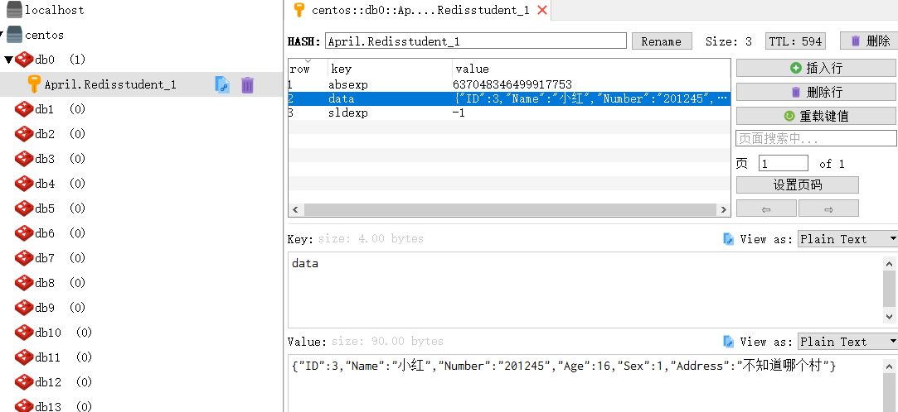

### 前言
中秋过完不知不觉都已经快两周没动这个工程了，最近业务需要总算开始搞后台云服务了，果断直接net core搞起，在做的中间遇到了不少问题，这个后续会一点点列出来包括解决方法，今天就先把之前挖的坑填一个。

### Redis
之前在缓存那篇提到过，**Cookie**，**Session**，**Cache**这几个不同的缓存方式，Cookie是存在客户端浏览器的，Session实质上也是客户端的存储，至于Cache是服务端的，但是如果是分布式的话，这几个方式可能除了Cookie其他两个都要有点儿问题，毕竟一台服务只存储自身一台，如果多台的话，需要涉及到多服务的交互，比如一台服务做了Cache存储，需要给其他服务发送内部信号或是http请求，其他服务根据请求执行对应操作。

当然这是在没有用到**Redis**的前提下，Redis是解决分布式缓存的神器，相当于是自身一台服务器专门处理数据的读写，可以理解为数据服务器（个人感觉。。。），至于自己业务的分布式只是为了业务需要去执行，需要用到数据缓存即可直接调用Redis的读写操作（当然，各个服务的Redis配置要保持一致）。

Redis的安装和配置在[Linux配置部署_新手向（四）——Redis安装与配置](/2019/09/12/vmware-redis/)已经说过，当时就是为了使用Redis而做了个小铺垫。

### 使用
首先，只要是类库肯定是引入Nuget包了，我们在**April.Util**引入**Microsoft.Extensions.Caching.Redis**，当然其他也有**StackExchange.Redis**，**CSRedisCore**，这里先试试官方的吧，[官方扩展包地址](https://github.com/aspnet/Extensions/tree/9bc79b2f25a3724376d7af19617c33749a30ea3a)。

引入完之后，我们在appsettings.json来配置下地址目录。

之后我们看下Redis的方法，毕竟调用第三方都是看看然后根据自己需要裹一下。

也是先要初始化配置信息，然后创建实体对象，调用方法，这里说明下，默认的value值是byte[]，当然官方也有扩展方法。

好了，看完了方法，我们来开始Util吧。

### RedisUtil
首先，我们还是要先做配置信息，前面已经在appsettings写过配置信息，这里直接在**AprilConfig**中添加上。
```csharp
private static string _IsOpenCache = string.Empty;
        /// <summary>
        /// 是否使用Redis
        /// </summary>
        public static bool IsOpenCache
        {
            get
            {
                if (string.IsNullOrEmpty(_IsOpenCache))
                {
                    _IsOpenCache = Configuration["Redis:IsOpenRedis"];
                }
                if (_IsOpenCache.ToLower() == "true")
                {
                    return true;
                }
                return false;
            }
        }

        private static string _RedisConnectionString = string.Empty;
        /// <summary>
        /// Redis默认连接串
        /// </summary>
        public static string RedisConnectionString
        {
            get
            {
                if (string.IsNullOrEmpty(_RedisConnectionString))
                {
                    _RedisConnectionString = Configuration["Redis:ConnectionString"];
                }
                return _RedisConnectionString;
            }
        }
```

配置信息设置完成之后，开始初始化Redis的方法。
```csharp
        private static RedisCache _redisCache = null;
        private static RedisCacheOptions options = null;
        /// <summary>
        /// 初始化Redis
        /// </summary>
        public static void InitRedis()
        {
            if (AprilConfig.IsOpenCache)
            {
                _redisCache = new RedisCache(GetOptions());
            }
        }
        /// <summary>
        /// 获取配置项信息
        /// </summary>
        /// <returns></returns>
        protected static RedisCacheOptions GetOptions()
        {
            options = new RedisCacheOptions();
            options.Configuration = AprilConfig.RedisConnectionString;
            options.InstanceName = "April.Redis";
            return options;
        }
        /// <summary>
        /// 添加数据
        /// </summary>
        /// <param name="key">键</param>
        /// <param name="value">值</param>
        /// <param name="ExprireTime">过期时间</param>
        public static void Add(string key, object value, int ExprireTime = 10)
        {
            if (string.IsNullOrEmpty(key))
            {
                return;
            }
            string strValue = string.Empty;
            try
            {
                strValue = JsonConvert.SerializeObject(value);
            }
            catch (Exception ex)
            {
                LogUtil.Error($"Redis.Add转换失败:{ex.Message}");
            }
            if (!string.IsNullOrEmpty(strValue))
            {
                _redisCache.SetString(key, strValue, new Microsoft.Extensions.Caching.Distributed.DistributedCacheEntryOptions()
                {
                    AbsoluteExpiration = DateTime.Now.AddMinutes(ExprireTime)
                });
            }
        }
        /// <summary>
        /// 获取数据（对象）
        /// </summary>
        /// <typeparam name="T">对象类型</typeparam>
        /// <param name="key">键</param>
        /// <returns></returns>
        public static T Get<T>(string key)
        {
            string value = Get(key);
            if (string.IsNullOrEmpty(value))
            {
                return default(T);
            }
            T obj = default(T);
            try
            {
                obj = JsonConvert.DeserializeObject<T>(value);
            }
            catch (Exception ex)
            {
                LogUtil.Error($"Redis.Get转换失败：{ex.Message},数据：{value}");
            }
            return obj;
        }
        /// <summary>
        /// 移除数据
        /// </summary>
        /// <param name="key">键</param>
        public static void Remove(string key)
        {
            if (!string.IsNullOrEmpty(key))
            {
                _redisCache.Remove(key);
            }
        }
        /// <summary>
        /// 重置数据
        /// </summary>
        /// <param name="key">键</param>
        /// <param name="value">值</param>
        /// <param name="expireTime">过期时间</param>
        public static void Replace(string key, object value, int expireTime = 10)
        {
            if (!string.IsNullOrEmpty(key))
            {
                Remove(key);
                Add(key, value, expireTime);
            }
        }
```

具体使用的方法，这里不多写了，代码地址见[net core Webapi 总目录](/2019/07/19/net-core-webapi-main/)，感觉代码贴的多了，自己也习惯了复制粘贴，看一个封装好的方法，就要去看他的源码（如果只是用的话就算了），这样对方法的使用以及自身的业务需要封装会有很好的帮助，毕竟会用是第一步，会改是第二步，封装是第三步，自己写那就是最终级了（这句纯属自勉）。

### 测试
好了，写完之后，习惯来一遍测试，不想自己整理的东西最终还是不能用，千篇一律不可怕，可怕的是不知道最终的效果。
**新增**


**获取**


**覆盖**
ps:说是覆盖，其实就是删除然后新增-,-|||


**删除**


### 小结
写到这里基本上都结束了，简单的说明了Redis的使用，后续还是会不断更新，比如那么多database，如果随意切换，redis存储之后会不会有什么其他问题等等，**学以致用，用方知错，错而能改，改了就行**。