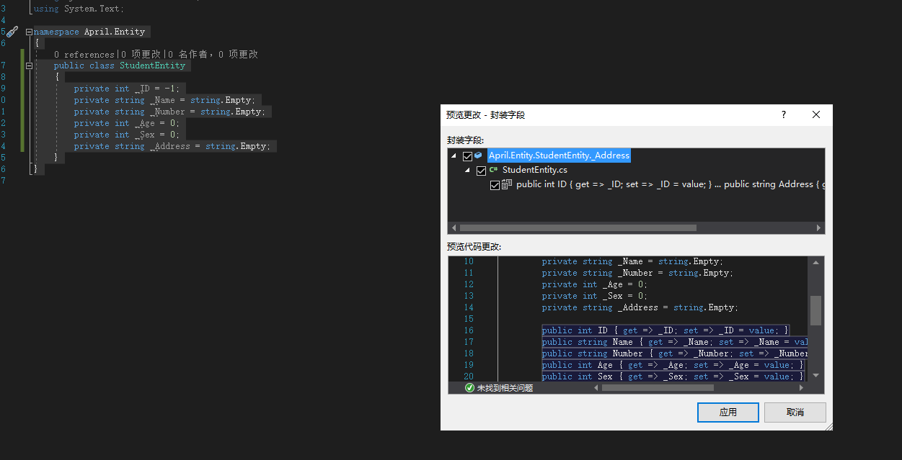

### 前言
后端开发最常打交道的就是数据库了（静态网站靠边），上一篇[net core Webapi基础工程搭建（五）——缓存机制](/2019/07/10/net-core-cache/)，缓存就是为了减少数据库的读操作，不过什么访问都是会耗时的，拿空间（内存）换时间对用户体验来说是惯用手段，后续介绍界面操作的时候再说用户体验。

### SqlSugar
当然你可以用EF（太重，扩展性相对差，但不可否认基本上涵盖范围够广），也可以用Dapper（这个我之前头一回鼓捣net core的时候用的是Dapper），或者自己基于原生去写数据库的操作，都Ok，但是如果有造好的轮子，对于我们来说用就行了，可以深入理解但对于常规开发来说，CV大法是最好的（新手向），**SqlSugar**的[文档地址](http://www.codeisbug.com/)。

> 之前的工程在最初创建的时候，没有创建完整，因为当时不操作数据层，所以偷个懒，这次一并创建，具体过程不再赘述
，同**April.Util**工程的创建一致，都是类库项目，新建**April.Service**，**April.Entity**。

好了，我们在Service与Entity项目中通过NuGet包引入**sqlSugarCore**，至于原因前面也说过[net core Webapi基础工程搭建（四）——日志功能log4net](/2019/07/04/net-core-log4net/)。

这里应该不需要再图文介绍引入了，如果不清楚，也可以去上面的链接查看NuGet的引入方法。

引入完成后，我们在Entity项目创建一个类对象，命名为**StudentEntity**吧，只是做个示例。

```csharp
    public class StudentEntity
    {
        private int _ID = -1;
        private string _Name = string.Empty;
        private string _Number = string.Empty;
        private int _Age = 0;
        private int _Sex = 0;
        private string _Address = string.Empty;
    }
```
对象属性这块儿，看个人习惯，有些人偏向于直接get，set方法，我习惯于先初始化，选中所有的私有属性，使用宇宙第一IDE的快捷键Ctrl+R+E，点击确定，好了自己去加注释去吧。

这里也说下为什么Entity这个实例对象层也要引入SqlSugar，是因为如果你的表名或者属性名与数据库不一致的时候，还是需要标识出来的，比如下面的代码，具体的用法还是去参考文档吧，我这只是轻描淡写下。

```csharp
	[SugarTable("test_Student")]
    public class StudentEntity
    {
        private int _ID = -1;
        private string _Name = string.Empty;
        private string _Number = string.Empty;
        private int _Age = 0;
        private int _Sex = 0;
        private string _Address = string.Empty;

        /// <summary>
        /// 主键
        /// </summary>
        [SugarColumn(IsPrimaryKey = true, IsIdentity = true)]
        public int ID { get => _ID; set => _ID = value; }
        /// <summary>
        /// 姓名
        /// </summary>
        public string Name { get => _Name; set => _Name = value; }
        /// <summary>
        /// 学号
        /// </summary>
        public string Number { get => _Number; set => _Number = value; }
        /// <summary>
        /// 年龄
        /// </summary>
        public int Age { get => _Age; set => _Age = value; }
        /// <summary>
        /// 性别
        /// </summary>
        public int Sex { get => _Sex; set => _Sex = value; }
        /// <summary>
        /// 家庭住址
        /// </summary>
        [SugarColumn(ColumnName = "test_Address")]
        public string Address { get => _Address; set => _Address = value; }
    }
```

实体对象我就不多写了，重复的工作是根据你自己的业务所处理的。

### Service层
这个地方我重点标注下，是因为数据库这块儿的操作还是需要重视的，我们先来新建个**BaseDbContext**用于执行数据库操作的实体。
```csharp
	public class BaseDbContext
    {
        public SqlSugarClient Db;
        /// <summary>
        /// 构造函数
        /// </summary>
        /// <param name="connStr">数据库连接串</param>
        /// <param name="sqlType">数据库类型</param>
        public BaseDbContext(string connStr, int sqlType = 1)
        {
            InitDataBase(connStr, sqlType);
        }

        /// <summary>
        /// 构造函数
        /// </summary>
        /// <param name="serverIp">服务器IP</param>
        /// <param name="user">用户名</param>
        /// <param name="pass">密码</param>
        /// <param name="dataBase">数据库</param>
        public BaseDbContext(string serverIp, string user, string pass, string dataBase)
        {
            string connStr = $"server={serverIp};user id={user};password={pass};persistsecurityinfo=True;database={dataBase}";
            InitDataBase(connStr);
        }

        /// <summary>
        /// 初始化数据库连接
        /// </summary>
        /// <param name="listConn">连接字符串</param>
        private void InitDataBase(string connStr, int sqlType = 1)
        {
            Db = new SqlSugarClient(new ConnectionConfig()
            {
                ConnectionString = connStr,
                DbType = (DbType)sqlType,
                IsAutoCloseConnection = true,
                //SlaveConnectionConfigs = slaveConnectionConfigs
            });
            Db.Ado.CommandTimeOut = 30000;//设置超时时间
            Db.Aop.OnLogExecuted = (sql, pars) => //SQL执行完事件
            {
                //这里可以查看执行的sql语句跟参数
            };
            Db.Aop.OnLogExecuting = (sql, pars) => //SQL执行前事件
            {
                //这里可以查看执行的sql语句跟参数
            };
            Db.Aop.OnError = (exp) =>//执行SQL 错误事件
            {
                //这里可以查看执行的sql语句跟参数
            };
            Db.Aop.OnExecutingChangeSql = (sql, pars) => //SQL执行前 可以修改SQL
            {
                return new KeyValuePair<string, SugarParameter[]>(sql, pars);
            };
        }
        /// <summary>
        /// 开启事务
        /// </summary>
        public void BeginTran()
        {
            Db.Ado.BeginTran();
        }
        /// <summary>
        /// 提交事务
        /// </summary>
        public void CommitTran()
        {
            Db.Ado.CommitTran();
        }
        /// <summary>
        /// 回滚事务
        /// </summary>
        public void RollbackTran()
        {
            Db.Ado.RollbackTran();
        }
    }
```

构造函数主要用于实例化你的数据库对象（连接串，数据库类型），日志的记录，事务这些也都标注上，后续可以替换直接使用。

### BaseService（基类）
> 在最初写net core的时候，我用Repository层来实现sql处理，Service用来做逻辑处理，传统的三层架构，但是对于简单的工程来说，个人感觉Bll层的存在不是那么理想，可能是我没彻底理解三层架构吧，这个地方如果有个人想法或好的见解也希望一块交流，互相进步。

在写基类之前，我们在Util层新建一个**SqlSqlFilterEntity**，这步可能算是多此一举，但是为了减少团队其他人的学习成本，我还是写了这个对象，以致于后续的封装，会以此为参数做传递而不公开lambda的写法使用。

```csharp
    public class SqlFilterEntity
    {
        private string _Filter = string.Empty;
        private Dictionary<string, object> _Value = null;
        /// <summary>
        /// 查询条件
        /// </summary>
        public string Filter { get => _Filter; set => _Filter = value; }
        /// <summary>
        /// 查询参数
        /// </summary>
        public Dictionary<string, object> Value { get => _Value; set => _Value = value; }
    }
```

在Service层新建**IBaseService**接口。
```csharp
    public interface IBaseService<T> : IDisposable
    {
        /// <summary>
        /// 分页查询集合
        /// </summary>
        /// <param name="pageIndex">页码</param>
        /// <param name="pageSize">分页大小</param>
        /// <param name="strField">查询字段</param>
        /// <param name="filter">查询条件</param>
        /// <param name="strOrder">排序规则</param>
        /// <param name="totalCount">总数</param>
        /// <returns>数据集合</returns>
        List<T> GetPageList(int pageIndex, int pageSize, string strField, SqlFilterEntity filter, string strOrder, out int totalCount);

        /// <summary>
        /// 获取列表集合
        /// </summary>
        /// <param name="field">查询字段</param>
        /// <param name="filter">查询条件</param>
        /// <returns>数据集合</returns>
        ISugarQueryable<T> GetList(string field, SqlFilterEntity filter);

        /// <summary>
        /// 获取列表集合
        /// </summary>
        /// <returns>数据集合</returns>
        ISugarQueryable<T> GetList(int top = 0);

        /// <summary>
        /// 获取对象
        /// </summary>
        /// <param name="field">查询字段</param>
        /// <param name="filter">查询条件</param>
        /// <returns>对象</returns>
        T GetEntity(SqlFilterEntity filter, string field = "");

        /// <summary>
        /// 判断数据是否存在
        /// </summary>
        /// <param name="filter">查询条件</param>
        /// <returns>执行结果</returns>
        bool IsExists(SqlFilterEntity filter);

        /// <summary>
        /// 新增
        /// </summary>
        /// <param name="entity">实例对象</param>
        /// <param name="ignoreColumns">排除列</param>
        /// <param name="isLock">是否加锁</param>
        /// <returns>自增id</returns>
        int Insert(T entity, List<string> ignoreColumns = null, bool isLock = false);

        /// <summary>
        /// 修改
        /// </summary>
        /// <param name="entity">实例对象</param>
        /// <param name="ignoreColumns">排除列</param>
        /// <param name="isLock">是否加锁</param>
        /// <returns>执行结果</returns>
        bool Update(T entity, List<string> ignoreColumns = null, bool isLock = false);

        /// <summary>
        /// 根据主键删除
        /// </summary>
        /// <param name="entity">实例对象</param>
        /// <param name="isLock">是否加锁</param>
        /// <returns>执行结果</returns>
        bool Delete(T entity, bool isLock = false);

    }
```
可以看到，我通过SqlFilterEntity这一实例来传递我的Where条件。

实现接口方法，新建**BaseService**。

```csharp
    public class BaseService<T> : IBaseService<T> where T : class, new()
    {
        private BaseDbContext baseDb;
        protected SqlSugarClient db;

        public BaseService()
        {
            baseDb = new BaseDbContext("你的数据库连接");
            db = baseDb.Db;
        }

        /// <summary>
        /// 分页查询集合
        /// </summary>
        /// <param name="pageIndex">页码</param>
        /// <param name="pageSize">分页大小</param>
        /// <param name="strField">查询字段</param>
        /// <param name="filter">查询条件</param>
        /// <param name="strOrder">排序规则</param>
        /// <param name="totalCount">总数</param>
        /// <returns>数据集合</returns>
        public List<T> GetPageList(int pageIndex, int pageSize, string strField, SqlFilterEntity filter, string strOrder, out int totalCount)
        {
            totalCount = 0;
            if (pageIndex <= 0)
            {
                pageIndex = 1;
            }
            if (pageSize <= 0)
            {
                pageSize = 10;//暂定默认分页大小为10
            }
            if (string.IsNullOrEmpty(strField))
            {
                strField = "";
            }
            if (string.IsNullOrEmpty(strOrder))
            {
                strOrder = string.Format("ID asc");//这个地方我当时是在Config设置默认的排序
            }
            if (filter == null)
            {
                filter = new SqlFilterEntity();
            }
            return db.Queryable<T>().With(SqlWith.NoLock).Select(strField).WhereIF(!string.IsNullOrEmpty(filter.Filter), filter.Filter, filter.Value).OrderByIF(!string.IsNullOrEmpty(strOrder), strOrder).ToPageList(pageIndex, pageSize, ref totalCount);
        }

        /// <summary>
        /// 获取列表集合
        /// </summary>
        /// <param name="field">查询字段</param>
        /// <param name="filter">查询条件</param>
        /// <returns>数据集合</returns>
        public ISugarQueryable<T> GetList(string field, SqlFilterEntity filter)
        {
            if (string.IsNullOrEmpty(field))
            {
                field = "";
            }
            if (filter == null)
            {
                filter = new SqlFilterEntity();
            }
            return db.Queryable<T>().With(SqlWith.NoLock).Select(field).WhereIF(!string.IsNullOrEmpty(filter.Filter), filter.Filter, filter.Value);
        }

        /// <summary>
        /// 获取列表集合
        /// </summary>
        /// <returns>数据集合</returns>
        public ISugarQueryable<T> GetList(int top = 0)
        {
            if (top > 0)
            {
                return db.Queryable<T>().With(SqlWith.NoLock).Take(top);
            }
            else
            {
                return db.Queryable<T>().With(SqlWith.NoLock);
            }
        }

        /// <summary>
        /// 获取对象
        /// </summary>
        /// <param name="field">查询字段</param>
        /// <param name="filter">查询条件</param>
        /// <returns>对象</returns>
        public T GetEntity(SqlFilterEntity filter, string field = "")
        {
            if (string.IsNullOrEmpty(field))
            {
                field = "";
            }
            if (filter != null)
            {
                return db.Queryable<T>().With(SqlWith.NoLock).Select(field).WhereIF(!string.IsNullOrEmpty(filter.Filter), filter.Filter, filter.Value).First();
            }
            return default(T);
        }

        /// <summary>
        /// 判断数据是否存在
        /// </summary>
        /// <param name="filter">查询条件</param>
        /// <returns>执行结果</returns>
        public bool IsExists(SqlFilterEntity filter)
        {
            var result = db.Queryable<T>().With(SqlWith.NoLock).WhereIF(!string.IsNullOrEmpty(filter.Filter), filter.Filter, filter.Value).Count();
            return result > 0;
        }

        /// <summary>
        /// 新增
        /// </summary>
        /// <param name="entity">实例对象</param>
        /// <param name="ignoreColumns">排除列</param>
        /// <param name="isLock">是否加锁</param>
        /// <returns>自增id</returns>
        public int Insert(T entity, List<string> ignoreColumns = null, bool isLock = false)
        {
            if (ignoreColumns == null)
            {
                ignoreColumns = new List<string>();
            }
            var result = isLock ?
                db.Insertable(entity).With(SqlWith.UpdLock).IgnoreColumns(ignoreColumns.ToArray()).ExecuteReturnIdentity()
                : db.Insertable(entity).IgnoreColumns(ignoreColumns.ToArray()).ExecuteReturnIdentity();
            return result;
        }


        /// <summary>
        /// 修改
        /// </summary>
        /// <param name="entity">实例对象</param>
        /// <param name="ignoreColumns">排除列</param>
        /// <param name="isLock">是否加锁</param>
        /// <returns>执行结果</returns>
        public bool Update(T entity, List<string> ignoreColumns = null, bool isLock = false)
        {
            if (ignoreColumns == null)
            {
                ignoreColumns = new List<string>();
            }
            var result = isLock ?
                db.Updateable(entity).With(SqlWith.UpdLock).IgnoreColumns(ignoreColumns.ToArray()).ExecuteCommand()
                : db.Updateable(entity).IgnoreColumns(ignoreColumns.ToArray()).ExecuteCommand();
            return result > 0;
        }

        /// <summary>
        /// 根据主键删除
        /// </summary>
        /// <param name="entity">实例对象</param>
        /// <param name="isLock">是否加锁</param>
        /// <returns>执行结果</returns>
        public bool Delete(T entity, bool isLock = false)
        {
            var result = isLock ?
                db.Deleteable<T>(entity).With(SqlWith.RowLock).ExecuteCommand().ObjToBool()
                : db.Deleteable<T>(entity).ExecuteCommand().ObjToBool();
            return result;
        }

        public void Dispose()
        {

        }
    }
```

### 小结
这一篇感觉写的不多，但是代码放的有点儿多，习惯性的把东西尽可能介绍详细点儿，万一有人真的从小白开始一点点儿想折腾个啥东西呢（比如说我），下一篇**Part 2**介绍具体的用法和测试吧。