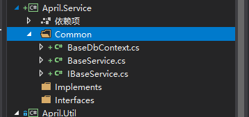
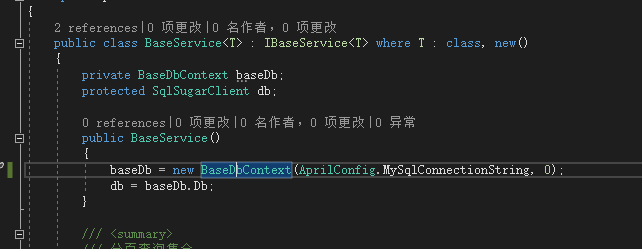
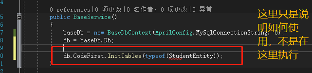
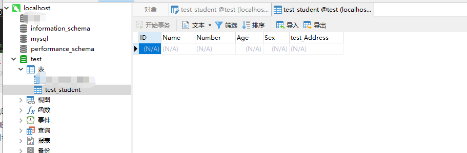
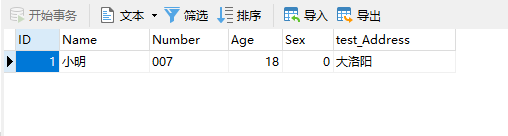
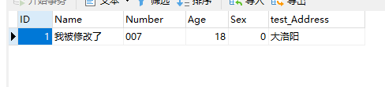
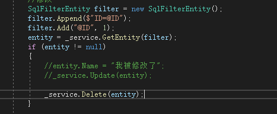
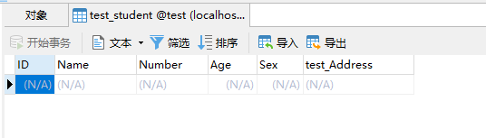
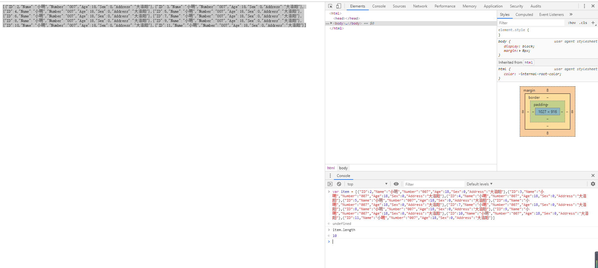

### 前言
昨天是写着写着发现，时间不早了，已经养成了晚上下班抽时间看看能写点儿啥的习惯（貌似），今天实在是不想让昨天没做完的事情影响，所以又坐下，沉下心（周末了），开始把数据库这块儿的补充完整。

昨天已经介绍过大部分的东西，包括方法封装也是基本的展示了下，实际上应该先介绍这一篇，从怎么用来引导封装类库，但是既然写都写出来了就不想再调整了，今天就主要说下怎么实际使用方法吧，需要查看具体使用的类库可查看[net core Webapi基础工程搭建（六）——数据库操作_Part 1](/2019/07/18/net-core-sqlsugar-1/)。（懒的不能行）

### 开始
闲话不多说，Service层搞起，新建两个文件夹，一个**Interfaces**，一个**Implements**，另外顺带新建个**Common**的文件夹，把上一篇的三个类放进去（纯粹是看的，归类，放不放不影响使用）。


上一篇我们创建了一个StudentEntity这个对象，忘了的朋友可以去看下。
新建一个**IStudentService**接口，继承IBaseService
```csharp
    public interface IStudentService : IBaseService<StudentEntity>
    {
    }
```
新建一个**StudentService**实现类，继承BaseService，实现IStudentService
```csharp
    public class StudentService : BaseService<StudentEntity>, IStudentService
    {
    }
```
好了，完了，回家睡觉吧。

### 使用
如果你看到上面的直接走了，对不起，娱乐一下，做开发千万不敢像乌鸦学盖房子，没听过自行度娘，我也不会讲故事。

我们需要在StartUp这里将接口与实现关联，有些博客会介绍自动关联用于解耦，需要也可以自行百度。

> 补充说明，昨天好像忘记在WebApi工程引入Service与Entity两个工程了，见谅见谅，特此补充。

这里我在Service项目下Common下新建Depends文件夹，新建一个类**ServiceInjection**，在这统一放接口与实现的对应关系。

```csharp
    public class ServiceInjection
    {
        public static void ConfigureRepository(IServiceCollection services)
        {
            services.AddSingleton<IStudentService, StudentService>();
        }
    }
```

对于依赖注入，这里简短穿插几句，后续有新的感受会再补充。

| 方法 |  说明 |
|--|--|
| Transient | 每一次调用都会创建一个新的实例 |
| Scoped | 一个作用域中只实例化一个 |
| Singleton | 整个应用程序生命周期以内只创建一个实例  |

然后我们在StartUp的ConfigureServices最前面加上这句话，这里在构造函数加上这句，用途就是由AprilConfig来统一接管配置信息。
```csharp
		public Startup(IConfiguration configuration)
        {
			...之前的东西
            AprilConfig.InitConfig(configuration);
        }
		
        public void ConfigureServices(IServiceCollection services)
        {
            ServiceInjection.ConfigureRepository(services);
            
			...之前的东西
		}
```
当然对应要有接收的方法。
```csharp
    public class AprilConfig
    {
        public static IServiceProvider ServiceProvider;
        public static IConfiguration Configuration;

        public static void InitConfig(IConfiguration _configuration)
        {
            Configuration = _configuration;
        }
	}
```

好了，所有的都写好后，我们继续拿万恶的Values控制器（多好的开刀对象）实验。

在这之前，确定好你的数据库是哪类，SqlServer请按1，MySql请按0，其他请自行查看文档。

为了方便项目统一管理，我们要好好利用appsettings，就像我们当时使用web.config一样，连接串自己根据实际情况修改。
```json
  //新加一个
  "DefaultSqlConnectionString": {
    "MySql": "server=127.0.0.1;userid=root;password=root;database=test;"
  }
```
在我们Util层的**AprilConfig**，来获取参数。

```csharp
        private static string _MySqlConnectionString = string.Empty;
        /// <summary>
        /// MySql默认连接串
        /// </summary>
        public static string MySqlConnectionString
        {
            get
            {
                if (string.IsNullOrEmpty(_MySqlConnectionString))
                {
                    _MySqlConnectionString = Configuration["DefaultSqlConnectionString:MySql"];
                }
                return _MySqlConnectionString;
            }
        }
```

然后我们来修改BaseService当时留的连接串信息。

创建表结构，这里说明下，不是说非要创建，毕竟SqlSugar有CodeFirst（当然也有DbFirst），需要的朋友可去文档查看，也比较简单，在程序启动的时候来判断是否有表，或者专门做个接口做初始化操作也可以，下图做用法简介，具体还是查看文档吧，毕竟还有备份啊改列名什么的。



万事具备，之前Values这个挨千刀的东风，构造函数来获取IStudentService这个接口。

```csharp
    public class ValuesController : ControllerBase
    {

        private readonly IStudentService _service;

        public ValuesController(IStudentService service)
        {
            _service = service;
        }
    }
```

- **插入**
```csharp
        [HttpGet]
        public ActionResult<IEnumerable<string>> Get()
        {
            StudentEntity entity = new StudentEntity();
            entity.Name = "小明";
            entity.Age = 18;
            entity.Number = "007";
            entity.Sex = 0;
            entity.Address = "大洛阳";
            _service.Insert(entity);
            return new string[] { "value1", "value2" };
        }
```

- **修改**
这里刚好也演示下SqlFilterEntity这个自己写的方法的用法，并且扩展了下实体的方法，方便使用。

*SqlFilterEntity扩展方法*
```csharp
		//...之前的实体对象
		
		/// <summary>
        /// 添加查询条件
        /// </summary>
        /// <param name="filter">条件</param>
        /// <param name="relation">关系</param>
        public void Append(string filter, string relation = "and")
        {
            if (string.IsNullOrEmpty(filter))
            {
                return;
            }
            if (Filter.Length > 0)
            {
                Filter += relation;
            }
            Filter += filter;
        }
        /// <summary>
        /// 添加查询参数
        /// </summary>
        /// <param name="key">键</param>
        /// <param name="value">值</param>
        public void Add(string key, object value)
        {
            if (string.IsNullOrEmpty(key) || value == null)
            {
                return;
            }
            if (Value == null)
            {
                Value = new Dictionary<string, object>();
            }
            if (Value.ContainsKey(key))
            {
                Value[key] = value;
            }
            else
            {
                Value.Add(key, value);
            }
        }
```

*修改测试*
```csharp
			StudentEntity entity = null;
            SqlFilterEntity filter = new SqlFilterEntity();
            filter.Append($"ID=@ID");
            filter.Add("@ID", 1);
            entity = _service.GetEntity(filter);
            if (entity != null)
            {
                entity.Name = "我被修改了";
                _service.Update(entity);
            }
	
```


- **删除**
删除这个不多说，就是把修改的换个方法。



- **查看**

这里直接做分页的测试，拿Values/{id}这个接口做实验。
```csharp
        [HttpGet("{id}")]
        public ActionResult<string> Get(int id)
        {
            string value = string.Empty;
            //value = CacheUtil.Get<string>("cachetest");
            //value = SessionUtil.GetSession("test");
            //value = CookieUtil.GetCookies("apirlcookietest");

            int count = 0;
            List<StudentEntity> lists = _service.GetPageList(id, 10, "", null, "", out count);

            value = JsonConvert.SerializeObject(lists);

            return value;
        }
```


### 小结

这里大致上介绍了SqlSugar的用法已经一些基础的不能基础的封装，实际使用的话，肯定需要扩展完善的，但是作为教程来讲，我也不可能把全部的情况都考虑到，毕竟业务不同，**没有万金油，只有不停的完善更新**，业务场景多了，功能就完善了，一步一步来，一口吃不成个胖子（这个胖子不是你认识的那个胖子），不过还是感慨下这些开源的好类库，真的是方便了开发人员，为了解放程序猿的双手（yy）做出了嗨翻天的贡献，好了，回归正题，下一篇**Aop的测试以及小东西**。