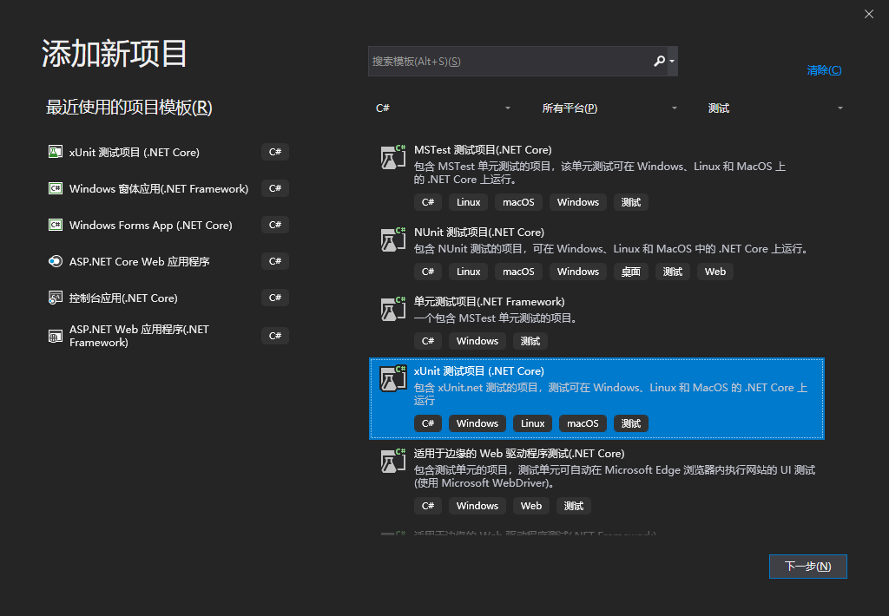
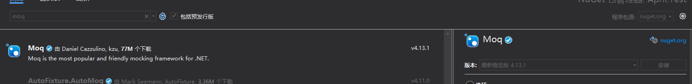

### 前言
从开始敲代码到现在，不停地都是在喊着记得做测试，记得自测，测试人员打回来扣你money之类的，刚开始因为心疼钱（当然还是为了代码质量），就老老实实自己写完自己跑一遍，没有流程没有规划没有测试文档，就是自己整理一组数据跑一遍，最后依然还是让测试人员老老实实把一大堆测试问题扔给你。

### 单元测试
首先，还是来聊聊为啥要搞测试吧。

1. 测试有助于代码整体健壮性，覆盖测试、压力测试都是为了全方位多角度更快更好为用户服务。
2. 测试有助于提高程序猿的积极性以及引起自身的重视，毕竟一个坑栽一遍就够了，两次也能容忍，再三再四再五怕是要被搞，同时这也是自我提高的一种手段吧。
3. 软件开发流程收尾的工作就是测试，绕不过，毕竟验收才是最终目标，达到效果才能获得应有的。

好了，聊完这些，当然我也不是专业测试人员，肯定不会给个测试文档模板，喏，照着这个规范起来，我主要是要鼓捣下我之前一直想试试的单元测试，这个自动化测试的手段之一，一直想试试但是一直都放着。

在**MSTest**，**NUnit**，**xUint**这三个中让我稍微犹豫了下，不过三七二十八管他呢，随便来个吧，就选了**xUnit**，当然MSTest是官方的，支持度应该高点儿，但是这不是我们该犹豫抉择的地方。

### xUnit
首先，我们新建一个项目**April.Test**。

#### Fact

新建之后，我们看到有个默认的 **[Fact]**。

这个就是测试的标准格式了，如果我们不需要测试数据的话，就是在这个标签下的方法做断言，简单举个例子吧。

```csharp
        [Fact]
        public void TestEqual()
        {
            int a = 10, b = 20;
            Assert.Equal(30, Add(a, b));
        }

        private int Add(int a, int b)
        {
            return a + b;
        }
```

敲下Assert之后，发现断言好多方法，这里也就不一一说明了，感觉方法名起的都挺明白的，这里就不过多描述了，代码中也有些测试示例，地址在文末给出。

#### Theory
我们在上面的代码可以看到，所有的数据都是自己定好的，如果我想自己做参数传入测试怎么搞呢，这时候就要用到 **[Theory]** 这个标签以及 **[InlineData]** 了，标签是为了更好的区分方法的类型（个人理解），来看下这种参数传递的测试怎么搞吧。

```csharp
        [Theory]
        [InlineData(new object[] { 1, 2, 3, 4 },1)]
        [InlineData(new object[] { "t", "e", "s", "t" }, "t")]
        public void TestContains(object[] objs,object obj)
        {
            Assert.Contains(obj, objs);
        }
```

当然我们也可以使用自定义数组来做测试数据源，这里我起初以为可以传任意类型参数，但是MemberData只支持object[]。
```csharp
        [Theory]
        [MemberData(nameof(tempDatas))]
        public void TestData(int a, int b)
        {
            int result = a + b;
            Assert.True(result == Add(a, b));
        }
        
        public static IEnumerable<object[]> tempDatas
        {
            get
            {
                yield return new object[] { 1, 2 };
                yield return new object[] { 5, 7 };
                yield return new object[] { 12, 12 };
            }
        }
```

#### 控制器
> 在之前鼓捣单元测试的时候，我一直想一个问题，如果只是这种操作的话，那测试有何意义，但是后来发现，原来单元测试比我以为能做的多得多，所以，学习是个不停的行程，走的多了，风景也就多了。

这里可以引入一个流程，在我们测试自己的工程的时候，我们需要三步来做完单个的测试。
- Arrange（准备工作）
- Act（实现方法）
- Assert（断言结果）

在测试之前，我们需要在当前工程引入一个**Moq**，至于为什么用这个呢，就跟vue一样我们需要模拟（虽说mock跟Moq还不是那么类似），总不可能我们单元测试引入了orm来实际操作数据库吧（当然测试库这个也是可行的），所以我们需要模拟接口的实现类及方法。


引入完，我们将April.WebApi引入到当前工程，之后我们创建一个Values的接口测试类**ValuesControllerTest**，然后测试方法如下：
```csharp
        [Fact]
        public void TestGet()
        {
            // Arrange
            var mockRepo = new Mock<IStudentService>();
            var controller = new ValuesController(mockRepo.Object);
            // Act
            var result = controller.Get();
            // Assert
            Assert.Equal(new string[] { "value1", "" }, result.Value);
        }
```

这里注意下，对应接口的方法我是都注释的，最终只有返回了字符串数组，因为对应接口中的方法都需要初始化，那么我们来测试下获取数据的接口，看下这个Moq的用法吧，首先我们需要初始化Mock来实现对应接口，然后我们通过实现对应方法来模拟获取数据。

```csharp
		[Theory]
        [InlineData(1)]
        public void TestGetByID(int id)
        {
            var mockRepo = new Mock<IStudentService>();
            mockRepo.Setup(repo => repo.GetList(s => s.ID == 38).ToList())
                .Returns(GetList());

            var controller = new ValuesController(mockRepo.Object);

            var result = controller.Get(id);

            Assert.NotNull(result);
            Assert.Contains("大洛阳", result.Value);
        }

        private List<StudentEntity> GetList()
        {
            List<StudentEntity> entities = new List<StudentEntity>();

            entities.Add(new StudentEntity()
            {
                ID = 1,
                Name = "小明",
                Number = "123456",
                Age = 19,
                Sex = 1,
                Address = "大洛阳"
            });
            entities.Add(new StudentEntity()
            {
                ID = 2,
                Name = "小红",
                Number = "456789",
                Age = 18,
                Sex = 0,
                Address = "大洛阳"
            });

            return entities;
        }
```

> 写到这我发现，我在引入WebApi的时候，好像已经把几个工程都已经引入进来，这个不知道合适不合适。

### 小结
写到这里，基本上单元测试这块儿也简单了走了一遍，至于具体在业务中如何实现，还是想着需要结合个小项目来实践下，东西走通个demo只能说明可行，走通不同体量的工程才能说明可用，包括后续的集成测试，压力测试，自动化测试也会一点点儿的开始鼓捣，**路漫漫**啊。

### 附录
代码地址：[April.WebApi](https://github.com/AprilBlank/April.WebApi/tree/3.0)