### 前言
在之前对Swagger的变化做了调整后，就开始想着要不把之前的工程升级得了，这样就还是个demo工程，来做各种测试（当然还是因为懒），这就有了今天这个比较折腾的一步。

### 升级之路
首先，April.WebApi工程右键->属性，将之前的net core 2.2升级到3.0，然后对每个类库项目右键->属性，将net standard 2.0升级到2.1（这个应该是没啥）。

升级之后，我们重新生成一下，咦，没报错美滋滋。

因为之前有过创建3.0的工程例子，所以对于Startup这块儿还是要调整下的。

#### 问题1
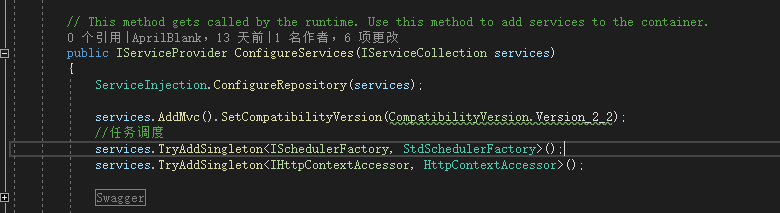
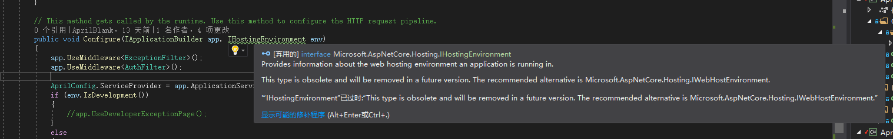
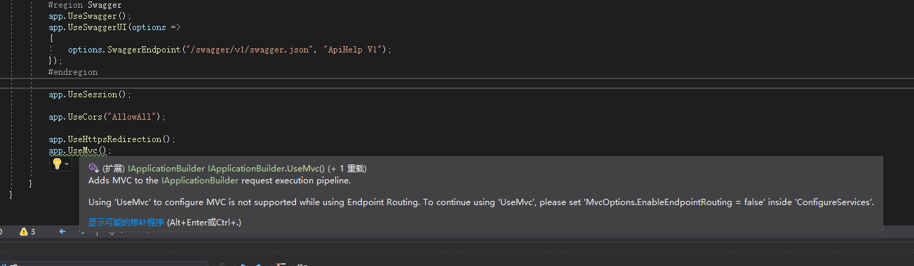
因为net core3.0之后，对于Api可能是调整了（因为没创建过Mvc工程），所以这个地方不再模糊的使用Mvc了。

- **修改后**

因为部分方法被弃用，因为3.0是一个崭新的开始，在开头添加**Microsoft.Extensions.Hosting**的引用。
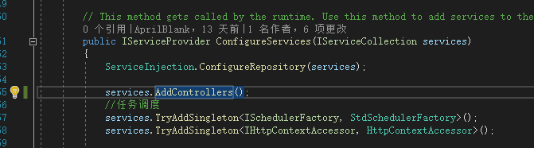
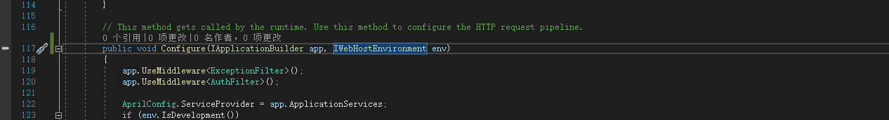
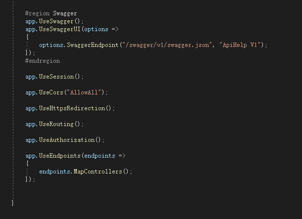

好了，修改完启动文件，我们来愉快的运行吧。

#### 问题2
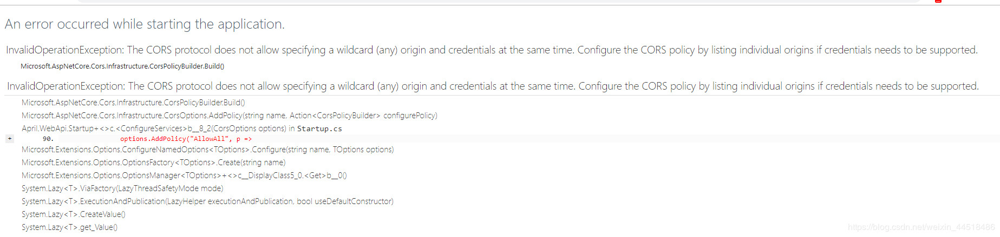
开头都这么难么，我们来看下这个错误，好了是跨域的问题，现在不让AllowAll了是吧，并不是，是因为我们又要允许所有访问，还能带上Cookie，现在不让这样搞了。

- **修改后**
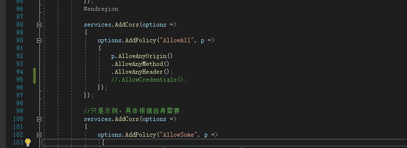
这个问题修改完后，我们再来运行下程序。

#### 问题3
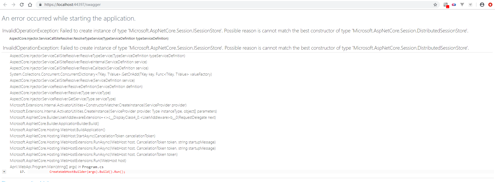
这个是什么问题呢，Session也不让这样玩了，也不是，主要问题呢是现在不需要WebHost了，Session的实现不明确了应该是，所以我们来该升级的升级，该调整的调整，**其他工程引入的同样需要更新下**。

- **修改**
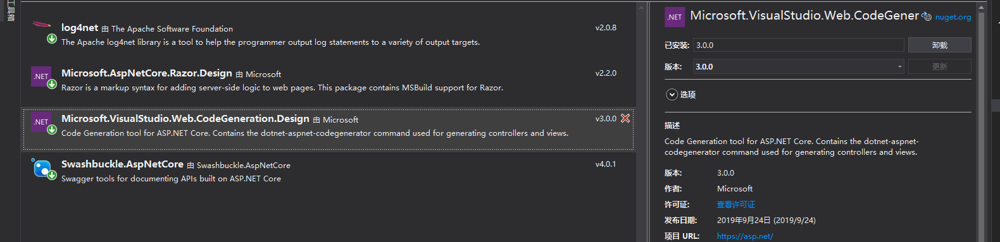
> 这个地方因为我在看到错误后直接来这升级了，没有截到图，升级的库名**Microsoft.VisualStudio.Web.CodeGeneration.Design**。

修改Program内容如下：
```csharp
    public class Program
    {
        public static void Main(string[] args)
        {
            CreateHostBuilder(args).Build().Run();
        }

        public static IHostBuilder CreateHostBuilder(string[] args) =>
            Host.CreateDefaultBuilder(args)
                .ConfigureWebHostDefaults(webBuilder =>
                {
                    webBuilder.UseStartup<Startup>();
                });
    }
```
- **补充**

在下面的执行时，我发现使用Session会有问题，具体什么问题呢，因为3.0多了一个注册项，所以session的代码调整如下，这里注意下UseSession的位置要在Redirection之后。
```csharp
        public void ConfigureServices(IServiceCollection services)
        {
        	…
            #region Session
            services.AddDistributedMemoryCache();
            services.AddSession(options =>
            {
                options.Cookie.Name = "April.Session";
                options.IdleTimeout = TimeSpan.FromSeconds(2000);//设置session的过期时间
                options.Cookie.HttpOnly = true;//设置在浏览器不能通过js获得该cookie的值,实际场景根据自身需要
                options.Cookie.IsEssential = true;
            });
            #endregion
            …
        }
        public void Configure(IApplicationBuilder app, IWebHostEnvironment env)
        {
        	…
            app.UseHttpsRedirection();

            app.UseSession();

            app.UseRouting();
            …
        }
```


修改完成后，我们再来运行下程序。

#### 问题4
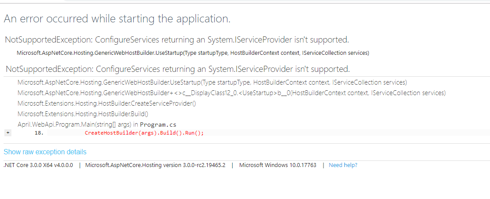
- **修改**

这个我不需要翻译软件都能看到，这什么什么不让返回了，emm。
这个问题我感觉是3.0可能是还没开始扩展，毕竟刚出想让人还是老老实实用内置的DI吧，这里我的处理方法，只能是老老实实改回void，这个代码就不用再展示了，不算是最好的解决方法。

让我们忘记刚才的难受，继续运行程序吧。

#### 问题5
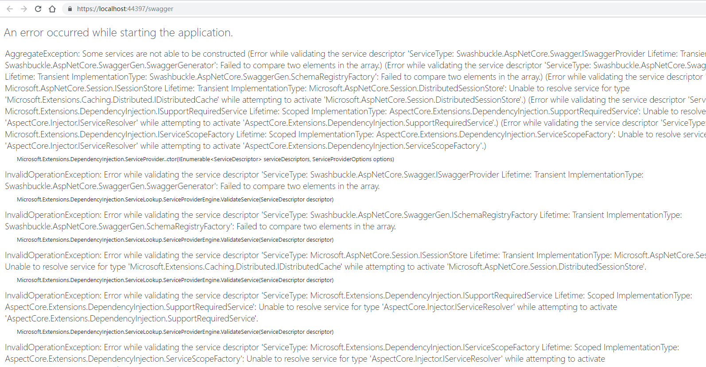
这个乌压压一大片我还以为浏览器崩了呢，仔细一看，好吧，swagger的事，这里就不多说了。

- **修改**
具体参考[向net core 3.0进击——Swagger的改变](/2019/10/07/net-core-v3-swagger/)

在我以为能看到友好的Swagger的时候，现实给了我一巴掌。
#### 问题6
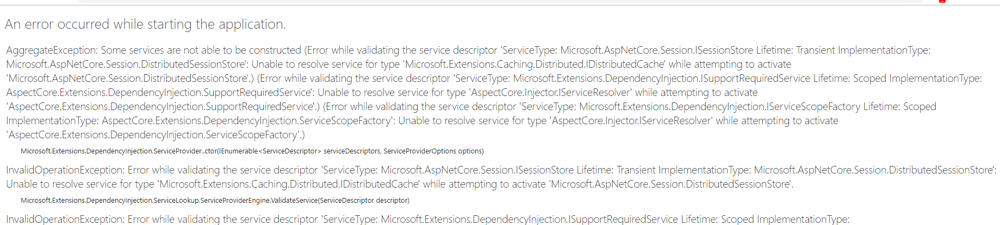
这个问题，依然是想用扩展的DI导致的，AspectCore这块儿的东西暂时先屏蔽了，后续找到解决方法之后再处理吧。

- **修改**
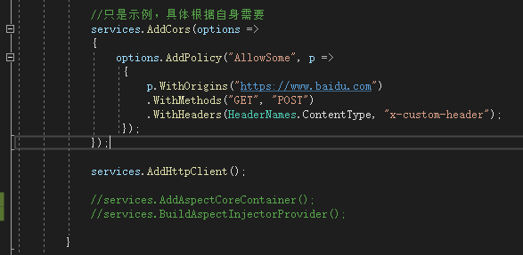

经过以上一堆折腾后，我们终于迎来了Swagger欢迎的样子，不容易。

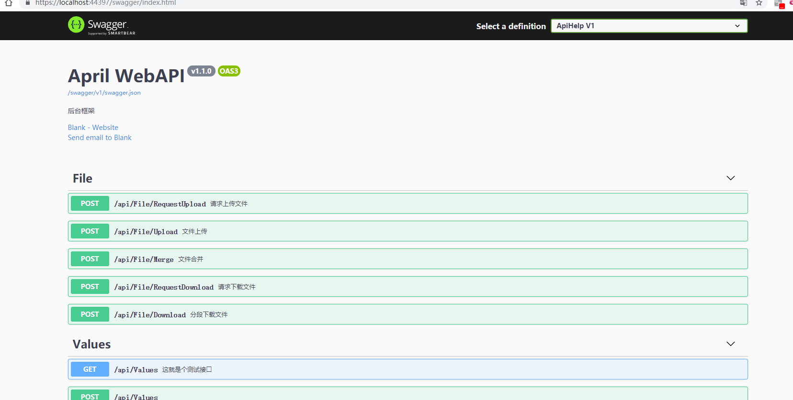
### 测试
> 为什么还要带上这个呢，我也搞不懂，习惯了测试一下功能吧，但是这里就不一一截图了，太麻烦（当然测试也只是简单的执行了下之前的测试方法）。

- log4功能正常
- swagger功能正常
- cache功能正常
- session功能正常
- cookie功能正常
- sqlsugar功能正常
- aop日志功能正常
- redis功能正常
- 拦截器与中间层功能正常

> 如果有我没试到的问题，可以给我留言，因为一个人的力量终究还是有那么点儿局限的。
### 小结
在覆盖原代码的时候我想了一会儿，我担心万一有人在用呢，这样覆盖后会不会对人有影响，但是转念一想，唉，这东西怕是都没人用吧，自己鼓捣的东西，还是折腾点儿好，折腾使人进步，折腾活跃大脑，折腾…，编不下去了，以后再鼓捣新东西就是直接net core3.0上搞起了。