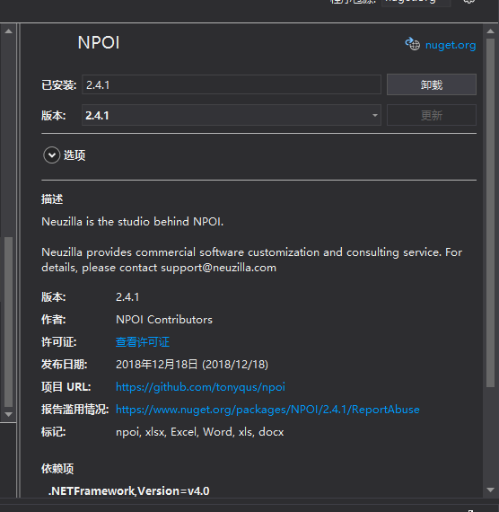
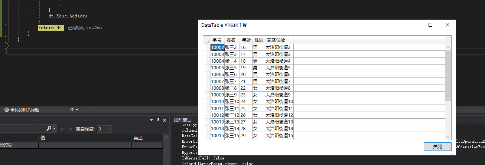
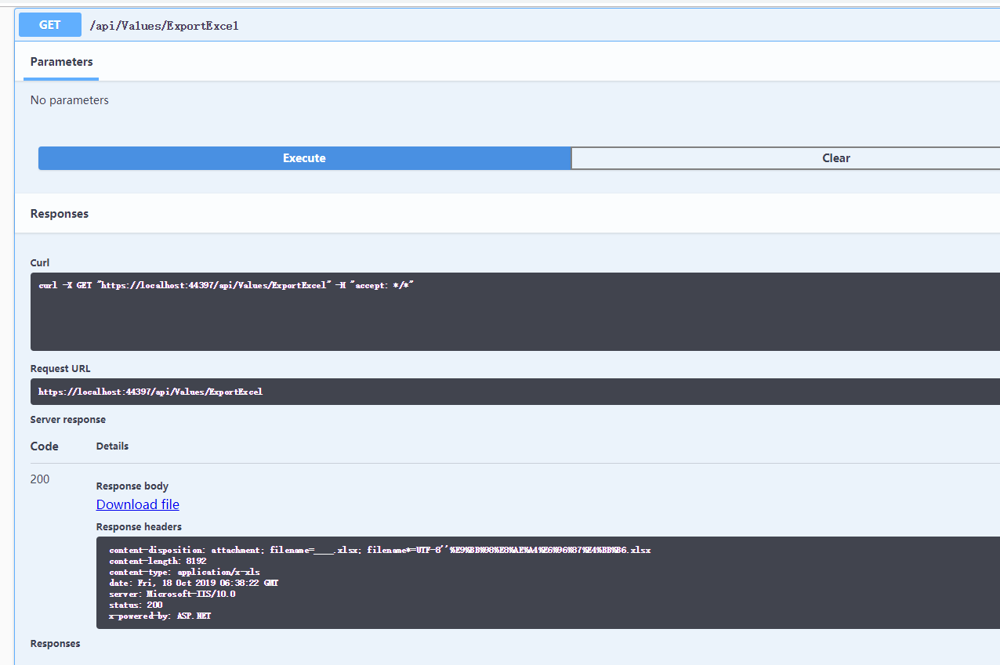
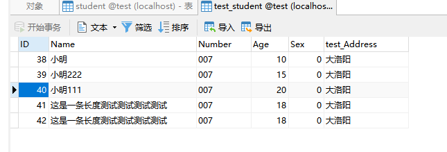
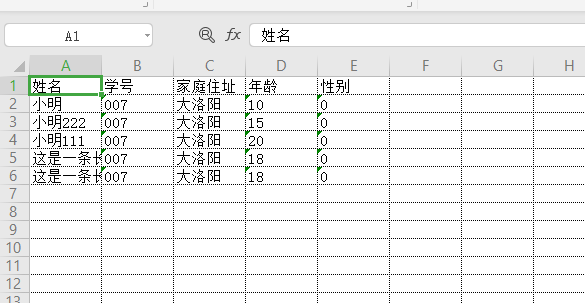

### 前言
时间过得好快，在之前升级到3.0之后，就感觉好久没再动过啥东西了，之前有问到Swagger的中文汉化，虽说我觉得这种操作的意义不是太大，也是多少鼓捣了下，其实个人感觉就是元素内容替换，既然可以执行js了那不就是网页上随便搞了，所以就没往下再折腾，但是现在需要用到Excel的操作了，那就不得不提起这个**NPOI**了。

### NPOI
在之前.net framework的时候，工程需要用到Excel的导入导出，当然用这个NPOI是偶然，也就是找了下这个看着可以就用了，之后遇到的各种问题也都找资料解决，什么多行合并啊，打开2007版本错误啊之类的，但是不得不说，用着还挺好，所以既然net core需要了，那就看看呗，刚好也是支持的。

在**Util**我们来引入这个类库**NPOI**。
- **导入**

在使用之前，我们先缕一下获取Excel数据需要哪些准备操作。

1. 获取文件（这个就不多说）
2. 获取sheet信息（考虑有可能多sheet操作）
3. 根据sheet获取对应文件信息（多少行，当然有些还有合并）
4. 根据合并行来判断第一行是否为标题
5. 判断哪一行是列名（用于对应数据）
6. 遍历每一行并根据每一行的数据格式来获取（有可能是公式/日期/数字/普通文本等等）

ok，大致上清楚了之后，我们就一步步来看吧，这里我创建一个**ExcelUtil**，来写第一个方法（这里只做说明展示吧）。

```csharp
	public class ExcelUtil
    {
        /// <summary>
        /// 读取Excel多Sheet数据
        /// </summary>
        /// <param name="filePath">文件路径</param>
        /// <param name="sheetName">Sheet名</param>
        /// <returns></returns>
        public static DataSet ReadExcelToDataSet(string filePath, string sheetName = null)
        {
            if (!File.Exists(filePath))
            {
                LogUtil.Debug($"未找到文件{filePath}");
                return null;
            }
            //获取文件信息
            FileStream fs = new FileStream(filePath, FileMode.Open, FileAccess.Read);
            IWorkbook workbook = WorkbookFactory.Create(fs);
            //获取sheet信息
            ISheet sheet = null;
            DataSet ds = new DataSet();
            if (!string.IsNullOrEmpty(sheetName))
            {
                sheet = workbook.GetSheet(sheetName);
                if (sheet == null)
                {
                    LogUtil.Debug($"{filePath}未找到sheet:{sheetName}");
                    return null;
                }
                DataTable dt = ReadExcelFunc(workbook, sheet);
                ds.Tables.Add(dt);
            }
            else
            {
                //遍历获取所有数据
                int sheetCount = workbook.NumberOfSheets;
                for (int i = 0; i < sheetCount; i++) {
                    sheet = workbook.GetSheetAt(i);
                    if (sheet != null)
                    {
                        DataTable dt = ReadExcelFunc(workbook, sheet);
                        ds.Tables.Add(dt);
                    }
                }
            }
            return ds;
        }

        /// <summary>
        /// 读取Excel信息
        /// </summary>
        /// <param name="workbook">工作区</param>
        /// <param name="sheet">sheet</param>
        /// <returns></returns>
        private static DataTable ReadExcelFunc(IWorkbook workbook, ISheet sheet)
        {
            DataTable dt = new DataTable();
            //获取列信息
            IRow cells = sheet.GetRow(sheet.FirstRowNum);
            int cellsCount = cells.PhysicalNumberOfCells;
            int emptyCount = 0;
            int cellIndex = sheet.FirstRowNum;
            List<string> listColumns = new List<string>();
            bool isFindColumn = false;
            while (!isFindColumn)
            {
                emptyCount = 0;
                listColumns.Clear();
                for (int i = 0; i < cellsCount; i++)
                {
                    if (string.IsNullOrEmpty(cells.GetCell(i).StringCellValue))
                    {
                        emptyCount++;
                    }
                    listColumns.Add(cells.GetCell(i).StringCellValue);
                }
                //这里根据逻辑需要，空列超过多少判断
                if (emptyCount == 0)
                {
                    isFindColumn = true;
                }
                cellIndex++;
                cells = sheet.GetRow(cellIndex);
            }

            foreach (string columnName in listColumns)
            {
                if (dt.Columns.Contains(columnName))
                {
                    //如果允许有重复列名，自己做处理
                    continue;
                }
                dt.Columns.Add(columnName, typeof(string));
            }
            //开始获取数据
            int rowsCount = sheet.PhysicalNumberOfRows;
            cellIndex += 1;
            DataRow dr = null;
            for (int i = cellIndex; i < rowsCount; i++) {
                cells = sheet.GetRow(i);
                dr = dt.NewRow();
                for (int j = 0; j < dt.Columns.Count; j++)
                {
                    //这里可以判断数据类型
                    switch (cells.GetCell(j).CellType)
                    {
                        case CellType.String:
                            dr[j] = cells.GetCell(j).StringCellValue;
                            break;
                        case CellType.Numeric:
                            dr[j] = cells.GetCell(j).NumericCellValue.ToString();
                            break;
                        case CellType.Unknown:
                            dr[j] = cells.GetCell(j).StringCellValue;
                            break;
                    }
                }
                dt.Rows.Add(dr);
            }
            return dt;
        }
    }
```

文件的导入操作就不再演示了，之前有文件上传的相关操作方法[net core WebApi——文件分片上传与跨域请求处理](/2019/08/23/net-core-fileuploader-and-cors/)。

导入的处理这里也只是大致演示下，具体需要的东西包括情况可能会比较复杂，但是终归数据还是那些，只是操作方法不同罢了（别说什么骚操作）。

- **导出**

相对于导入，导出的流程就比较简单了。

1. 获取数据信息（sql或文件）
2. 组成数据集合（List或DataTable）
3. 创建sheet
4. 设置相关样式等等
5. 遍历赋值row
6. 导出文件流

了解完，我们就继续来搞吧。

```csharp
		/// <summary>
        /// 导出Excel文件
        /// </summary>
        /// <typeparam name="T">数据类型</typeparam>
        /// <param name="entities">数据实体</param>
        /// <param name="dicColumns">列对应关系,如Name->姓名</param>
        /// <param name="title">标题</param>
        /// <returns></returns>
        public static byte[] ExportExcel<T>(List<T> entities,Dictionary<string,string> dicColumns, string title = null)
        {
            if (entities.Count <= 0)
            {
                return null;
            }
            //HSSFWorkbook => xls
            //XSSFWorkbook => xlsx
            IWorkbook workbook = new XSSFWorkbook();
            ISheet sheet = workbook.CreateSheet("test");//名称自定义
            IRow cellsColumn = null;
            IRow cellsData = null;
            //获取实体属性名
            PropertyInfo[] properties = entities[0].GetType().GetProperties();
            int cellsIndex = 0;
            //标题
            if (!string.IsNullOrEmpty(title))
            {
                ICellStyle style = workbook.CreateCellStyle();
                //边框  
                style.BorderBottom = BorderStyle.Dotted;
                style.BorderLeft = BorderStyle.Hair;
                style.BorderRight = BorderStyle.Hair;
                style.BorderTop = BorderStyle.Dotted;
                //水平对齐  
                style.Alignment = HorizontalAlignment.Left;

                //垂直对齐  
                style.VerticalAlignment = VerticalAlignment.Center;

                //设置字体
                IFont font = workbook.CreateFont();
                font.FontHeightInPoints = 10;
                font.FontName = "微软雅黑";
                style.SetFont(font);

                IRow cellsTitle = sheet.CreateRow(0);
                cellsTitle.CreateCell(0).SetCellValue(title);
                cellsTitle.RowStyle = style;
                //合并单元格
                sheet.AddMergedRegion(new NPOI.SS.Util.CellRangeAddress(0, 1, 0, dicColumns.Count - 1));
                cellsIndex = 2;
            }
            //列名
            cellsColumn = sheet.CreateRow(cellsIndex);
            int index = 0;
            Dictionary<string, int> columns = new Dictionary<string, int>();
            foreach (var item in dicColumns)
            {
                cellsColumn.CreateCell(index).SetCellValue(item.Value);
                columns.Add(item.Value, index);
                index++;
            }
            cellsIndex += 1;
            //数据
            foreach (var item in entities)
            {
                cellsData = sheet.CreateRow(cellsIndex);
                for (int i = 0; i < properties.Length; i++)
                {
                    if (!dicColumns.ContainsKey(properties[i].Name)) continue;
                    //这里可以也根据数据类型做不同的赋值，也可以根据不同的格式参考上面的ICellStyle设置不同的样式
                    object[] entityValues = new object[properties.Length];
                    entityValues[i] = properties[i].GetValue(item);
                    //获取对应列下标
                    index = columns[dicColumns[properties[i].Name]];
                    cellsData.CreateCell(index).SetCellValue(entityValues[i].ToString());
                }
                cellsIndex++;
            }

            byte[] buffer = null;
            using (MemoryStream ms = new MemoryStream())
            {
                workbook.Write(ms);
                buffer = ms.GetBuffer();
                ms.Close();
            }

            return buffer;
        }
```

### 测试
写完，免不了一通测试，这里不多说了，直接上图。

导入这里前面也说了没做界面上传什么的，就是一个文件路径，直接执行，Excel原文件我也会同步上传到代码仓库。


导出的话，这里也是用Swagger神器来测试。

数据库数据如下图。




带标题导出。


### 小结
最近真的是有点儿忙，一直在鼓捣opengl这类图形化的东西，各种矩阵转换模型转换，要么是用c++，qt写opengl，要么是用threejs搞opengl，唉，整的最近也只能是晚上回去摸索会儿net core，**工作总是不那么尽如人意，但是身为程序猿的我们，不都是不断的摸索前进么？我们可以不会，但那不是我们不整的借口。**