### 前言
在经历过好多折腾后，总算是把部署走通了一遍，之前只是简单创建个工程在linux下部署，后来一直将这件事搁置，直到最近刚好团队入手一个小服务器，很显然是linux的，那就没啥说的了，Come On！

### 发布
在这个时候我挺想也秀一把命令行，什么dotnet build啊，publish什么的，但是还是老老实实用我的宇宙第一神器吧。

右键工程发布。
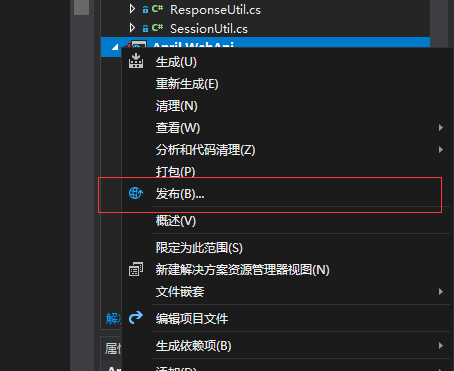
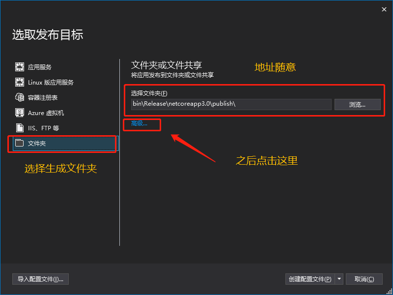
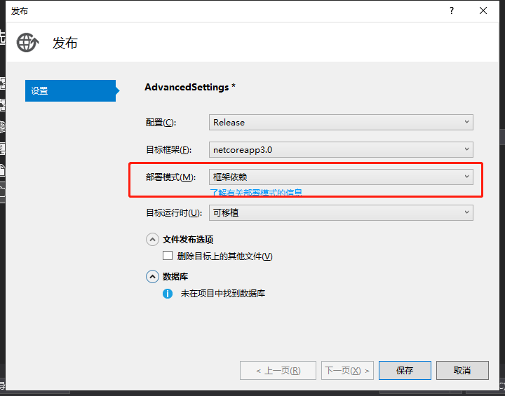
> 这个地方我引用下[官网](https://docs.microsoft.com/zh-cn/dotnet/core/deploying/#self-contained-deployments-scd)的介绍。

**依赖框架**

优点：
- 不需要设置部署的系统，因为都是通用的pe文件，这就是跨平台很嗨皮的地方
- 部署包小
- 允许程序使用net core最新的runtime
- 多应用可通用一个net core类库

缺点：
- 主机系统必须安装当前程序net core版本或更高的版本
- 如果net core高版本砍掉部分使用的功能，那升级可能就会有问题

**独立部署**

优点：
- 可以单独维护当前使用的net core
- 目标系统也可以运行你的net core

缺点：
- 需要提前选择你部署的系统
- 部署包大，因为独立嘛
- 每个应用自己本身都会带个net core，重复率，emm

其他的倒没有太多注意的地方，我这里选择的是依赖框架。

之后就是生成文件了，我们来看下这一堆玩意儿。
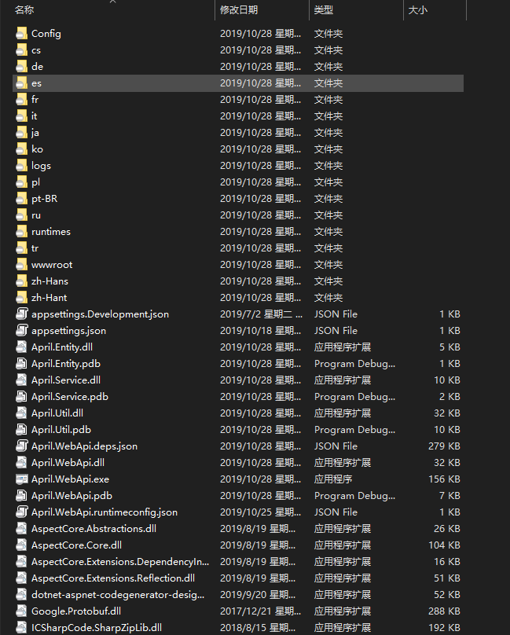
> 这里注意自己复制下April.xml这个文件，因为我没连带发布，留个坑。。。

### 测试
#### Windows

我们来试下dotnet命令吧。
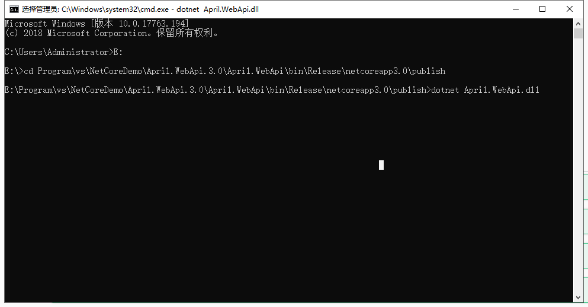
直接访问https://localhost:5001吧，这里没有输出内容。
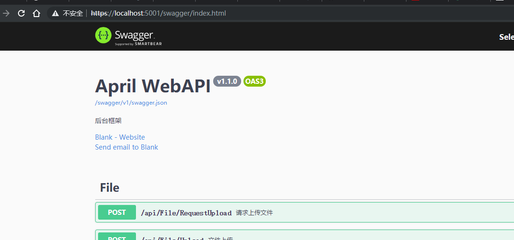
好了，这说明发布直接在Windows运行，应该是没啥问题。

##### IIS部署
本身想着这里都不多说了，后来一想，算了，既然写相关部署了，那哪能少的了这伴随了好长时间的IIS啊。

新建网站
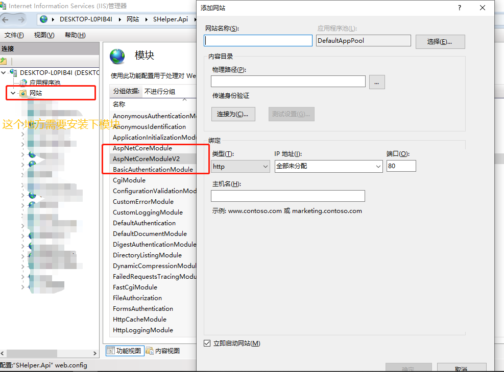
这里注意下标注的模块，IIS部署net core需要单独安装一个[.NET Core Windows Server Hosting](https://aka.ms/dotnetcore.2.0.0-windowshosting)，然后置于sdk到这一步了应该是都安装过了，路径就选择自己发布的路径。

然后在应用池中更改下托管。
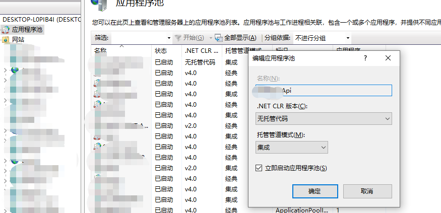
之后运行网站就可以了，测试这块儿我就不放了，毕竟一般这地方没啥问题，如果前面都能运行的话，有问题的朋友可以私信我。

#### Linux
这里我用的是Centos 7（虚拟机Vmware），相关的安装软件什么的我在之前新手向相关的也已经介绍过了，这里不多说了，直接开始吧。

首先我们把publish下发布的文件打包上传到linux，我这里放的目录是/www/april-webapi/，这里我们直接运行的话，是不行的，毕竟linux下我们还没有安装dotnet相关的环境，已经安装的忽视。
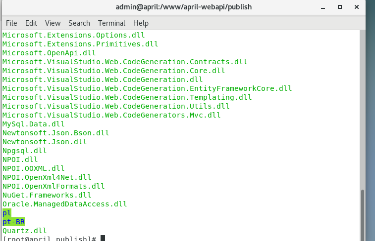
一个是运行库dotnet，一个是运行时库runtime，这个都可以通过官网来下载的，当然可以直接通过docker（直接跳过这块儿往下看），但是我这里只是把我自己趟的一遍复述下而已。

```bash
$ sudo rpm -Uvh https://packages.microsoft.com/config/centos/7/packages-microsoft-prod.rpm
$ sudo yum install dotnet-sdk-3.0
```

```bash
$ sudo rpm -Uvh https://packages.microsoft.com/config/centos/7/packages-microsoft-prod.rpm
$ sudo yum install aspnetcore-runtime-3.0
```

ok，小等会儿就可以安装完了，完成之后，我们来切到工程目录下。
```bash
$ cd /www/april-webapi/publish/
```

来试下dotnet的命令吧。

```bash
$ dotnet April.WebApi.dll
```

运行之后，如果不出意外，我们会看到下面这个错误，当然如果你的工程比较简洁（什么引用都没有，就是个空工程），那这个地方你就完全运行了，但是那样的工程除了demo毫无卵用（就像我当年那么天真以为走一遍新建工程发布就已经大结局了一样）。

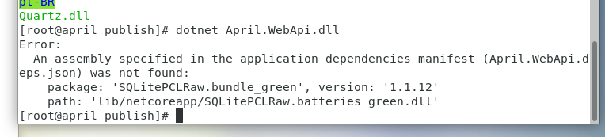

好了，不扯了，我们来看下这个问题，提示我们在对应lib/xxx路径下找不到xxx.dll，但是为何我们windows就可以了呢，这是因为类库缓存，在你运行程序的时候这些类库已经有了，默认会从net core的安装目录也就是系统盘下对应的不知道哪个文件夹下/lib/netstandardx.x/xxx.dll，所以windows下就没有报错。

这里我第一反应就是，那既然这样我就把需要的dll文件都放过来，然后路径换换不就得了（不得不说确实好麻烦），于是就这样一通操作，把类库都单独放到一个文件夹，其实发布之后的工程已然包含这些类库了，对**April.WebApi.deps.json**这个文件修改路径之后（我是全改成/lib/netcore-libs/xxx.dll），我们运行之后还是提示找不到。

对于这种现象，我只能说，世界之大~，然后继续查资料吧，最终在一个[ Nate McMaster的博客](https://natemcmaster.com/blog/2017/12/21/netcore-primitives/)中找到了这个问题的解决方法，原来还有这个**April.WebApi.runtimeconfig.json**的属性**additionalProbingPaths**配置，这种要不是深入还真是不行啊，国外的钻研精神不得不说，值得学习，看过之后也发现，原来发布的文件夹中有一个这种写法的配置，注意看**April.WebApi.runtimeconfig.dev.json**。

配置好对应路径之后，我们来测试下，如果没有其他问题，应该跟我看到的界面效果一样，ok，那这样不就已经结束了。

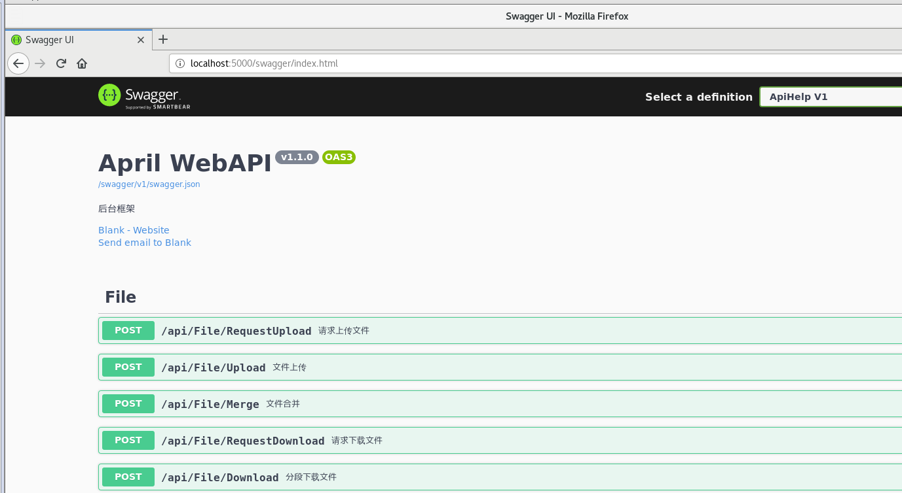
##### Docker
docker的配置这块儿，我也是在[Linux配置部署_新手向（五）——Docker的安装与使用](/2019/10/28/vmare-docker/)简单的介绍了，包括基本用到的命令语句什么的。

这里直接来个Dockerfile吧，这里也只是简单写下需要的环境，端口，路径等基础配置。

```bash
FROM mcr.microsoft.com/dotnet/core/aspnet:3.0-buster-slim AS base
WORKDIR /app
EXPOSE 80
EXPOSE 443
COPY . /app
ENTRYPOINT ["dotnet", "April.WebApi.dll"]
```

然后我们在当前目录下，运行以下命令生成镜像，注意末尾，还有个点，意思就是当前目录。

```bash
$ docker build -t april-webapi .
```

稍等一会儿（网速不好的话可能很长时间），提示完成的时候，我们来看下镜像。

```bash
$ docker images
```

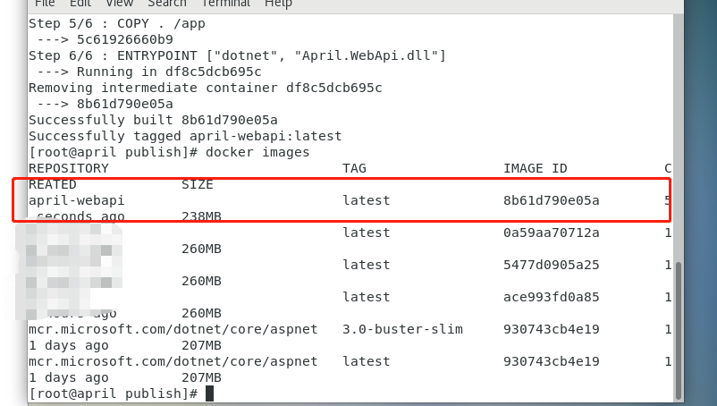

看到有镜像那就说明走了一大半了，然后我们只需要运行镜像创建容器就行了。

```bash
$ docker run --name april-webapi-demo -d -p 8080:80 april-webapi
$ docker ps -a
```
指定8080来接收80端口，指定名字叫*april-webapi-demo*，然后看下运行容器的情况。

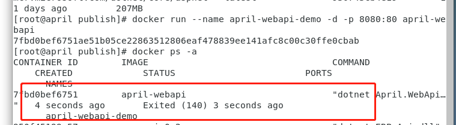

这里我们看到已经创建了容器，但是注意状态EXIT(140)，这很明显我们的程序跑了但是没有持久，emm，不持久可不行。

看下日志是咋回事吧。
```bash
$ docker logs april-webapi-demo
```

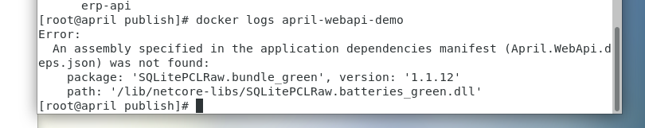

一看，哟，又是同样的错误，但是我们的路径已经指向绝对路径了，为啥还错呢，这里注意下，我们的类库是在linux下的根目录下的指定文件夹，但是docker呢，可以理解为单独的虚拟机，那很显然docker当中没有这个路径下的文件，那既然这样，我们就好解决了，因为Dockerfile中我们的**WorkingDir**是/app，那么我们是不是只要指定到这个目录下就可以了呢？Let's 踹踹。

首先我们在publish下创建个packages，然后把类库包复制到文件夹下，之后替换**April.WebApi.deps.json**中/lib/netcore-libs/为/app/packages/，这里说下为啥是/app/xxx呢，因为Dockerfile中配置的工作区为app。

一番替换之后，我们来重新走一遍build，这次改个名字（当然可以删除之前的无效镜像跟容器），重新运行下我们再看容器的状态，咦好像是可以了，那我们来访问下，这次用主机访问这个地址，看到这个界面之后，不禁感慨，路漫漫啊。

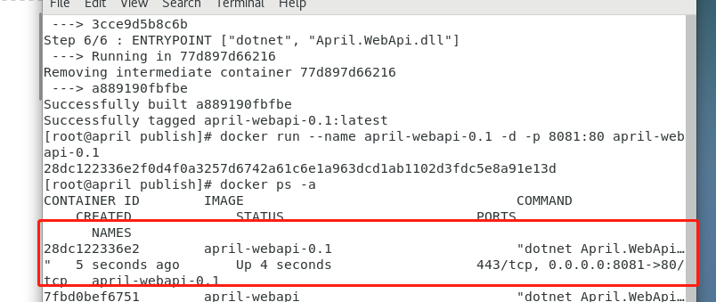
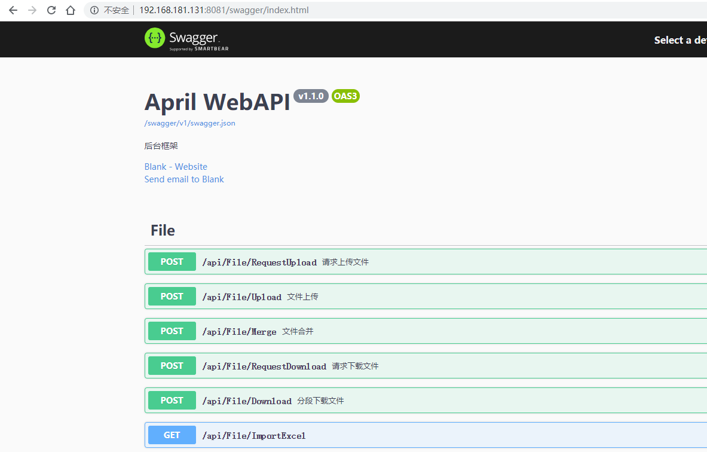

### 小结
> 这篇同样没有测试，因为一路都捎带着测试，所有的走完一遍之后，我在想，为何会这么麻烦，按说通用的话，一个文件夹移哪都能用才对，至于相对路径我也是试过，但是没有效果，应该还是那个配置查找路径的属性问题，我们还是需要先指明从哪读类库，后续看看有啥新进展的话，我还是会继续更新的。

在net core刚开始的时候，我们都已经知道这是一个要跨平台的，但是直到现在我才开始鼓捣linux下部署，实在是惭愧，一直在windows下让我有点儿过于舒适（当然还是因为windows服务器到期了），还是来一句结束吧，**我们总是想的太多，而却做的太少，总以为理所当然，可现实四处碰壁，生活在于折腾，而折腾使人进步，树欲静而风不止，那就可劲儿刮吧。**
