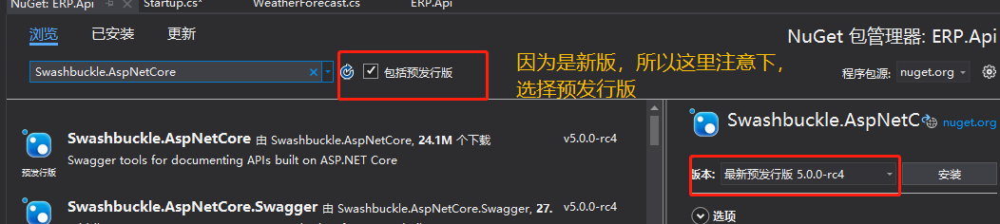
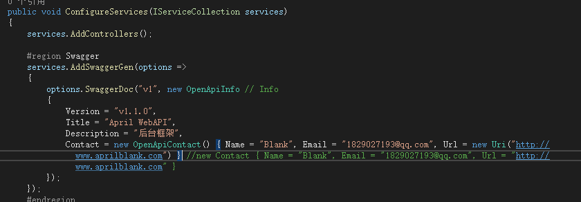
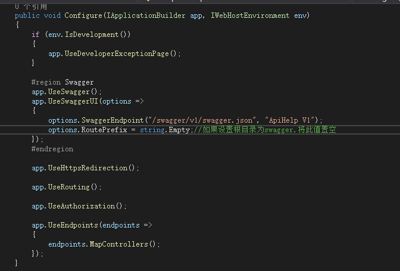
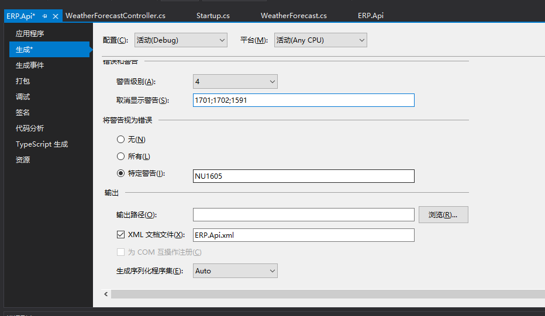
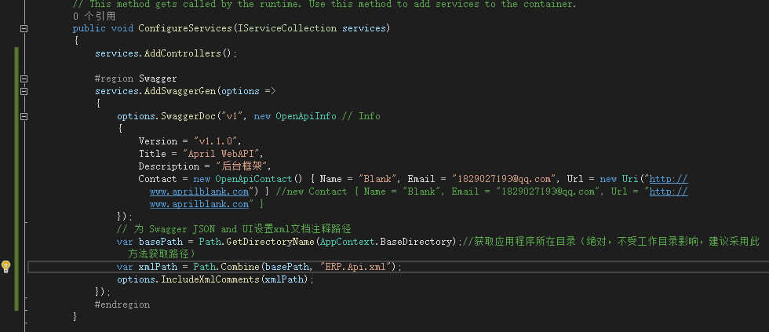
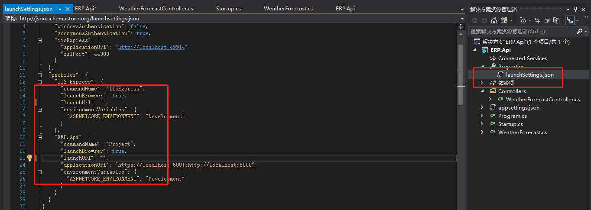
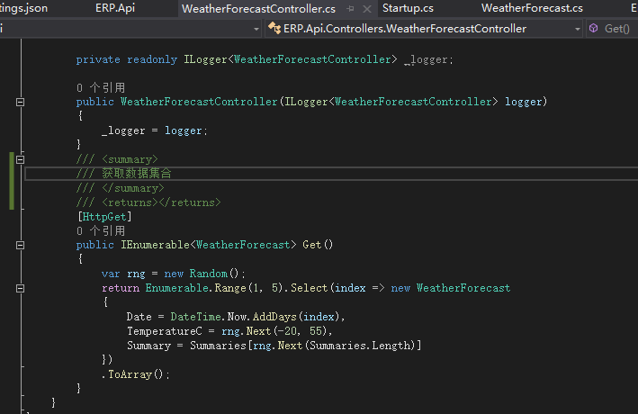
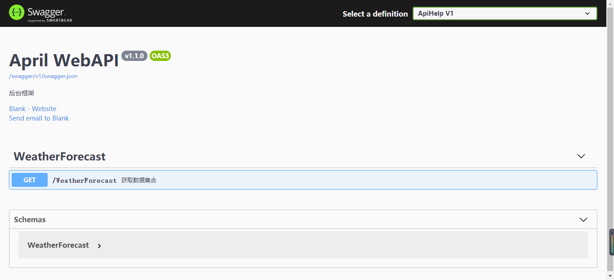

### 前言
十一小长假在不知不觉间可都没了，在这个小尾巴的空隙，把这两天鼓捣的net core 3.0升级过程记录一下，首先还是根据之前的顺序一个个补充进来，先从Swagger的变化说起（新建工程什么的不多说了，就是选择的时候选3.0就可以了，2019新版更新后创建默认都是3.0）。

### 引入
按之前的习惯，对于引入我是不会多说，一个链接（我自己之前引入那些截图）就给大家了，但是因为3.0属于比较新的版本，所以在引入的时候，有些注意点还是要标注下的。

> 在3.0中，我们会在Startup这里发现，Mvc没了统一替换成Controllers，当然这并不影响我们使用，但是最关键的，我们用来实验的**Values**木得了，取而代之的是一个挺不错的api的WeatherForecast接口

引入之后，我们还复制我们之前的swagger配置内容来试试，会发现新版也针对类名，属性做了雪微的调整，这里直接一张图就可以看到。

```csharp
            #region Swagger
            services.AddSwaggerGen(options =>
            {
                options.SwaggerDoc("v1", new OpenApiInfo
                {
                    Version = "v1.1.0",
                    Title = "ERP WebAPI",
                    Description = "后台框架",
                    Contact = new OpenApiContact() { Name = "Blank", Email = "1829027193@qq.com", Url = new Uri("https://www.cnblogs.com/AprilBlank/") }
                });
            });
            #endregion 
```

在使用注册引用的地方倒是没有变化。

```csharp
            #region Swagger
            app.UseSwagger();
            app.UseSwaggerUI(options =>
            {
                options.SwaggerEndpoint("/swagger/v1/swagger.json", "ApiHelp V1");
                //如果设置根目录为swagger,将此值置空
                options.RoutePrefix = string.Empty;
            });
            #endregion
```

注释这次也一步到位，当然也是没有太大的区别的。
首先，我们来生成xml文件。

然后，我们直接复制之前的配置内容即可。

```csharp
            #region Swagger
            services.AddSwaggerGen(options =>
            {
                options.SwaggerDoc("v1", new OpenApiInfo
                {
                    Version = "v1.1.0",
                    Title = "ERP WebAPI",
                    Description = "后台框架",
                    Contact = new OpenApiContact() { Name = "Blank", Email = "1829027193@qq.com", Url = new Uri("https://www.cnblogs.com/AprilBlank/") }
                });
                // 为 Swagger JSON and UI设置xml文档注释路径
                var basePath = Path.GetDirectoryName(AppContext.BaseDirectory);//获取应用程序所在目录（绝对，不受工作目录影响，建议采用此方法获取路径）
                var xmlPath = Path.Combine(basePath, "ERP.Api.xml");
                options.IncludeXmlComments(xmlPath);
            });
            #endregion 
```

全搞完之后，我们把默认路径直接指向根路径。


### 测试
> 唉，没有Values以后测试可怎么过啊。

ok，我们来给默认创建的控制器写个注释。

所有整理完毕之后，我们直接运行程序，这时就会发现，新版的swagger对于默认界面也是做了些调整的。


### 小结
net core 3.0作为一个期待已久的版本，大统一的前景还是挺不错的，编程语言只是一个工具，没有好坏之分，所以无需纠结，**你为何而编程**，相信每个人心中都已有答案。