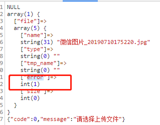

### 前言
在整理一套php代码的时候，需要添加文件上传功能，虽说我对php不算怎么熟悉，但是我想着一个简单的文件上传其实就form表单的提交能有多麻烦，谁知道遇到的问题颇为诡异，不过好在最后那么简单的问题解决了。

### 问题
在页面做了一个上传控件，用到了layui的文件上传，之后在Controller接收文件时发现，获取的文件为空。

html代码如下：
```html
               <div class="col-md-6 column">
                    <div class="form-group">
                        <label for="describe">商品图片</label>
                        <div class="input-group">
                            <input id='location' class="form-control" readonly="">
                            <label class="input-group-btn">
                                <input type="button" id="i-check" value="浏览文件" class="btn btn-primary" > <!-- onclick="$('#i-file').click();" -->
                            </label>
                       </div>
                    </div>
                </div>
```

```js
	var img_index;
    layui.use('upload', function(){
        var $ = layui.jquery
            ,upload = layui.upload;
        upload.render({
            elem: '#i-check'
            ,url: '/Instorage/upload'
            ,accept: 'images'
            ,ext: 'jpg|png|jpeg'
            ,acceptMime: 'image/*'
            ,number: 1
            ,method: 'post'
            //,auto: false
            ,before: function(obj) {
                img_index = layer.msg("图片上传中...",{
                    time: 3000,
                });
                // obj.preview(function(index, file, result){
                //     console.log(file);
                //     $("#location").val(file.name);
                // });
            }
            ,done: function(res){
              //console.log(res);
              layer.close(img_index);
              if(res.code==1){
                $("#location").val(decodeURIComponent(res.message));
              }else{
                layer.msg("上传失败,请重新上传");
              }
            }
          });
    });
```

一个很简单的文件上传，没什么介绍的，但是，后端却是接收不到文件。

```php
	public function upload(){
        // 获取表单上传文件  
        $file = request()->file('file'); 
        //var_dump($file);
        //var_dump($_FILES);
        if(empty($file)) {  
            return AjaxReturn(0,'请选择上传文件');
        }  
        // 移动到框架应用根目录/public/uploads/ 目录下  
        $info = $file->move('./public/static/uploads/img/'); 
        //如果不清楚文件上传的具体键名，可以直接打印$info来查看  
        //获取文件（文件名），$info->getFilename()  ***********不同之处，笔记笔记哦
        //获取文件（日期/文件名），$info->getSaveName()  **********不同之处，笔记笔记哦
        $filename = $info->getSaveName();  //在测试的时候也可以直接打印文件名称来查看 
        if($filename){              
            return AjaxReturn(1,'/public/static/uploads/img/' . $filename);
        }else{  
            // 上传失败获取错误信息  
            return AjaxReturn(0);
        }  
    }
```

### 排除尝试
#### 前端
- 查看文件是否上传
- 查看js是否报错
- 查看后端回调信息
#### 后端
- 查看request()->file()是否有文件 array(0)
- 查看$_FILES是否有文件array(1)

问了问搞php的人这种情况，但是也是看完之后觉得没啥问题，我想着可能是layui这个在别的框架下会有问题（当然最后不是），我替换成formData的提交方式，发现问题一样。

又开始考虑是不是服务端配置的问题，比如文件格式的限制，大小的限制（后来确实是这个问题），不过因为不是搞php的，所以我也不太清楚，就只能通过能看到的东西来排除，突然看到了$_FILES的回调数据，发现了问题。

按照我常规的想法，error如果是大于零，应该是有错误了，就去查这个error对应的问题所在。

这里把对应的都列出来：
|ErrorCode| 错误描述 |
|--|--|
| 0 | 成功 |
| 1 | 上传的文件超过了 php.ini 中 upload_max_filesize选项限制的值 |
| 2 | 上传文件的大小超过了 HTML 表单中 MAX_FILE_SIZE 选项指定的值 |
| 3 | 文件只有部分被上传 |
| 4 | 没有文件被上传 |
| 6 | 找不到临时文件夹 |
| 7 | 文件写入失败 |

### 小结
问题不大，但是折腾了不少，做了这么多尝试最后是配置问题，这里也记录下，如果以后再遇到或者有相同问题的，可以参考，少折腾。

