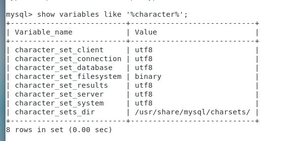

### 前言
马上就要放假了，按捺不住激动的心情（其实是实在敲不下去代码），就继续鼓捣虚拟机来做些常规的安装与使用吧，毕竟闲着也是闲着，唉，opengl还是难啊。

### 安装
其实网上好多安装的方法，所以也不算是个教程什么的，这里我只是自己做个记录，毕竟走通一遍就行，配置的东西不需要过多去关注（除非遇到很棘手的问题）。
```bash
# 获取文件源
[root@april /]# wget http://repo.mysql.com/mysql-community-release-el7-5.noarch.rpm

[root@april /]# sudo rpm -ivh mysql-community-release-el7-5.noarch.rpm

# 如果有提示安装，按y回车
[root@april /]# yum install mysql-server

# 安装成功后，启动mysql
[root@april /]# systemctl start mysqld 

# 配置mysql信息
[root@april /]# mysql_secure_installation 
```

最后一步执行过后会给出提示
```bash
# 输入当前root账号密码，可以直接回车
Enter current password for root (enter for none): 
# 是否修改root密码，当然选是了
Set root password? [Y/n] y
New password: 
Re-enter new password: 
Password updated successfully!
# 是否删除匿名账号
Remove anonymous users? [Y/n] y
# 是否允许通过root账号远程登录，这个我自己测试，无所谓
Disallow root login remotely? [Y/n] n
# 是否删除测试数据库
Remove test database and access to it? [Y/n] y
# 是否刷新权限
Reload privilege tables now? [Y/n] y

```

配置完之后我们来登录mysql，话说为啥不能刚开始的时候不要密码。
```bash
[root@april /]# mysql -u root -p
Enter password: 

# 查看mysql编码
mysql>show variables like '%character%'; 
```
初始化的时候没啥意外的话，database与server的字符编码不是utf8，一个涉及到表数据格式可能会读取乱码，另一个是我们连接的时候可能会有问题，这个时候要调整下编码，在/usr/share下找**my-default.cnf**（具体路径可能不一样，只要找到mysql文件夹就行），找到后复制到**/etc/my.cnf**。

```bash
[root@april mysql]# cp /usr/share/mysql/my-default.cnf /etc/my.cnf
cp: overwrite ‘/etc/my.cnf’? 
[root@april mysql]# cd /etc/
[root@april etc]# vi my.cnf
```

在文件中添加下面两句。
```bash
[client]
default-character-set = utf8
[mysqld]
character_set_server =  utf8
```

这里串一下linux文件编辑的命令（毕竟linux没玩过几次），i是开始insert编辑。

| 命令 | 描述 |
|--|--|
| :w | 保存文件但不退出vi |
| :w file | 将修改另外保存到file中，不退出vi |
| :w! | 强制保存文件但不退出vi |
| :wq | 保存文件并退出vi |
| :wq! | 强制保存文件，并退出vi |
| q: | 不保存文件，退出vi |
| :q! | 不保存文件，强制退出vi |
| :e! | 放弃所有修改，从上次保存文件开始再编辑 |

```bash
# 基本上所有的配置文件改了之后都需要重启服务
[root@april etc]# systemctl restart mysql.service
```

这样再登录mysql查看character的话就应该是正常了，另外我们开启远程登录。


```bash
mysql> GRANT ALL PRIVILEGES ON *.* TO 'root'@'%' IDENTIFIED BY 'root';
Query OK, 0 rows affected (0.00 sec)

mysql> FLUSH PRIVILEGES;
Query OK, 0 rows affected (0.00 sec)
```

开启之后，我们就可以先通过ip访问了，毕竟我们这个是虚拟机。


### 防火墙
如果连接不上，不要急，我们的防火墙还没处理，之前在笔记里记录了下防火墙的一些常用命令。

```bash
# 查看防火墙服务状态
$ systemctl status firewalld

# 开启、重启、关闭防火墙状态
$ systemctl start firewalld 

$ systemctl restart firewalld

$ systemctl stop firewalld

# 查看防火墙规则
$ firewall-cmd --list-all 

# 查询、开放、关闭端口
$ firewall-cmd --query-port=80/tcp //查看80端口是否开放

$ firewall-cmd --permanent --add-port=80/tcp //开放80端口

$ firewall-cmd --permanent --remove-port=80/tcp //关闭80端口

$ firewall-cmd --reload //重启防火墙
```

另外，还是一样，不管是修改了配置文件还是什么规则之类的东西，都需要重新启动服务。

### 小结
linux接触的不多，这一系列算是小白入门的学习笔记，主要是为了net core在linux服务器的部署做测试，环境配置完了之后，就开始着手工程发布部署。