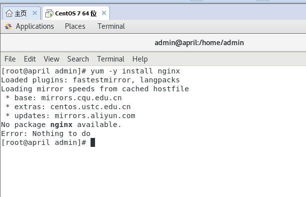
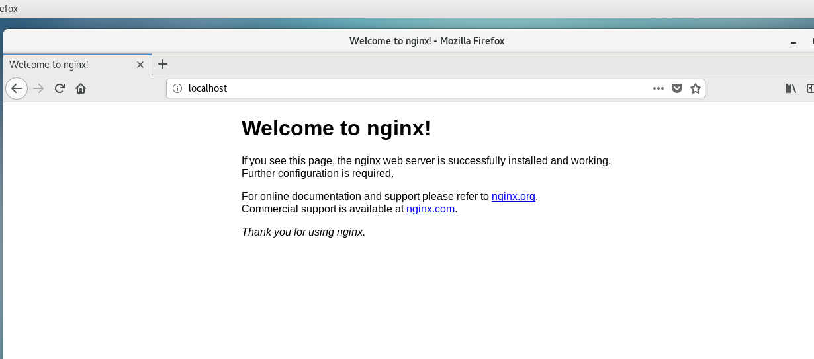

### 前言
上一篇整完Linux系统的安装，紧接着就开始来安装些常用的东西吧，首先**Nginx**。

### Nginx
- 简介
Nginx作为转发，负载均衡，凭着其高性能的特效在web这一块儿是一个神器，只要体量稍微大点儿的工程都必不可少使用Nginx来做负载均衡。
- 安装使用
我们有两种安装方式，一种是通过yum指令来安装，一种是通过源码包下载make编译安装。

| 方式 | 好处 |
|--|--|
| yum | 简单快捷，一键安装 |
| 源码 | 服务性能好 |

##### 1. yum安装（推荐）
通过yum指令安装nginx，安装目录是在 **/etc/nginx**
```bash
$ sudo yum update  					#这条指令执行与否都可以，目的主要为了更新yum包为最新
$ sudo yum -y install nginx 		#安装nginx
$ sudo yum remove nginx 			#卸载nginx
```

如果出现以下问题，请执行添加源命令。

解决方法：
```bash
$ sudo rpm -Uvh http://nginx.org/packages/centos/7/noarch/RPMS/nginx-release-centos-7-0.el7.ngx.noarch.rpm
```

安装完成后，可以通过以下命令操作nginx：
```bash
$ sudo systemctl enable nginx 			# 设置开机启动 
$ sudo service nginx start 				# 启动nginx服务
$ sudo service nginx stop 				# 停止nginx服务
$ sudo service nginx restart 			# 重启nginx服务
$ sudo service nginx reload 			# 重新加载配置，一般是在修改过nginx配置文件时使用。
```

##### 2. 源码安装
为何不推荐源码安装呢，因为我自己试过一次感觉太麻烦，并且使用起来也是比较麻烦。
首先，我们需要安装依赖项：
**1. gcc**
```bash
$ sudo yum -y install gcc gcc-c++ # nginx编译时依赖gcc环境
```
**2. pcre**
```bash
$ sudo yum -y install pcre pcre-devel # 让nginx支持重写功能
```
**3. zlib**
```bash
$ sudo yum -y install zlib zlib-devel # nginx使用zlib对http包内容进行gzip压缩
```
**4. openssl**
```bash
$ sudo yum -y install openssl openssl-devel # 安全套接字层密码库，用于通信加密，可以理解为使用https
```
我们从[Nginx下载地址](https://nginx.org/en/download.html)下载需要的版本压缩包，放置自己常规使用的地址，我这里放到 **/usr/local/**。
```bash
$ cd /usr/local/ #切换到目标目录
$ sudo tar -zxvf  nginx-x.xx.x.tar.gz # 解压缩，这里的x.xx.x是你的版本号
$ cd nginx-x.xx.x	# 切换到目标文件夹
$ ./configure --user=nobody --group=nobody --prefix=/usr/local/nginx --with-http_stub_status_module --with-http_gzip_static_module --with-http_realip_module --with-http_sub_module --with-http_ssl_module
```
上述步骤完成config配置，如果后缀哪个执行出错，可查看错误信息根据对应错误引入依赖库，我之前遇到过缺少c，c++，openssl等相关类库的报错（因为我直接执行配置了）。
错误排除后，我们执行编译及安装
```
$ make && make install
```
安装完毕后，我们开始使用命令来执行，这个比yum安装后的命令雪薇长了那么一丢丢。
```bash
$ /usr/local/nginx/sbin/nginx # 启动
$ /usr/local/nginx/sbin/nginx -s reload # 重新加载
$ /usr/local/nginx/sbin/nginx -s stop # 停止
```

需要查看nginx进程的话，通过以下命令：
```bash
$ ps -ef | grep nginx # 查看服务进程
```

启动nginx后，我们访问下网页，如果看到这个效果说明已经安装完毕。

### 配置（后续补充）
### 小结
nginx的安装完成后，下一步安装其他web需要用到的东西。