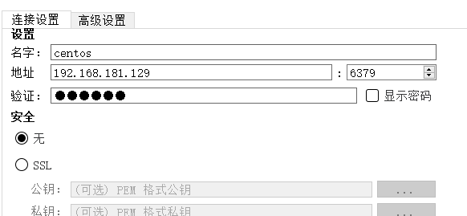

### 前言
配置完mysql之后，我们来紧接着安装redis，毕竟这些不用太多的思考，就是命令执行，配置文件，连接测试。

### 安装
首先，我们要看安装哪个版本，可以在[Redis官网](http://download.redis.io/releases/)看看我们安装哪个版本。

> 在之前使用wget的时候，我一直以为下载都会放到默认文件夹，谁知道一看，原来是在哪执行就下载到哪，这里注意下

```bash
[root@april tmp]# wget http://download.redis.io/releases/redis-5.0.5.tar.gz

[root@april tmp]# tar -zxvf redis-5.0.5.tar.gz -C /usr/local/

```

解压完成之后我们看下是否有gcc依赖库，毕竟要用到make命令编译吧。
```bash
[root@april tmp]# gcc -v
bash: gcc: command not found...
[root@april tmp]# sudo yum install -y gcc
```
安装完依赖库后，我们来切换目录开始执行编译。
```bash
[root@april tmp]# cd /usr/local/redis-5.0.5/
[root@april redis-5.0.5]# make MALLOC=libc 
[root@april redis-5.0.5]# cd src && make install
```

编译完成后，我们就开始来运行一下看看吧。
```bash
[root@april src]# ./redis-server 
```

OK，运行完成后，我们就开始来看看配置吧。

```bash
 #将值改为yes
daemonize yes  

# 注释掉它，以便让外网访问
# bind 127.0.0.1
 
# 关闭保护模式
protected-mode no

# 当Redis以守护进程方式运行时，Redis默认会把pid写入/var/run/redis.pid文件，可以通过pidfile指定
pidfile /var/run/redis_6379.pid

# 指定Redis监听端口，默认端口为6379
# 如果指定0端口，表示Redis不监听TCP连接
port 6379

# 注意，这里只能指定一个目录，不能指定文件名
dir /var/redis/6379
```

保存之后，我们来设置redis后台启动，开机启动，省的每次调整。

```bash
[root@april redis-5.0.5]# mkdir /etc/redis
[root@april redis-5.0.5]# cp /usr/local/redis-5.0.5/redis.conf /etc/redis/6379.conf
[root@april redis-5.0.5]# cp /usr/local/redis-5.0.5/utils/redis_init_script /etc/init.d/redisd
# 切换到服务目录
[root@april redis-5.0.5]# cd /etc/init.d/
[root@april init.d]# chkconfig redisd on
# 校验通过后我们就可以像操作服务一样了
[root@april init.d]# service redisd start
```

完成后，记得我们开启下防火墙。
```bash
[root@april init.d]# firewall-cmd --permanent --add-port=6379/tcp
success
[root@april init.d]# firewall-cmd --reload
```

### 测试


随便添加一个键值对试试。


### 小结
Redis配置完成后，下来会先对基础工程进行redis的连接使用做示例，路漫漫，要鼓捣的东西还有很多。