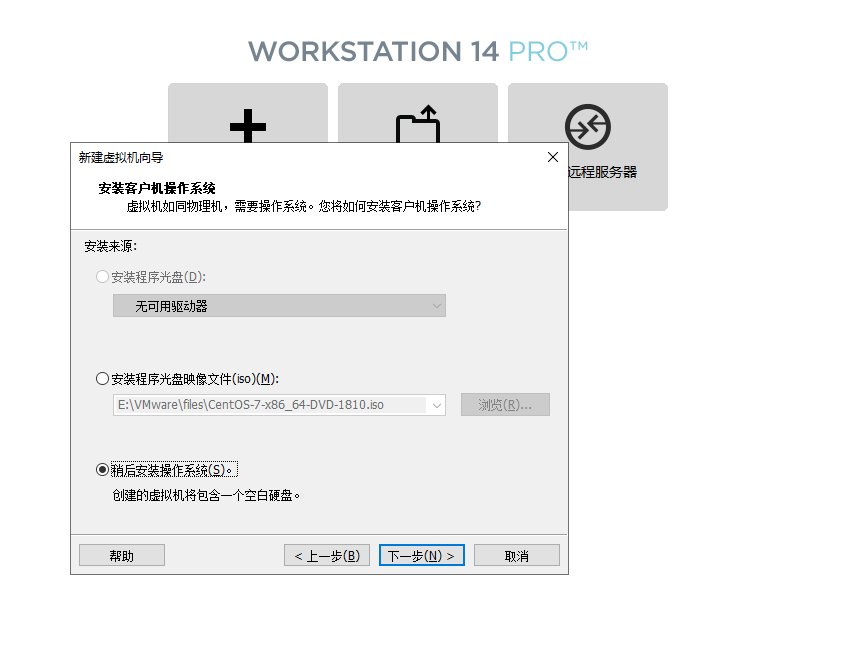

### 前言
最近忙过一件人生大事之后，终于稍微有点时间鼓捣东西，之前net core相关的基础已经鼓捣的差不多了，既然net core跨平台，那就来体验一把Linux的世界吧（Windows还没玩完就鼓捣Linux，头疼）。

### VMware
毕竟Windows玩的多，没有Linux系统怎么办，只要装个VMware什么多系统都是很随意，并且随意鼓捣炸了都不影响，具体安装什么的不多说，常规的软件安装对于程序猿来说都是很随意的（需要的可以给我留言联系-_-|||），安装完之后，就是去找个镜像包了，这里我使用的CentOS 7（毕竟net core支持7以上）。

### 开始安装

- 创建虚拟机，如果不用虚拟机直接跳过这一大步看系统安装吧。

- 选择自定义

- 虚拟机兼容性

- 稍后安装操作系统

- 选择操作系统

- 选择虚拟机位置

- 虚拟机配置，这里根据自己电脑配置调整

- 虚拟机内存，还是根据你的电脑配置调整

- 选择网络连接方式

- 虚拟机向导，默认就行

- 磁盘类型，默认就行

- 选择磁盘，这里选择新建

- 指定磁盘容量，我这里选择存储为单个文件

- 磁盘文件名，随意起吧

- 自定义硬件，这里可选，也可直接下一步

点击**自定义硬件**后，根据自身需要，用不到的硬件可以直接移除了，如果不需要，直接点击**完成**就全结束了。

- 最后一步，选择系统文件位置

这里也可以捎带着给网络适配器调整下。

### 系统安装
OK，上面的完工之后，我们开始运行虚拟机吧。

下图这两个随意选哪一个，都是安装只是第二个多了一个检测而已，我这里选择的是第一个。

- 选择系统语言跟默认键盘，我这里直接下一步了，根据自身需要吧。

- 之后我们进入了一堆配置项的界面

- 首先来设置时间，没有北京那就只能用上海了。

- 再然后我们选择要安装的版本，默认是Mini精简版，这里我们改下，毕竟不想直接面对命令行，如果想要深入了解Linux的朋友可以直接Mini。

- 之后文件存储这块儿根据自身需要设置吧，可以单独设置，也可以直接托管默认。

- 然后我们来设置网络信息

设置完成之后，我们点击下一步，这里我们一个是设置root超管的密码，也可以创建普通用户，设置完之后就坐等系统安装。

OK，等了个三五分钟之后，安装完成，我们点击重启。

重启的速度还是挺快，完了之后我们就看到类似Windows的欢迎界面了，常规的一些简单配置，想改了改，不想改直接Next。

如果你看到这个界面，那说明你的Linux系统已经安装完毕了。

### 小结
VMware我之前一直用来做系统安装测试，毕竟不想直接拿真机去试系统安装包的水（当然目前的安装包都是比较纯净的），这里也介绍完VMware添加虚拟机以及安装Linux系统，下来就开始鼓捣Nginx，MySql，Redis，Docker以及net core在Linux下的部署。