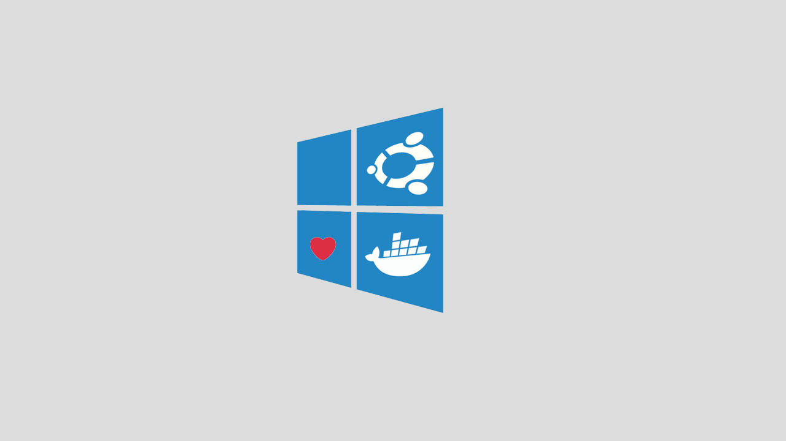
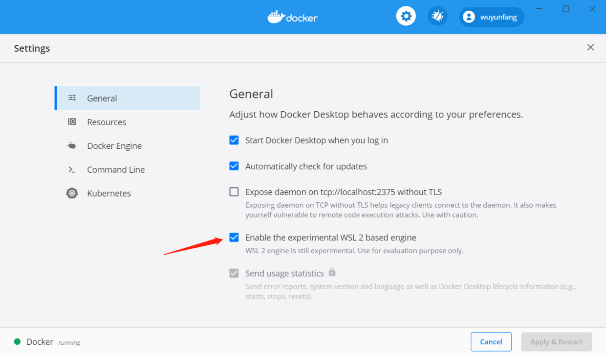
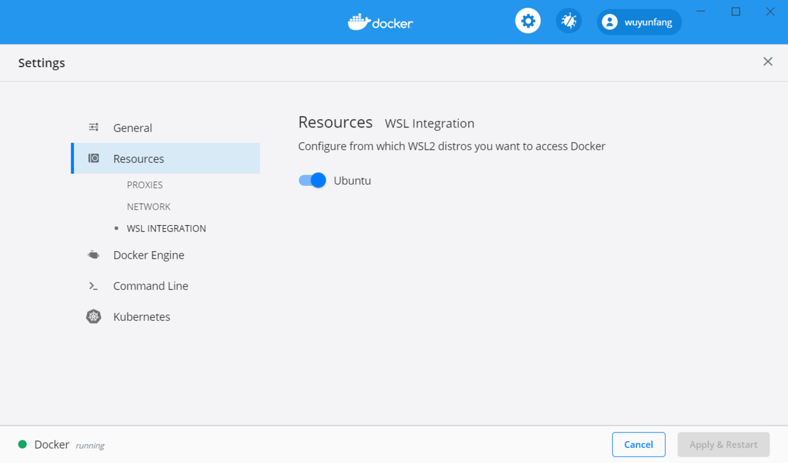
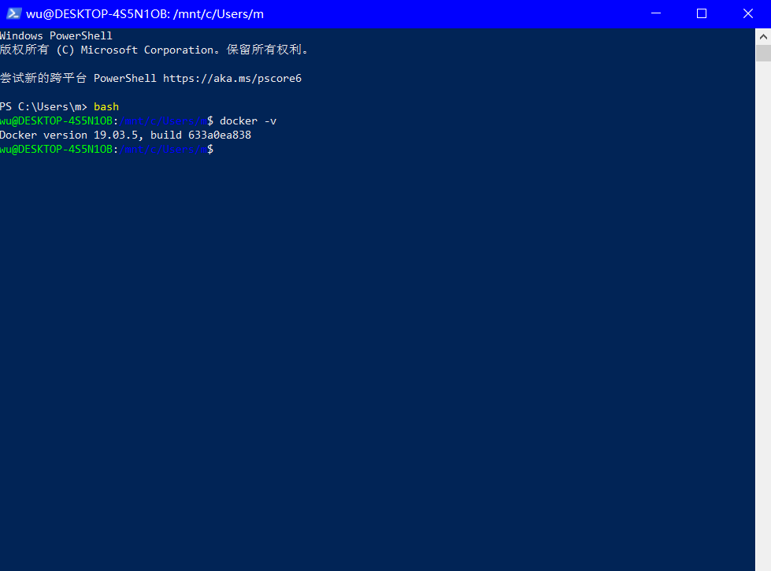
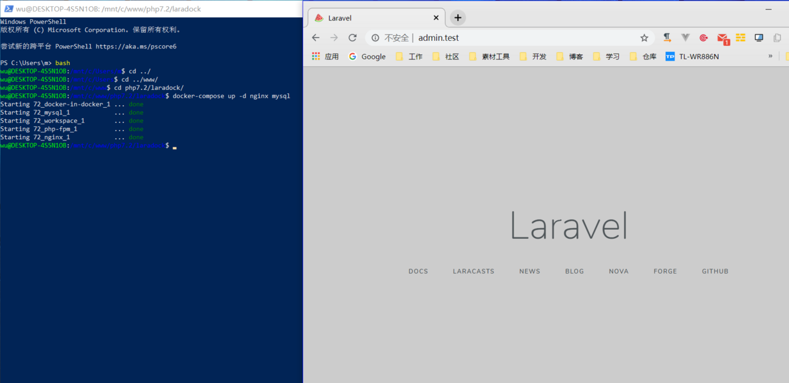

没忍住，把家里的电脑更新到了预览版，然后体验了一下 wls2，相对于 wsl1，使用 docker 简直不要太简单。


<!-- more  -->
#### 更新 wsl2
开个命令行：
```
wsl --set-version Ubuntu 2
wsl --set-default-version 2
```

#### 下载docker
 [wsl2 版 docker 下载]([https://docs.docker.com/docker-for-windows/wsl-tech-preview/](https://docs.docker.com/docker-for-windows/wsl-tech-preview/)

#### 配置
下载完成后，先勾选 wsl2。


然后直接重启 docker。

重启完成后，勾选你的发行版子系统。


然后再次重启 docker。

#### 测试
```
bash
docker -v
```


重装好像把我之前的镜像都给弄没了，切到 laradock 重新下载。



正常访问，打完收工。
